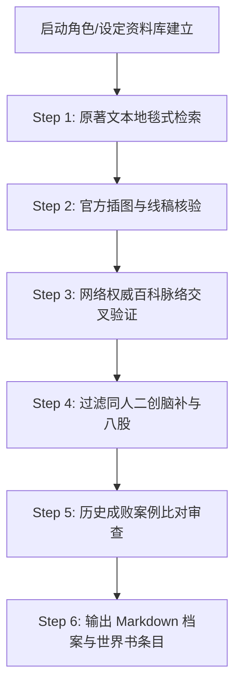

# Character Visual & Lore Dossier (角色外貌与多源设定资料库工作流)

构建具备严格证据链的小说人物外貌、官方设定、网络考据与多模态视觉资料库，杜绝 AI 凭空脑补、公式化八股与同人刻板印象。

---

## 一、 核心使命与哲学 (Core Philosophy)

在角色卡制作、世界书沉淀与跑团设计中，最常见的灾难是**模型依据通用动漫刻板印象进行“虚空脑补”**（例如将神秘高冷的剑圣写成随手端出苹果派的温柔保姆，或为了推进剧情而擅自给角色增删因果律权能）。

本工作流确立的核心铁律是：
> **「言必有据，图必有核，画必有据，源必有溯。」**  
> 一切外貌描写、战力设定、性格侧写与能力机制，必须建立在多源证据交叉印证的基础之上。严禁以未经核验的“AI 直觉”替代原著事实。

---

## 二、 四级信息证据阶梯 (Four-Tier Source Hierarchy)

在收集与整理任何角色的外貌与设定资料时，必须严格遵守以下信息信任层级，低层级不得推翻或篡改高层级事实：

```text
┌─────────────────────────────────────────────────────────────┐
│ Tier 1: 原作小说原著正文 (Canonical Novel Text)              │
│ - GBK/日版原著正文、作者后记、官方 Profile、加加美鉴定专栏    │
├─────────────────────────────────────────────────────────────┤
│ Tier 2: 官方插画与视觉原案 (Official Illustrations)          │
│ - 文库版彩页与黑白插图、官方人设线稿、动画官方人设表          │
├─────────────────────────────────────────────────────────────┤
│ Tier 3: 权威网络百科与深度考据 (Verified Web Encyclopedias)   │
│ - 日文 Pixiv 百科、萌娘百科、日文 Wiki、深度贴吧/论坛考证     │
├─────────────────────────────────────────────────────────────┤
│ Tier 4: 同人创作与衍生材料 (Fanworks & Community Materials) │
│ - 高质量同人插画、Cosplay 还原、社区讨论、二创合理化扩写     │
└─────────────────────────────────────────────────────────────┘
```

1. **Tier 1（最高法定依据）**：具有最高排他权。当网络流传的说法或同人印象与小说正文冲突时，无条件以正文为准。
2. **Tier 2（官方视觉基准）**：角色发型、瞳色、服装结构、灵装外形必须优先比对官方插图，不可单凭文字脑补造型。
3. **Tier 3（外延脉络考证）**：用于补充人物创作原型、外文译名、声优演化及跨卷时间线梳理，但必须反向在原著中找到文本锚点。
4. **Tier 4（灵感与修辞补充）**：仅用于丰富视觉细节表现力或跑团描述词，**绝对不可将同人二创假说当成官方正史写入设定库**。

---

## 三、 历史成败案例剖析与避坑铁律 (Case-Driven Grounding)

本体系直接由本项目在《落第骑士英雄谭》世界书构建过程中的**真实血泪教训与成功突破**提炼而成。任何档案整理必须严格对照以下案例进行自我审查：

### 3.1 五大历史失败案例（Anti-Patterns / 警示录）

1. **案例一：凭空脑补八股与同人刻板标签（“甜点烘焙女仆”陷阱）**
   - **发生场景**：在整理世界最强剑士〈比翼〉爱德怀斯时，AI 凭空撰写了“资深甜食控与烘焙达人”、“闲暇时常戴着厚厚的隔热手套从烤炉中端出烘烤得焦糖金黄、香气四溢的现烤苹果派”、“对后辈充满护短宠溺”等大段公式化网文修辞。
   - **用户纠错**：*“依据呢？你的词条现在每个都要找依据！”*
   - **教训总结**：原著中爱德怀斯仅在极少数生活场景中流露过爱吃甜点、体恤晚辈，但其本质是清冷出尘、不问世事、隐居万米雪山之巅的世界绝巅剑神，绝非日常系家庭主妇。**严禁为了“丰满人设”而滥用廉价生活化八股填充档案**。

2. **案例二：擅自发明不存在的超常权能（“因果斩击”癔想陷阱）**
   - **发生场景**：在梳理爱德怀斯能力时，AI 臆想其能够“斩断因果”，给其赋予了概念干涉系神级刀法。
   - **用户纠错**：*“其三具体能力，你之前癔想了斩断因果但其实不是，必须找原文依据！”*
   - **教训总结**：原著中爱德怀斯的灵装是主掌契约的【圣约之仪】，其剑技本质是超越人类神经反应极致的**“零与一百、无加速度、完全无声”的纯物理神速境界**。擅造招式会彻底摧毁原著严谨的战力体系。**招式与能力必须有明确的卷次出处与命名依据**。

3. **案例三：盲目以图猜人脱离正文（“看图说话”陷阱）**
   - **发生场景**：用户发来第 12 卷封面/插画询问白发女性是谁，AI 仅凭直觉看图盲猜。
   - **教训总结**：轻小说插画具有画风演变、视角透视与新角色引入等特点，光靠看图猜人极易张冠李戴。**必须结合该卷小说目录、出场人物登场上下文进行地毯式文本检索比对**。

4. **案例四：因果逻辑颠倒与规则矛盾（“一日二连战一刀罗刹”陷阱）**
   - **发生场景**：在总结第六卷终章一辉战胜城之崎白夜时，将剧情误写为“一辉为备战晚间与莎拉的死斗，开局直接以一刀罗刹瞬杀白夜”。
   - **用户纠错**：*“一辉为备战晚间与莎拉的死斗，开局直接以一刀罗刹瞬杀白夜。开挂了这里不是我记得一天只能一次一刀修罗吗？”*
   - **教训总结**：一刀修罗/一刀罗刹一天只能使用一次是核心铁则。一辉开局开大恰恰是因为白夜算准一辉不敢在上午用大招，一辉被迫**“孤注一掷透支全天唯一王牌”**，导致晚间陷入绝无大招可用的死局。把“透支代价”写成“备战手段”，导致逻辑完全自相矛盾。**任何战术动作必须严密契合技能设定约束与因果链条**。

5. **案例五：阵营脸谱化与动机简单化（“非黑即白”误判）**
   - **发生场景**：将挂名解放军的爱德怀斯直接归类为反派恐袭组织成员。
   - **用户纠错**：爱德怀斯当年只是为了解救因能力暴走企图自杀的紫乃宫天音，给天音寻找容身之处才短暂引荐天音加入并挂名，其政治立场始终中立独行。
   - **教训总结**：复杂角色的阵营关系往往涉及深层因果，**严禁将复杂灰色人物粗暴贴上正邪二元标签**。

---

### 3.2 四大历史成功经验（Best Practices / 最佳实践）

1. **跨卷伏笔全景追踪与因果闭环（平贺玲泉/傀儡王范例）**：
   - 追踪第三卷钟乳洞石人偶袭击（左手被烧焦脱落露出非人机械臂伏笔）；
   - 追踪第四卷奥多摩地狱蜘蛛丝突袭；
   - 追踪第六卷机械降神被史黛菈轰碎暴露金属齿轮与人造骨架；
   - 追踪第十一卷阿尔卑斯总部完全相同的石人偶屠杀使徒；
   - 最终坐实平贺玲泉自始至终是十二使徒魔人〈傀儡王〉欧尔·格尔的远程操纵中继机关人偶。**跨卷证据链闭环极大提升了资料库的历史纵深感**。

2. **严密的物理与数值量化锚定（500kg 基准与魔力标尺）**：
   - 在第十卷第四章成功挖掘出正规伐刀者基础魔力强化后**单臂爆发力平均达 500kg（半吨）**的官方量化证据；
   - 确立“1 辉 = 1/10 正常人魔力，E-D 级 = 1/300 史黛菈”的魔力换算基准；
   - 明确魔人打破先天魔力恒定上限开放至 S 级与无上限。**以原著量化数据作为跑团与规则系统坚不可摧的底层地基**。

3. **零加速度与神经重构的高阶设定还原（比翼剑理范例）**：
   - 完整考据爱德怀斯“力量发挥在 0 与 100 之间无过渡”、“无加速度故而完全无声”、“重构大脑神经突触以超密超短信号驱动肌肉”的微观机理，展现神级剑士与普通强化系的次元差距。

4. **三位一体交叉考据法（文字 + 插画 + 官方数据）**：
   - 文字描写（身材面容）+ 卷次插画（具体形象）+ 加加美鉴定档案（六维属性攻击力/敏捷/魔力等评级），三方相互印证，杜绝任何单一视角的偏差。

---

## 四、 角色外貌与视觉资料库建设标准规范 (Dossier Schema)

针对小说中重要角色，资料库档案必须遵循以下六大模块的标准化工程结构：

```markdown
# 角色全名（中日双语 / 罗马字 / 官方英文）

> **所属势力/学园**：...
> **伐刀者等级/战力定位**：...
> **核心称号/绰号**：...
> **登场与活跃核心卷次**：...

---

## 一、 外貌生理与视觉核心特征 (Visual & Anatomical Dossier)
### 1.1 基础生理参数与体态轮廓
- 身高/体型/骨架（精瘦、魁梧、娇小、高挑等精准描述）
- 肌肉轮廓与体脂特征（千锤百炼无赘肉、钢浇铁铸块状肌、柔韧修长流线型）
- 显著体表特征（战斗疤痕、手术缝合线、非人机械改造痕迹、异化器官如龙角/魔眼）

### 1.2 头部与五官微表情
- 发型与发色（长短、发质、刘海走向、特定高光）
- 瞳色与眼神特质（冷澈锐利、兽性嗜血、空洞呆滞、纯真天真）
- 标志性微表情（自信爽朗露出白牙、玩味戏谑假笑、毫无感情的人偶表情）

### 1.3 服饰装束变迁矩阵
- 日常/校服形态（领带、衬衫、披风、裙摆长短与徽章）
- 战斗/全武装形态（装甲材质、战袍颜色、特殊护具）
- 特殊/破损/特化形态（断臂熔接态、暴走状态、爆衣负伤态）

---

## 二、 固有灵装与异能视觉呈现 (Device & Elemental Manifestation)
### 2.1 固有灵装实体外观
- 武器类型、尺寸比例（如长度超两米的长枪、薄如蝉翼的细剑、单片眼镜、画笔等）
- 材质质感、刀纹与魔导符文（乌金、白银、钛合金、半透明丝线）
### 2.2 施法与战斗视觉特效
- 魔力放射色彩与粒子光效（深红龙炎、刺目蓝白电弧、幽深真空光轮、绝对零度霜雾）
- 空间与环境异象（重力下陷、大气波纹、时间定格灰度化）

---

## 三、 官方设定与原著文本证据链 (Canonical Textual Evidence)
- 精准摘录原著小说中的外貌、身材描写原文（标明卷次、章节与行号）
- 摘录官方加加美鉴定（六维参数与人物背景评述）

---

## 四、 官方插画与多模态参考索引 (Illustrations & Visual References)
- 文库版对应卷次插图编号（如第X卷插图001、彩页插画）
- 角色官方人设图/动画线稿位置索引
- 核心视觉判定要点（避免画师二次创作偏离）

---

## 五、 战术克制、博弈盲区与判定规约 (Tactical & Mechanics Integration)
- 战术优势面与克制链
- 心理盲区与致命弱点（如天眼的棋谱自负、诸星的拳眼PTSD、一辉的无大招真空期）
- 酒馆世界书触发词（Trigger Words）与防止递归（preventRecursion）配置
```

---

## 五、 多源收集工作流执行标准操作程序 (SOP)



1. **Step 1（原著检索）**：
   - 运行本地检索工具，在 `落第骑士英雄谭 第X卷 gbk.txt` 中地毯式扫描角色的全名、简称、灵装名、称号与外貌描写语句。
2. **Step 2（插图核验）**：
   - 调取该角色登场卷次的黑白插图与彩插，对照文本描写的服装、发色、武器形态核实画稿一致性。
3. **Step 3（网络验证）**：
   - 检索日文 Pixiv 百科与官方资料，核对日文原名、声优、官方公式书数据与隐藏世界线。
4. **Step 4（去伪存真）**：
   - 剔除无正文依据的二创设定、粉丝同人滤镜与公式化网文套话，保留纯正原著设定。
5. **Step 5（对照成败案例复审）**：
   - 检查是否存在“爱德怀斯甜点式脑补”、“因果斩击式招式捏造”、“一刀罗刹二连战式逻辑颠倒”或“以图盲猜”。
6. **Step 6（成果落地）**：
   - 生成结构化档案文件，并提炼为符合 SillyTavern 规范的世界书 JSON 条目。
