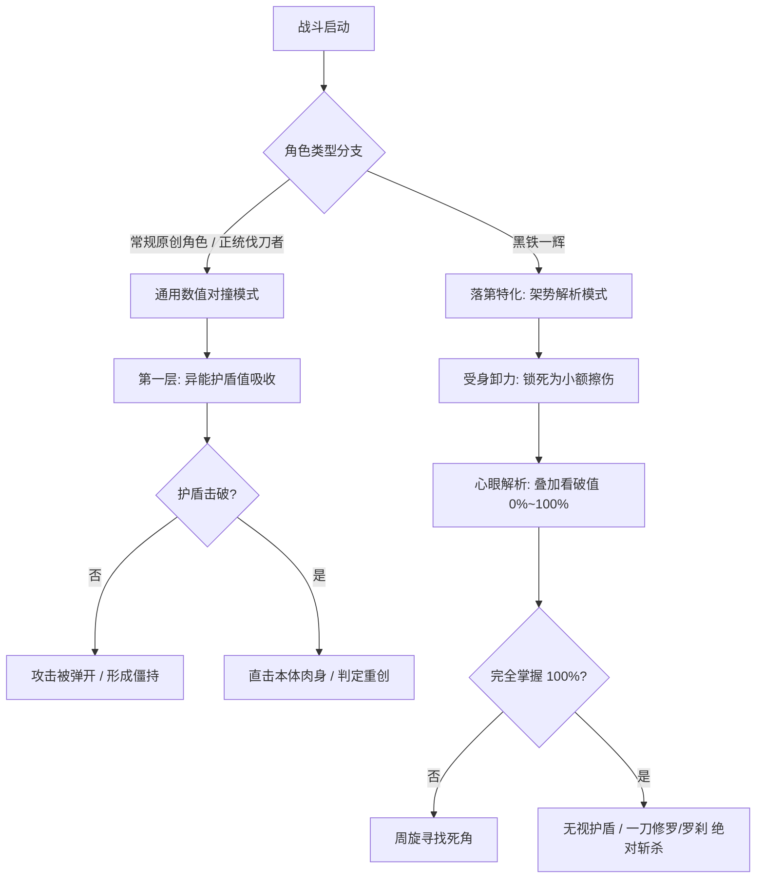

# 《落第骑士英雄谭》TRPG 规则引擎与酒馆世界书架构设计方案

> **文档定位**：用于与 Claude、GPT 等大语言模型及开发者深入讨论、评审与迭代的系统设计白皮书。  
> **核心目标**：在《落第骑士英雄谭》严谨世界观与“先天魔力锁死”的设定下，构建一套兼顾“硬核卡牌数值对碰”、“弱者以技弑神”以及“火纹式羁绊破界（魔人觉醒）”的高沉浸感文字跑团系统。

---

## 目录
1. [设计背景与核心宗旨](#一设计背景与核心宗旨)
2. [原著设定考据与量化基准](#二原著设定考据与量化基准)
3. [战斗系统架构：尖塔卡牌 + 去肉鸽 + 双轨驱动](#三战斗系统架构尖塔卡牌--去肉鸽--双轨驱动)
4. [角色养成与能效演化模型（魔力锁死下的变强路径）](#四角色养成与能效演化模型魔力锁死下的变强路径)
5. [火纹式 S 级支援与魔人觉醒系统](#五火纹式-s-级支援与魔人觉醒系统)
6. [SillyTavern（酒馆）工程落地实现](#六sillytavern酒馆工程落地实现)
7. [开放讨论议题（To Claude & GPT）](#七开放讨论议题to-claude--gpt)

---

## 一、设计背景与核心宗旨

### 1. 原著痛点与 TRPG 破局
原著作者海空陆在前期展现了极其精彩的“富坚义博式”智斗——注重距离感知、步法（抽足）、受身卸力、肌肉与呼吸预读（完全掌握）、战术针对与相性克制；但中后期不可避免地滑向了“魔人爆气、因果互切、数值神仙打架”的膨胀流派。

在 TRPG / 酒馆（SillyTavern）设计中，如果单纯照搬传统数值升级体系（打怪升级涨蓝条），会彻底毁掉原著“才能至上、命运之锁不可破”的残酷史诗感；若完全交给纯文本 AI 自由发挥，又会出现大模型“数值幻觉、无限锁血、出戏秒杀”的弊病。

### 2. 本方案三大核心宗旨
* **规则层与渲染层解耦**：底层由严谨的状态机与卡牌规则判定胜负（血量、AP、MP、破绽值、环境修正），表现层由 LLM 战报渲染器输出极富轻小说张力的打戏。
* **锁定魔力天花板，深耕能效比与卡牌进化**：凡人角色魔力总量终生锁死，变强依靠“魔力利用效率（消耗锐减/倍率暴增）”与“技能概念深化（从划伤到空间斩）”。
* **火纹式羁绊破界**：将魔人突破设计为类似《火焰纹章》的 **S 级支援（S-Support）** 机制，以不可动摇的情感羁绊作为在必死绝境下斩断命运之链的唯一奇迹钥匙。

---

## 二、原著设定考据与量化基准

### 1. 官方六维雷达真实定义（加加美鉴定权威解构）
* **攻击力（Offense）**：魔力瞬间释放规模与异能冲击破坏力（非纯肉体臂力）。
* **防御力（Defense）**：利用异能构筑魔力屏障、概念护盾的能力。**伐刀者肉体本质依然是脆弱凡人**，一旦屏障被破或被绕过，真刀砍中要害必定致死/致残。
* **魔力量（Aura Capacity）**：先天魔力储备池总量（十岁测定后终生固定）。
* **魔力控制（Control）**：施法微操精度与能效比（A级控制可使能耗锐减、微观筛选分子）。
* **体能（Physical）**：肉体力量、神经反射与移动极速。
* **运气（Luck）**：因果干涉与绝境动摇倾向。
* **核心铁律**：**官方评级（Rank A~F）完全基于先天魔力与异能潜力，剑技武艺再高也绝不计入官方等级。**

### 2. 战力标尺与度量衡
* **自然基准单位【1 普（1 Unit）】**：破军学园普通及格生（D/E级中坚）魔力量基准 = **100 MP**。
  * **黑铁一辉（F级）** = **0.1 普（10 MP）**（只有平均值的十分之一，放不出任何外放法术）。
  * **桐原静矢（C级正选）** = **2.5 普（250 MP）**。
  * **史黛菈·法米利昂（A级怪物）** = **30.0 普（3000 MP）**（新生的 30 倍，一辉的整整 300 倍）。
  * **S 级魔人（爱德怀斯 / 突破后）** = **100.0+ 普（10000+ MP）**（上限解除，自主增长）。
* **三大落第“度量衡”角色**：
  * **【1 桐原】（桐原静矢）——“落第六车拳西 / 正选守门员”**：C 级顶峰，虐杂鱼极稳（隐身+追踪箭），但机制单一且心理素质差，高端局极其稳定地充当背景板被一击秒杀。用于检验是否具备全国正选门槛。
  * **【1 桃谷】（桃谷次郎）——“重甲沙包单位”**：铠甲灵装，专用于测试大招贯穿力与瞬间破坏力的木桩假人。
  * **【1 藏人】（仓敷藏人）——“全国八强硬核标尺”**：近战攻防双 B + 神速反射，凡人一辉在不开一刀修罗状态下能战胜的战力上限。

---

## 三、战斗系统架构：尖塔卡牌 + 去肉鸽 + 双轨驱动

### 1. 为什么“去肉鸽（Non-Roguelike）”？
原著魅力在于角色固定的灵魂灵装、精研的独门秘剑与战术博弈，随机抓牌和遗物堆叠会破坏严肃的人设构筑。每位角色携带一套 **15~25 张预设专属卡组（Fixed Build）**，战斗前调整策略。

### 2. 双资源槽与脆弱肉身
* **生命值（HP）**：全员凡人肉身，普遍为 **80 ~ 120 HP**（体能 A 约 120，体能 E 约 80）。
* **行动力（AP / 体能费）**：基础 **3 AP**（体能 A 为 4~5 AP），用于出刀、闪避、步法。
* **魔力池（MP / 异能费）**：依据角色固定总量结算，扣完即空，严禁嗑药回蓝。

### 3. 双轨战斗驱动模式（Dual-Engine）



#### 分支 A：通用数值模式（原创 User / 正统骑士）
* 结算公式：
  $$\text{实体伤害} = (\text{基础打击} + \text{体能修正}) \times \text{剑技补正}$$
  $$\text{异能伤害} = \text{绝技威能} \times \text{魔力输出系数} \times \text{属性克制倍率} \times \text{环境卡修正}$$
* 防御抵消：异能护盾（Barrier）优先吸收伤害；一旦护盾清零发生【破甲】，后续伤害直接扣除肉体 HP。

#### 分支 B：黑铁一辉模式（Worst One Mode）
* **受身擦伤（Glancing Hit）**：一辉受到攻击时不硬抗，通过体能与刀法滑卸，将单发重创强制锁死为 $1 \sim 4$ 点轻微【肉体擦伤】。
* **挨打即解析（Insight Accumulation）**：每次受创或交锋，敌方【看破值】增加 $15\% \sim 25\%$。
* **完全掌握（Perfect Vision）**：当看破值达 $100\%$ 时，敌方所有魔力屏障在判定上一律视为 $0$（找到了防御死角），一辉挥出【一刀修罗 / 一刀罗刹】触发直接斩杀判定！

### 4. 独立环境卡系统（Field System）
地形并非单纯的背景板，而是对属性和命中有着决定性影响的乘区：
* **【密林演习场】**：潜行/暗杀绝技耗魔 -50%；火系出招有 40% 几率引燃全场形成持续灼烧。
* **【暴雨湿地】**：水系护盾强度 +50%；雷系伤害附带全场导电；火系威力 -30%。
* **【熔岩焦土】**：非火系角色每回合扣除 5 点真实 HP，体能恢复 -1 AP。
* **【狭窄室内/楼道】**：长兵器与大剑受阻，匕首/小太刀出招帧数加快，全员闪避率 -40%。

---

## 四、角色养成与能效演化模型（魔力锁死下的变强路径）

### 1. 解决原著矛盾：为什么 D 级绚濑在实战中能“爆楼”？
* **A 级爆楼靠“随手平 A”**：史黛菈随手一剑把几百米场地熔成岩浆，魔力 3000 MP 挥霍不尽。
* **D 级爆楼靠“概念杠杆与陷阱筹备”**：绫辻绚濑（魔力只有 E）事先在第六训练场预埋上百道【风之爪痕】；她的异能是上位【概念操作系·伤口扩大】，直接在建筑承重结构上切开微小缝隙并放大撕裂，以极小魔力引发连锁剪切坍塌！
* **结论**：**官方等级（Rank）决定的是常态平 A 规模与能量池；而实战破坏力取决于“概念深度、准备时间与战术杠杆”！**

### 2. 三维能效与卡牌进阶模型
角色在成长过程中，魔力上限始终不变，但卡牌与能效发生四次质变进化：

```
绫辻绚濑成长轨迹示例：
【初始卡·风之爪痕】: 消耗 25 MP | 伤害 15 | 需预设，易被识破
        ↓ (随剧情历练 / 剑道领悟)
【进阶卡·疾风断层】: 消耗 15 MP | 伤害 40 | 随刃瞬发，附带持续流血
        ↓ (魔力微调 / 敛息抽足)
【极意卡·死角抽足】: 消耗  8 MP | 伤害 80 | 自身闪避倍率升至 250%，抹除出招杀气
        ↓ (终极奥义开发)
【奥义卡·天衣无缝·空间斩】: 消耗 6 MP | 伤害 150 (3.0倍) | 撕裂空间维度，无视任何护盾直接穿透！
```

* **能耗修正比**：$1.0\times \rightarrow 0.2\times$（原本只能放 3 次绝技，现在能连出 13 次！）。
* **伤害倍率**：$1.0\times \rightarrow 3.5\times$（魔力汇聚在极微小的一点，破坏力倍增）。
* **闪避与受身**：$1.0\times \rightarrow 2.5\times$（融入无意识步法与预读）。

---

## 五、火纹式 S 级支援与魔人觉醒系统

在原著中，魔人觉醒**绝非靠自闭打坐，而是源于极其深沉的执念、爱意与生死契约**（一辉为了史黛菈突破命运，西京宁音因琢海而动摇）。

引入**火纹式支援度等级（Support Rank: C $\rightarrow$ B $\rightarrow$ A $\rightarrow$ S）**，作为打破命运之锁的唯一途径：

### 1. 支援度等级与实战联动
* **【C 级支援（初识与同行）】**：战斗中触发协同攻击，同伴有 20% 几率出手打断敌方追击。
* **【B 级支援（默契战友）】**：彼此熟悉出招节奏，技能 MP 消耗额外 -20%，AP 行动力 +1。
* **【A 级支援（生死相托）】**：当一方陷入濒死（HP < 30%）时，另一方进入【誓死守护】状态，伤害与闪避暴增 100%。
* **【S 级支援（灵魂誓约 / 唯一挚爱）】**：
  * 仅限唯一角色（必须通过深层情感剧情、正式表白或誓约确立）。
  * 获得隐藏特质【命运共鸣】：在同一战场时，双方必定保留 1 点 HP 免除一次致死攻击。

### 2. S 级支援破界：【魔人觉醒（Brute Soul）】
* **触发条件（不可随意触发，必须满足三位一体的大事件）**：
  1. 两人已达成 **S 级支援**；
  2. 面对不可抗拒的宿命绝境（如必死的战略级魔法、毁灭因果）；
  3. 角色为了守护对方，将全部爱意化为灵魂燃料，斩断命运之链。
* **觉醒收益**：
  * **魔力上限解绑**：突破终生锁死的宿命，魔力总量暴增至 10,000+，且今后可通过锻炼持续增长；
  * **因果超脱**：免疫任何概率干涉、必中诅咒与命运操控；
  * **官方等级重评**：在学籍档案与国际公会上，正式获得**【S 级·规格外（魔人）】**称号！

---

## 六、SillyTavern（酒馆）工程落地实现

### 1. 酒馆变量与状态栏输出格式（Status Format）

```xml
<status_format>
<status>
🎭身份: 破军学园学生骑士
🎖️伐刀者等级: [A / B / C / D / E / F / S级·魔人]
🏷️称号/二名: 【称号名称】
🗡️固有灵装(Device): 【灵装名】 (形态: 日本刀/大剑/长弓/短剑)
🌟灵装展开形态: [幻想形态(非致命切磋) / 实像形态(流血真刃)]
💪🏼肉体状况: 当前生命值%｜受创描写
⚡️体能/气力(SP): 当前值% (决定出招AP上限)
💫魔力总量(MP): 当前MP/魔力上限 (当前值%) [凡人上限锁死]
📊六维能力值:
┣ 攻击力: [A-F] ┣ 防御力: [A-F] ┣ 魔力量: [A-F]
┣ 魔力控制: [A-F] ┣ 体能: [A-F] ┗ 运气: [A-F]
🌀核心技能构筑:
┣ 基础构筑: 【技能名】 (MP消耗, 伤害/闪避倍率)
┗ 终极奥义: 【奥义名】 (核心底牌，如空间斩、雷切、一刀修罗)
❤️羁绊支援: [与User的支援等级: 无/C/B/A/S]
🌐当前战场环境(Field): [场地名及环境乘区]
</status>
</status_format>
```

### 2. 自动化演化结算脚本（MVU 驱动 JS）
*在剧情时间大幅流逝（月差 $\ge 3$）时，自动结算 NPC 的技能构筑进化与能效优化，免除 AI 手动维护负担：*

```javascript
// 酒馆 MVU 自动演化脚本
$(() => {
  (async () => {
    await waitGlobalInitialized('Mvu');

    const 技能阶梯 = ['入门雏形', '熟练连贯', '微观调谐', '极意奥义', '法则空间斩'];

    function 计算月差(当前, 上次) {
      const p1 = 当前.match(/(\d+)年(\d+)月/);
      const p2 = 上次.match(/(\d+)年(\d+)月/);
      if (!p1 || !p2) return 0;
      return (parseInt(p1[1]) * 12 + parseInt(p1[2])) - (parseInt(p2[1]) * 12 + parseInt(p2[2]));
    }

    eventOn(Mvu.events.VARIABLE_UPDATE_ENDED, variables => {
      try {
        const 当前时间 = _.get(variables, 'stat_data.世界.当前时间', '');
        const 上次结算 = _.get(variables, 'stat_data.世界.上次成长结算', '');
        if (!当前时间 || 当前时间 === 上次结算) return;

        const 月差 = 计算月差(当前时间, 上次结算);
        if (月差 < 3) return; // 季度修行沉淀

        const 伙伴列表 = _.get(variables, 'stat_data.登场人物.同行伙伴') || {};
        for (const 名 of Object.keys(伙伴列表)) {
          const npc = 伙伴列表[名];
          if (!npc) continue;

          // 1. 技能构筑进阶 (魔力上限绝对不动，降低能耗并提升倍率)
          const 当前阶 = npc.技能阶位 || '入门雏形';
          const 档 = 技能阶梯.indexOf(当前阶);
          if (档 >= 0 && 档 < 技能阶梯.length - 1) {
            _.set(variables, `stat_data.登场人物.同行伙伴.${名}.技能阶位`, 技能阶梯[档 + 1]);
            const 原能耗 = npc.MP能耗倍率 || 1.0;
            const 原伤害 = npc.伤害倍率 || 1.0;
            const 原闪避 = npc.闪避倍率 || 1.0;
            _.set(variables, `stat_data.登场人物.同行伙伴.${名}.MP能耗倍率`, Math.max(0.2, 原能耗 - 0.2));
            _.set(variables, `stat_data.登场人物.同行伙伴.${名}.伤害倍率`, 原伤害 + 0.5);
            _.set(variables, `stat_data.登场人物.同行伙伴.${名}.闪避倍率`, 原闪避 + 0.3);
          }

          // 2. 羁绊支援自然推进 (C -> B -> A; S级必须锁定由剧情高潮手动赋予)
          const 当前支援 = npc.支援等级 || '无';
          if (当前支援 === 'C' && 月差 >= 6) {
            _.set(variables, `stat_data.登场人物.同行伙伴.${名}.支援等级`, 'B');
          } else if (当前支援 === 'B' && 月差 >= 12) {
            _.set(variables, `stat_data.登场人物.同行伙伴.${名}.支援等级`, 'A');
          }
        }

        _.set(variables, 'stat_data.世界.上次成长结算', 当前时间);
      } catch (e) {
        console.error('[落第成长结算异常]', e);
      }
    });
  })();
});
```

---

## 七、开放讨论议题（To Claude & GPT）

请与 Claude 和 GPT 围绕以下四个核心问题展开深度评审与扩展：

1. **数值膨胀的防御性边界**：
   * 当 NPC 掌握【天衣无缝·空间斩】等概念法则技能后，面对同样拥有因果防御的敌人（如御祓泡沫的《绝对不确定性》或西京宁音的《霸道天星》），两者在卡牌结算时应遵循何种“概念优先级（Priority）”裁决？
2. **卡牌构筑的维度平衡**：
   * 80 MP 的绚濑在能耗降为 6 MP/次后，每场战斗能挥出 13 次空间斩。这是否会导致传统 A 级高魔力角色（如史黛菈）沦为被穿透的活靶子？如何给高魔力角色设计合理的“大范围领域压制卡（Field Suppression）”进行反制？
3. **S 级支援剧情触发器的判定条件**：
   * 在酒馆世界书中，应该用怎样的 Prompt 触发词和情境约束，确保 LLM 只有在真正面对生死离别的高潮战役中才允许 NPC 觉醒为魔人，避免好感度一满就无门槛暴走的滥发风险？
4. **自建玩家角色（原创 User）的天赋平衡**：
   * 原创主角开局时，若选择体能 A + 魔力 F（一辉流），与魔力 A + 体能 C（史黛菈流），两者在卡牌获取和初始套牌构筑上应如何进行差异化配置以保证初期的游戏趣味？
