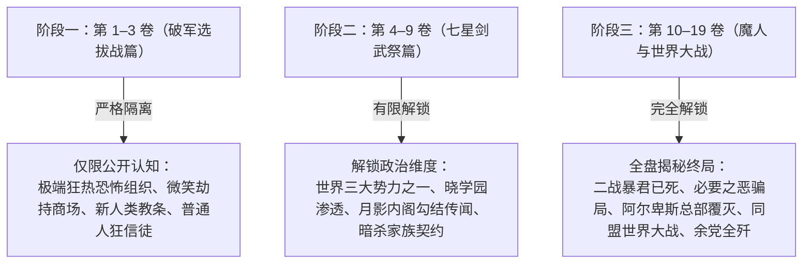

# 解放军（Rebellion）

- **组织 ID**：`org-rebellion`
- **显示名**：解放军（Rebellion）
- **别名/触发词**：解放军、Rebellion、使徒、十二使徒、信徒、暴君、必要之恶、阿尔卑斯总部、秘密结社解放军
- **组织类别**：国际秘密结社／极端恐怖组织／战后世界三大势力之一（“必要之恶”第三极）
- **核心据点**：
  - 历史总部：瑞士阿尔卑斯山脉深处凿空之山体要塞（第 11 卷被〈傀儡王〉欧尔·格尔夷平摧毁）。
  - 地方分支：各国地下秘密支部（如日本分队、法米利昂边境潜伏据点、美军收编秘密研究所等）。
- **存续时间**：数百年前起源 ～ 二次大战（策源与暴君战死） ～ 战后作为“受控的必要之恶”维系半个多世纪 ～ 第 11 卷总部被灭实质瓦解 ～ 第 16–19 卷世界大战余党全歼彻底终结。

---

## 一、 组织本质与世界格局（全系列真相）

### 1. 表面定位（世界公认的极恶教团）
在普通民众与国际魔法骑士联盟官方宣传中，〈解放军〉是由一群信奉**“伐刀者是天选新人类、非伐刀者是低劣家畜”**极端思想的异能狂徒建立的跨国犯罪集团与秘密结社。组织长期从事劫持人质、勒索巨额赎金、暗杀政要、制造城市爆破等恐怖袭击，以筹措活动资金并散播对现有国际秩序的恐惧。

### 2. 国际地位：世界三大势力的“第三极”
战后半个多世纪以来，全球地缘政治形成了三足鼎立的均势格局：
1. **〈国际魔法骑士联盟〉**（以西欧诸国为主体，日本亦为其加盟国）；
2. **〈大国同盟〉**（以美、中、俄等未加入联盟的超级大国为主体）；
3. **〈解放军（Rebellion）〉**（盘踞地下世界、吸收全球暴徒与黑暗势力的第三势力）。

三大势力相互制衡，使大国同盟与联盟无法轻易吞并对方，从而在冷战与局部摩擦中维系了脆弱的“非战”和平。世界第一剑士〈比翼〉爱德怀斯亦深知这一地缘平衡，因而在漫长岁月里未单枪匹马将解放军连根拔起。

### 3. 终极真相：二战黑幕与“必要之恶”骗局（Vol 10, 11, 14, 17–19）
- **暴君已死数十年**：
  解放军历史上的绝对独裁者——黑暗之王**〈暴君〉**，是第二次世界大战的三大魔人之一。他拥有以心灵与因果干涉洗脑多国首脑的恐怖能力，是引发二战的真正罪魁祸首。但在二战末期，反法西斯同盟军突袭阿尔卑斯要塞，年少的〈白胡公〉等顶级骑士浴血奋战，**早已将〈暴君〉当场格杀在阿尔卑斯王座之上**。
- **“必要之恶”的设计者**：
  二战结束后，世界化为一片废墟。如果向全世界宣布暴君死讯，解放军所属的数百万亡命之徒、恐怖分子与凶恶伐刀者将失去统御、化整为零散落全球，酿成无法收拾的治安浩劫，导致人类战后复兴推迟整整一个世纪。此外，失去第三极缓冲，联盟与大国同盟将立刻爆发第三次世界大战。
  日本综合企业风祭财团总帅**风祭晄三**在此危局下提出惊天构想：**隐瞒暴君已死，将其尸体防腐供奉在王座上作为神像假人，由大国高层与财团暗中注资操控，把解放军打造成拘束天下恶徒的“必要之恶”**。
- **全球仅三人知晓的最高机密**：
  整个世界上只有三人知道暴君早在数十年前就已经是一具尸体：
  1. **风祭晄三**（风祭财团总裁，表面为资助者兼使徒，实为日本/联盟方的秘密操盘人）；
  2. **卡尔·爱兰兹 / 爱兰兹·伯格**（代号〈大教授 Grand Professor〉，美联储 FRB 主席兼十二使徒，实为美方/大国同盟的秘密操盘人）；
  3. 另有一名核心协同者。
- **窥视者的肃清机制**：
  解放军内部凡有人对王座帷幕后的暴君起疑、企图接近查探者，均会被联盟与同盟派出的秘密王牌暗中抹杀。美方负责执行抹杀的秘密刺客正是魔人〈超人〉亚伯拉罕·卡特（黑铁王马早年闯入阿尔卑斯最深处即是被卡特击成重伤）。

---

## 二、 组织架构与人员体系

```
                      【盟 主】
           〈暴君〉（实为已死数十年的干尸）
                         │
          ┌──────────────┴──────────────┐
     【幕后知情操盘人】              【最高干部·十二使徒】
  风祭晄三 / 〈大教授〉爱兰兹       各执一方的顶尖魔人/权贵
                                        │
                         ┌──────────────┴──────────────┐
                   【一线指挥·使徒】             【附属家族与雇佣兵】
                 黑底金纹法衣/伐刀精英          千年暗杀家族/实验体/债务打手
                 （如第 1 卷“微笑”）          （有栖院、幽衣、莎拉、B·B）
                         │
                   【基层战力·信徒】
                 普通人狂徒/手持重火器与炸药
```

### 1. 盟主：〈暴君〉（The Tyrant）
- 二战三大魔人之一，精神与概念干涉的怪物。
- **正传事实**：在第 1 卷至第 19 卷正传的所有时间线中，暴君**从始至终都是一具端坐在阿尔卑斯宝座上的死尸**，所有“暴君的谕令”皆为风祭晄三与大教授借神权假托发出的政治调控指令。

### 2. 最高干部：〈十二使徒（Numbers）〉
解放军名义上的决策中枢与战略王牌，由十二名各怀异心、实力达到世界顶点或手握世界命脉的巨头组成：
- **〈独腕剑圣〉华伦斯坦（Wallenstein）**：
  世界顶级剑豪，认同解放军建立伐刀者乐园的崇高理念，是有栖院凪与欧尔·格尔的剑术指导与引路人。为人刚直严厉，真心效忠于解放军，却不知暴君早已死亡。第 11 卷在阿尔卑斯总部被徒弟欧尔·格尔反噬斩首。
- **〈傀儡王〉欧尔·格尔（Or-Gaule）**：
  踏入魔人领域的纯粹恶之化身，以看不见的因果丝线操纵傀儡与人心。法国 A 级骑士〈黑骑士〉艾莉丝·阿斯卡里德的亲弟弟。因厌恶受制于虚假的秩序，于第 11 卷发动叛变弑师，血洗阿尔卑斯总部，将留在总部的另外 6 名使徒全部屠杀殆尽，直接导致解放军解体。
- **〈大教授〉卡尔·爱兰兹（Carl Eilands）**：
  代号 Grand Professor，美联储主席，十二使徒之一，实际是代表美国大国同盟利益的幕后操盘人。通过债务与生化技术控制莎拉·布拉德莉莉等人。
- **风祭晄三**：
  风祭财团总帅，出资维持解放军运转的十二使徒之一，实际是“必要之恶”体系的设计师，代表日本与联盟的战略纵深。
- **留守总部的另外 7 名十二使徒**：
  在第 11 卷欧尔·格尔的突然叛乱中，与华伦斯坦一同在山体要塞中被全歼。

### 3. 一线指挥官：〈使徒（Apostles）〉
- 具有独立固有灵装与高阶伐刀绝技的异能者干部。
- 标志性装束为**黑底金绣的宽大法衣（大衣）**。
- 代表人物为第 1 卷的**“微笑”**（固有灵装〈大法官之环〉，左环吸收记录“罪”，右环释放转化为“惩罚”）。负责率领支部信徒执行绑架、洗劫、筹款与恐吓任务。

### 4. 基层战斗员：〈信徒（Believers）〉
- 占解放军全员 95% 以上的基层武装分子。
- **本质**：**绝大多数是没有魔力与伐刀异能的普通人**。因社会不公或被狂热洗脑，对“伐刀者新人类”产生病态崇拜，甘当家畜与炮灰。
- **装备**：配备正规军制式的突击步枪、冲锋枪、手榴弹、遥控炸药以及火箭筒等重武器，作战时毫无人性、残忍嗜杀。

### 5. 契约暗杀家族与外围打手
- **千年暗杀家族**：世代与解放军保持商业雇佣关系的杀手世家。有栖院凪（代号暗黑隐者）即出身此门，曾被指派潜伏入破军学园刺杀黑铁珠雫，后因认同一辉与珠雫的友情而背叛暗杀使命。
- **世代暗杀一族**：多多良幽衣（〈暗杀者〉）所属的杀手一族，后在七星剑武祭中被一辉击败并感化。
- **债务受制佣兵**：〈染血达文西〉莎拉·布拉德莉莉（因治疗绝症欠下大教授天文数字般的医疗费，被迫充当打手）。
- **生化兵器**：B·B（BIG BABY，年仅 5 岁即被解放军进行残酷肉体改造的巨大人形兵器）。

---

## 三、 全卷 1–19 卷编年史与重大战役

### 1. 第一卷：湾岸商业街（Bay Promenade）人质危机
- **事件经过**：使徒微笑率领数十名手持重火器的狂信徒突袭东京湾岸商业街，将 50 余名顾客劫持在美食街作为人质，勒索 3 亿日元赎金与逃生直升机，企图以此充当组织在日本的活动经费。
- **战局结局**：破军学园学生黑铁一辉、史黛菈·法米利昂、黑铁珠雫、有栖院凪四人联手反击。一辉以〈一刀修罗〉斩出肉眼不可见的极速神速斩，击溃微笑“必须捕捉攻击”的能力破绽，斩断其双手。微笑被移交日本警方收押，信徒全员被逮捕。

### 2. 第四卷至第九卷：国立晓学园与七星剑武祭渗透
- **事件经过**：日本首相月影獏牙与风祭晄三暗中动用解放军的资金与顶级杀手（黑铁王马、有栖院凪、多多良幽衣、莎拉·布拉德莉莉、B·B、平贺玲次郎等），组建“国立晓学园”强行空降七星剑武祭。
- **政治意图**：月影企图借晓学园夺冠制造政治声浪，推动日本脱离国际魔法骑士联盟实行完全独立公投；外界一度盛传“月影内阁勾结恐怖分子解放军”。
- **结局分化**：有栖院凪反水营救珠雫、多多良幽衣与莎拉相继被破军骑士击败并脱离掌控，晓学园最终被一辉与年轻骑士们正面击溃。

### 3. 第十一卷：阿尔卑斯大屠杀与要塞毁灭（组织实质覆灭）
- **事件经过**：〈傀儡王〉欧尔·格尔彻底厌恶了充当提线木偶与维持伪善的均势。他突然在阿尔卑斯总部发难，斩杀恩师〈独腕剑圣〉华伦斯坦，并将留守要塞内的其余 6 名十二使徒与全山基地将士斩尽杀绝。
- **深远影响**：阿尔卑斯山脉被炸成废墟，**解放军作为一个拥有全球统一指挥链的组织彻底土崩瓦解**。维持了半个世纪的三强均势瞬间归零。

### 4. 第十二卷至第十五卷：法米利昂—奎多兰战争
- **事件经过**：欧尔·格尔率领部分残党流窜至法米利昂皇国与奎多兰公国边境，暗中挑唆两国爆发全面战争，企图以两国民众的鲜血与绝望作为愉悦自身的祭品。
- **战局结局**：在黑铁一辉、史黛菈与黑骑士艾莉丝·阿斯卡里德等人的浴血奋战下，欧尔·格尔的阴谋破产，其本人被一辉彻底击倒。

### 5. 第十六卷至第十九卷：第三次世界大战与余党终局
- **世界大战爆发**：
  美军〈超人〉亚伯拉罕·卡特与大教授以“日本及联盟高层长期勾结并庇护恐怖组织解放军”为政治借口，突入阿尔卑斯废墟抢走暴君遗体，向联盟与日本全面宣战，第三次世界大战爆发。
- **余党结局**：
  - **使徒微笑**：失去双手后从关押中流入地下世界，沦落到贫民窟地下黑拳场靠残躯卖命苟延残喘。
  - **三百狂信徒与雇佣兵**：解放军残存的三百余名残兵败将彻底沦为美军 PSYON 秘密研究所的看门犬，充当人体实验场的警卫。在第 18 卷被杀入研究所的黑铁一辉及日本年轻骑士全数歼灭。
- **终局收束（第 19 卷）**：
  大战以年轻骑士的胜利落幕。风祭晄三痛切反省了“妄图利用与操控必要之恶、终被恶所反噬”的历史罪责。随着暴君被焚毁、使徒与信徒全灭，三大势力的旧时代彻底落幕，解放军的历史至此完全终结。

---

## 四、 关键成员谱系与状态一览

| 角色 / 称号 | 组织身份 | 固有灵装 / 特性 | 首次出场 / 关键卷 | 最终结局（全系列） |
|---|---|---|---|---|
| **〈暴君〉** | 盟主／二战魔人 | 心灵掌控、因果干涉 | Vol 10 提及、Vol 14 揭露 | 二战末期已被斩首；尸体在第 16 卷被美军劫走，第 19 卷彻底销毁 |
| **〈独腕剑圣〉华伦斯坦** | 十二使徒之一 | 顶级剑豪／单手神技 | Vol 5 回忆、Vol 10 | 第 11 卷在阿尔卑斯总部被徒弟欧尔·格尔背叛斩杀 |
| **〈傀儡王〉欧尔·格尔** | 十二使徒之一 | 因果丝线操纵、人偶魔人 | Vol 10–15 | 第 11 卷毁灭解放军总部；第 15 卷在法米利昂战争中被一辉击败逮捕 |
| **〈大教授〉爱兰兹** | 十二使徒／美联储主席 | 科技改造、操盘金融 | Vol 11, 14, 17 | 真实身份为美国同盟幕后操盘者；随战败退出历史舞台 |
| **风祭晄三** | 十二使徒／风祭财团总裁 | 庞大财阀、战略设计 | Vol 4, 11, 14, 19 | 战后反省“必要之恶”体系的罪孽，接受战后审判与清算 |
| **“微笑”** | 使徒（一线干部） | 〈大法官之环〉（吸收与反击） | Vol 1（MAT-001） | 第 1 卷被一辉断手逮捕；后流落地下黑拳，沦为残废弃子 |
| **有栖院凪（艾莉丝）** | 暗杀家族雇员／前信徒 | 〈暗黑隐者〉（影子操控） | Vol 1–9 | 因与珠雫、一辉的羁绊背叛解放军与晓学园，成为忠诚同伴 |
| **多多良幽衣** | 暗杀家族雇员 | 反射与死角刺杀 | Vol 4–8 | 在七星剑武祭中被一辉感化，脱离暗杀血途 |
| **莎拉·布拉德莉莉** | 债务雇佣打手 | 〈染血达文西〉（色彩具现） | Vol 4–8 | 战败后还清债务，脱离晓学园重获自由 |
| **B·B（BIG BABY）** | 改造人兵器 | 巨大化肉体强化 | Vol 4–8 | 5 岁幼童，战败后脱离恐怖活动，获得正常保护 |
| **300 名残存狂信徒** | 基层武装余党 | 突击步枪、重火器、炸药 | Vol 18 | 在美军地下研究所充当警卫，被一辉等人全数歼灭 |

---

## 五、 世界书时序分级与防剧透使用指引

在将本词条用于 AI 角色扮演或对话生成时，**必须根据当前故事所处的卷章阶段进行严格的认知截断**，切忌让低卷阶段的角色知晓后卷黑幕：



1. **阶段一（第 1–3 卷）：破军学园选拔战时期【默认启用】**
   - **允许提及**：解放军是无恶不作的恐怖秘密结社；使徒微笑率信徒袭击湾岸商业街；教义贬低普通人为家畜；信徒大多是使用冲锋枪的凡人。
   - **严禁剧透**：严禁在此阶段提及暴君早已死亡、风祭晄三是幕后黑手、必要之恶体制、大国操盘或有栖院凪的杀手身世。
2. **阶段二（第 4–9 卷）：晓学园与七星剑武祭时期**
   - **允许提及**：解放军是与同盟、联盟并称的三大势力；月影首相与风祭晄三借助解放军雇佣兵建立国立晓学园；有栖院凪受命刺杀黑铁珠雫但产生动摇；多多良与莎拉的身世。
   - **严禁剧透**：严禁在此阶段提前透露暴君是具干尸、阿尔卑斯总部将在第 11 卷被欧尔·格尔炸平。
3. **阶段三（第 10–19 卷）：法米利昂战争与第三次世界大战时期**
   - **允许全量解锁**：暴君二战战死真相、阿尔卑斯大屠杀、欧尔·格尔反噬、美国夺走暴君尸体引发世界大战、微笑打黑拳、300 余党在美军地下基地全灭等所有终局事实。

---

## 六、 世界书标准摘要（供上下文/世界书注入）

```xml
<entry name="解放军_Rebellion">
【组织性质】与〈国际魔法骑士联盟〉、〈大国同盟〉鼎立的世界三大势力之一（暗黑第三极），表面为信奉“伐刀者为新人类、非异能者为家畜”的极端恐怖组织，长期以勒索、暗杀与爆炸危害社会。
【真实黑幕（跨卷真相）】盟主〈暴君〉早于二战末期被反法西斯同盟军斩杀于王座；风祭财团总帅风祭晄三与美联储主席〈大教授〉爱兰兹为防恶徒失控及第三次世界大战爆发，合谋隐瞒死讯，将解放军操控为拘束全球罪犯的“必要之恶”（知情者仅三人）。
【人员编制】
- 盟主：〈暴君〉（端坐于阿尔卑斯要塞王座上的数十年前死尸）。
- 十二使徒（Numbers）：最高干部，包含〈独腕剑圣〉华伦斯坦、〈傀儡王〉欧尔·格尔、大教授、风祭晄三等顶级战力与权贵。
- 使徒（Apostles）：身穿黑底金绣法衣的精锐伐刀者干部（如第1卷微笑）。
- 信徒（Believers）：占95%以上的普通人士兵，无异能，手持正规军突击步枪与军规火器，凶残狂热。
- 附庸：千年暗杀家族（有栖院凪）、世代暗杀一族（多多良幽衣）、受制佣兵（莎拉·布拉德莉莉）、生化兵器（B·B）。
【全卷历史宿命】
- 第1卷：使徒微笑率信徒袭击湾岸商业街绑架50名人质索赎金，被一辉、史黛菈、珠雫、有栖院联手击破逮捕。
- 第4-9卷：以雇佣兵身份组成“国立晓学园”强插七星剑武祭，最终破产且多名杀手脱离组织。
- 第11卷：欧尔·格尔叛乱弑师华伦斯坦并屠灭阿尔卑斯总部另外6名使徒与全山基地，解放军实质灭亡。
- 第16-19卷：美国掠夺暴君尸体发动第三次世界大战；残余300名雇佣兵在美军秘密基地被一辉全数歼灭，微笑沦落地下黑拳，三强时代与解放军彻底终结。
【扮演注意】第1-3卷角色仅知其为凶残恐怖组织，严禁跨卷剧透“暴君已死/必要之恶/总部覆灭”真相。
</entry>
```

---

## 七、 禁止误写与正典边界约束

1. **意识形态定性**：不得将解放军宣扬的“伐刀者是优等新人类，普通人是家畜”写成作者认可的世界真理；这在原著中是恐怖组织用来洗脑狂信徒与合理化犯罪的邪教说辞。
2. **基层战力构成**：严禁把普通信徒写成“人均拥有固有灵装的高手”。原著明确指出普通信徒绝大部分是没有魔力的凡人，全靠现代冲锋枪、突击步枪与炸药作战；唯有“使徒”与“十二使徒”才是伐刀者。
3. **暴君活动状态**：在正传全 19 卷中，暴君从未在当世活人面前走下王座、发表演说或亲自出战。凡有涉及暴君出手的描述，在时间线上必须限定为数十年前的第二次世界大战回忆。
4. **同名角色绝对隔离**：
   - 有栖院凪（代号艾莉丝 / 暗黑隐者 / 千年暗杀家族，曾受命于解放军，破军学园学生）；
   - 艾莉丝·阿斯卡里德（称号〈黑骑士〉，法国 A 级骑士，KOK 世界排名第四，欧尔·格尔的亲姐姐，隶属联盟，非解放军成员）。
   两人身世与阵营完全不同，严禁混淆混写。
5. **总部毁灭后的组织状态**：在第 11 卷阿尔卑斯总部被欧尔·格尔夷平之后，解放军不再具备统一中枢与指挥网络。第 12 卷以后的解放军只能称为“残党”、“游勇流寇”或“美军收编的雇佣兵”，不得描写为完好无损的全球结社。
