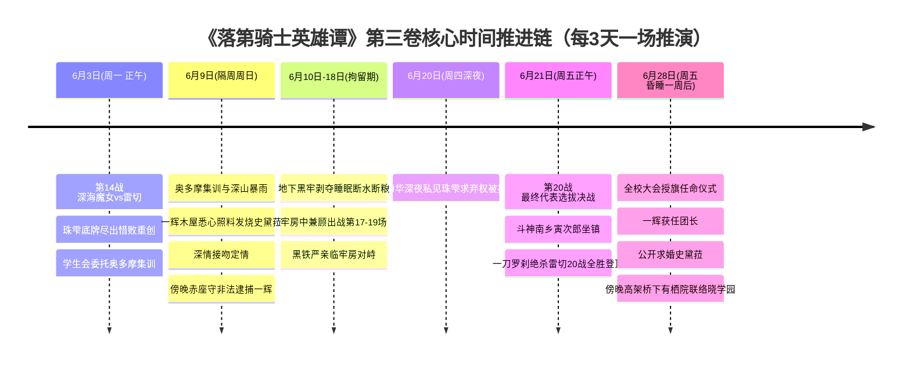

# 第三卷卷内时间线：全量锚定与时序坐标

> **权威材料依据**：`落第骑士英雄谭 第三卷 gbk.txt`（`MAT-003`，8,972 行全量原著正文）  
> **底层推演时钟**：严格基于**破军学园选拔战“每 3 天一场”（一人上限二十场）**的赛程演进链，与卷内显式时间词（星期天、整整一周、平日、场次战绩）100% 严密闭环，不捏造虚假公历日期。  
> **事实状态标定**：`extracted`（原文显式字句确认）、`proposed`（卷内赛程天数与逻辑推导）。

---

## 一、大周期背景与选拔战赛程推演链（第 1 战 ～ 第 20 战最终决战）

破军学园七星剑武祭代表选拔战实行“积分淘汰制，一人最多二十场”。以第一卷选拔战首日开幕（4月22日周一）、一辉首战桐原（4月23日周二）为基准，按照**每 3 天一场**的硬核赛程时钟推导，第三卷正赛与羁押全量场次完全闭环：

| 场次 | 推算公历日期（2013年） | 星期 | 原著对应卷章与关键原话佐证 |
|---|---|---|---|
| **开幕** | **4 月 22 日** | **周一** | 第一卷第四章：选拔战首日开幕（珠雫胜管、史黛菈胜桃谷）。 |
| **第 1 战** | **4 月 23 日** | **周二** | 第一卷第四章：一辉首战胜桐原静矢（战绩 1 胜 0 败，一战成名）。 |
| **第 2～7 战** | 4/26、4/29、5/2、5/5、5/8、5/11 | — | 中段常规连胜推进期。 |
| **第 8 战** | **5 月 14 日** | **周二** | 第二卷第一章：一辉胜兔丸恋恋（8 胜 0 败），史黛菈胜碎城雷，绚濑天台拜师。 |
| **第 9 战** | 5 月 17 日 | 周五 | 中段特训连胜推进。 |
| **第 10 战** | **5 月 20 日** | **周一** | 第二卷第二章开头：一辉取得第十胜（10 胜 0 败），相约次日休息日去泳池。 |
| — | 5 月 21 日 ～ 5 月 23 日 | 周二～四 | 泳池与餐厅藏人挑衅、抽签对阵绚濑、天台失踪简讯。 |
| **第 11 战** | **5 月 24 日** | **周五** | 第二卷第三章：凌晨 3 点天台坠楼透支，白天正赛木刀破陷阱救赎绚濑（11 胜 0 败）。 |
| — | 5 月 25 日 ～ 5 月 26 日 | 周六～日 | 5/25 傍晚奥多摩道场踢馆斩落仓敷藏人；5/26 清晨特大头条壁报引爆全校。 |
| **第 12 战** | 5 月 27 日 | 周一 | 战后常规赛程推进。 |
| **第 13 战** | 5 月 30 日 | 周四 | 战后常规赛程推进。 |
| **第 14 战** | **6 月 3 日** | **周一** | **第三卷序章～第一章**：6/2 傍晚收到抽签简讯，6/3 正午开战！黑铁珠雫 vs 东堂刀华（刀华此时已达 15 胜 0 败，超音速居合雷切胜出）。赛后学生会委托调查奥多摩。 |
| **第 15 战** | 6 月 6 日 | 周四 | 常规赛程推进。 |
| **第 16 战** | **6 月 9 日** | **周日** | **第三卷第二章**：原著显式写明**「时间到了隔周的星期天」**（`MAT-003#L98`）！一辉战绩结算至 **16 胜 0 败**！当天奥多摩集训、暴雨接吻定情，傍晚赤座守突袭非法逮捕一辉！ |
| **第 17 战** | **6 月 12 日** | **周三** | **第三卷第三章**：原著显式写明**「拘禁起来，已经过了三天」**（`MAT-003#L226`，6/9 被捕后第 3 天正是 6/12！）；外界假新闻爆发，一辉在分部牢房内兼顾打完第 17 场。 |
| **第 18 战** | **6 月 15 日** | **周六** | **第三卷第三章**：黑铁严亲临牢房亲口对一辉说**「听说你的战绩至今是十六胜零败」**（结算至被捕时战绩）；随后原著写道**「联盟日本分部进行了一辉的第十八场选拔战……他平安取得第十八场胜利了」**（`MAT-003#L1300-L1316`）！ |
| **第 19 战** | **6 月 18 日** | **周二** | 一辉在严酷绝食与刑求中坚韧拿下第 19 场，达成 **19 胜 0 败**。 |
| **第 20 战 （最终选拔决战）** | **6 月 21 日** | **周五** | **第三卷第四章**： 1. 6/20（周四深夜）刀华私见珠雫被拒； 2. 6/21（周五正午）一辉残躯登台，原著现场解说亲口播报：**「同样战绩为十九战十九胜零败！」**（`MAT-003#L1374`）； 3. 原著写明当天是**「平日」**（周五工作日）； 4. 一辉生死关头开创〈一刀罗刹〉斩断超音速〈雷切〉，达成 **20 战 20 胜 0 败全胜登顶**！ |
| **授旗仪式** | **6 月 28 日** | **周五** | **第三卷终章**：原著写明**「在那之后，一辉整整睡了一个星期。当一连串事件解决后过了一周——全校学生聚集在体育馆，进行正式的任命仪式」**（`MAT-003#L2`、`L16`）！6/21 决战睡满整整 7 天，正是 **6 月 28 日（周五）**！一辉就任代表队团长，当众向史黛菈公开求婚！ |

---

## 二、卷内核心时间节点全量锚定（Anchor `T01` ～ `T07`）

---

### `T01` 选拔战第 14 战·深海魔女 VS 雷切（西历 2013 年 6 月 3 日·星期一·正午至午后）

- **时间状态**：`extracted`
- **章节范围**：序章至第一章（L3–L2210）
- **时序标志**：承接第二卷终章抽签结果（6月2日傍晚抽签，次日开战）。代表选拔战中盘高潮。
- **核心事件**：
  1. 序章回溯珠雫在黑铁家饱受家族溺爱却被一辉以耳光拯救、立誓成为兄长坚强依靠的心路历程；
  2. 正午破军第一对决场，珠雫迎战破军学园最强、十五战全胜的学生会长东堂刀华；
  3. 珠雫以超纯水绝缘、极寒冻土、高压水蒸气爆炸突袭；刀华施展古流步法〈抽足〉与摘镜全知〈闪理眼〉，最终以超音速居合〈雷切〉秒杀胜出，珠雫虽败犹荣；
  4. 赛后学生会茶会，刀华邀请一辉与史黛菈协助调查破军学园奥多摩演习场的“岩石巨人异变”。
- **出场人物**：黑铁珠雫、东堂刀华、黑铁一辉、史黛菈·法米利昂、御祓泡沫、贵德原彼方、碎城雷、兔丸恋恋。
- **地点**：第一对决场、学生会办公室。

---

### `T02` 奥多摩集训、病榻照料与定情之吻（西历 2013 年 6 月 9 日·星期日·正午至傍晚）

- **时间状态**：`extracted`
- **章节范围**：第二章（L2211–L4550）
- **时序标志**：原文明确标记：*“时间到了隔周的星期天。”*（`MAT-003#L98`）。此时一辉选拔战已达 16 胜 0 败。
- **核心事件**：
  1. 黑铁严在联盟分部默许赤座守的抹黑陷害计划；
  2. 星期天中午一辉与史黛菈随学生会抵达奥多摩集训场，野餐做咖喱；下午搜索森林遭遇暴雨，史黛菈淋雨发高烧虚脱，一辉公主抱护送至废弃木屋悉心照料；
  3. 脆弱的史黛菈向一辉倾吐软弱与爱慕，两人在瓢泼雨声中深情拥吻，达成全书核心纯爱定情誓约；
  4. 数十具四公尺岩石巨人暴动围攻木屋，一辉挥刀苦撑，副会长御祓泡沫施展因果干涉绝技〈无法观测（Fifty-Fifty）〉平息事态。
- **出场人物**：黑铁一辉、史黛菈·法米利昂、东堂刀华、御祓泡沫、贵德原彼方、碎城雷、兔丸恋恋、黑铁严、赤座守。
- **地点**：奥多摩集训场、山间废弃木屋。

---

### `T03` 伦理委员会突袭与一辉遭非法拘禁（西历 2013 年 6 月 9 日·星期日·傍晚）

- **时间状态**：`extracted`
- **章节范围**：第二章尾段（L4551–L4761）
- **核心事件**：
  1. 赤座守率数十名黑衣人包围奥多摩木屋，出示暗中偷拍的一辉与史黛菈接吻照片；
  2. 赤座颠倒黑白污蔑一辉“利用室友特权性胁迫皇女、品行严重失德、涉嫌作弊”，强行将一辉逮捕并押送至骑士联盟特别秘密收容所。
- **出场人物**：赤座守、黑铁一辉、史黛菈、学生会干部。
- **地点**：奥多摩山间木屋前。

---

### `T04` 地底囚室酷刑刑讯、兼顾出战与父子决裂（西历 2013 年 6 月 10 日周一 至 6 月 18 日周二）

- **时间状态**：`extracted`
- **章节范围**：第三章全章（L4762–L6420）
- **时序标志**：*“拘禁起来，已经过了三天”*（6/12 拘禁第3天）、*“持续整整一周”*。
- **核心事件**：
  1. 赤座守对一辉施加强光直射、剥夺睡眠、连续罚站、断水断粮等残酷肉体折磨，逼迫一辉签署认罪弃权书，一辉坚决拒绝；
  2. 外界媒体铺天盖地造谣抹黑，史黛菈、加加美、有栖院、绚濑全力搜集洗冤证据；新宫寺黑乃理事长硬顶联盟政治压力，立下绝不宣布弃权的铁律；
  3. 在分部兼顾出战第 17 场（6/12）与第 18 场（6/15），取得第 18 胜；黑铁家当主黑铁严亲临牢房，以维护阶层秩序为由要求一辉退学，一辉凭借武者自尊断然拒绝；
  4. 一辉拿下第 19 胜（6/18，达成 19 战 19 胜 0 败）；赤座定下毒计：将最终选拔战（一辉 vs 东堂刀华）定为面向全国的电视直播公开处刑。
- **出场人物**：黑铁一辉、赤座守、黑铁严、史黛菈、新宫寺黑乃、日下部加加美。
- **地点**：骑士联盟日本分部地下秘密羁押所。

---

### `T05` 最终选拔决战·落第骑士 VS 雷切（西历 2013 年 6 月 20 日深夜 至 6 月 21 日星期五正午）

- **时间状态**：`extracted`
- **章节范围**：第四章全章（L6421–L8655）
- **时序标志**：6/20（周四深夜）前夜会面；6/21（周五工作日正午）比赛日。原文现场解说亲口唱名：*“同样战绩为十九战十九胜零败！”*（`MAT-003#L1374`）。
- **核心事件**：
  1. 6/20 深夜，刀华在学生会室私下找珠雫，提出如果一辉身体无法支撑愿弃权，珠雫愤怒拒绝同情，要求堂堂正正一战；
  2. 6/21 清晨，赤座故意不备车，一辉顶着高烧内伤在寒风山道徒步登山赴会；
  3. 万人看台坐满受谣言蛊惑的观众，史黛菈以 3 秒速胜金牌与破军同伴的齐声呐喊逆转全场声援；二战活传说〈斗神〉南乡寅次郎亲临见证；
  4. 刀华摘镜以全盛武圣姿态拔刀；一辉于生死关头超越极限开创终极禁招——〈一刀罗刹〉，一击秒杀斩断超音速〈雷切〉与名刀〈鸣神〉！
  5. 一辉以 **20 战 20 胜 0 败（满分满绩点）** 奇迹战绩夺得破军第一正选席位！赤座守彻底垮台。
- **出场人物**：黑铁一辉、东堂刀华、史黛菈、南乡寅次郎、西京宁音、新宫寺黑乃、赤座守。
- **地点**：破军学园·第一对决场决战擂台。

---

### `T06` 代表队任命仪式、当众求婚与团长授旗（西历 2013 年 6 月 28 日·星期五·上午）

- **时间状态**：`extracted`
- **章节范围**：终章前段（L8656–L8874）
- **时序标志**：原文明确标记：*“在那之后，一辉整整睡了一个星期。当一连串事件解决后过了一周——”*（`MAT-003#L2`、`L16`）。6/21 决战睡满 7 天正是 **6 月 28 日（周五）**。
- **核心事件**：
  1. 破军全校学生齐聚大体育馆举行任命仪式，新宫寺黑乃当众宣布黑铁一辉出任破军代表队【团长】；
  2. 东堂刀华亲手将破军校旗郑重移交给一辉，全校齐声欢呼〈无冕剑王〉；
  3. 一辉在全校乃至电视镜头前单膝下跪向史黛菈公开求婚，史黛菈哭泣相拥答应，全场轰动。
- **出场人物**：黑铁一辉、史黛菈·法米利昂、东堂刀华、新宫寺黑乃、破军全体师生。
- **地点**：破军学园·主校区大体育馆。

---

### `T07` 阴影中的暗杀者与晓学园前瞻（西历 2013 年 6 月 28 日·傍晚）

- **时间状态**：`extracted`
- **章节范围**：终章尾声（L8875–L8920）
- **核心事件**：
  1. 欢庆仪式同日傍晚，缺席任命仪式的有栖院凪在高架桥下拿出特殊军用通讯器联络神秘人；
  2. 揭晓其暗杀者代号〈黑蔷薇〉/〈黑影凶手〉，宣告反体制势力“晓学园”即将成为全国大赛真正的主角。
- **出场人物**：有栖院凪（艾莉丝）、晓学园神秘联络人。
- **地点**：东京都内·高架桥下地下暗渠。

---

## 三、第三卷时间锚定速查与 MVU 契约映射表

在 SillyTavern 剧情推进中，当前卷设定为 `3`，当前章与事件记录严格遵循以下时间/地点锚点：

| 章节键 | 阶段建议地点 | 推荐标准化时间描述 | 核心已发生事件键 |
|---|---|---|---|
| **序章** | 第一对决场选手通道 / 黑铁大宅 | 西历 2013 年 6 月 3 日（星期一）·晴朗清晨至入场前（选拔战第 14 战揭幕日） | `珠雫幼年回忆`、`第十四战候场` |
| **第一章** | 第一对决场擂台、学生会室 | 西历 2013 年 6 月 3 日（星期一）·正午至午后（选拔战第 14 战正赛及赛后） | `深海魔女对雷切`、`珠雫重创惜败`、`奥多摩集训委托` |
| **第二章** | 联盟分部、奥多摩集训场废弃木屋 | 西历 2013 年 6 月 9 日（星期日）·正午野餐至傍晚雷雨（第 16 战后隔周星期天） | `第十六胜`、`史黛菈高烧照料`、`小木屋拥吻定情`、`赤座突袭逮捕一辉` |
| **第三章** | 联盟地下秘密羁押所、破军学园 | 西历 2013 年 6 月 10 日（周一）至 6 月 18 日（周二）·长达一周以上（第 17～19 战） | `地牢酷刑绝食`、`舆论污名化`、`严父子决裂`、`取得第十八与十九胜` |
| **第四章** | 破军外围山道、第一对决场万人看台 | 西历 2013 年 6 月 20 日（周四深夜）至 6 月 21 日（星期五）正午（第 20 战最终决战） | `刀华深夜访珠雫`、`残躯登山`、`史黛菈金牌呼喊逆转舆论`、`一刀罗刹秒杀雷切登顶` |
| **终章** | 破军大体育馆、都内高架桥下 | 西历 2013 年 6 月 28 日（星期五）·初夏晴空上午至傍晚（昏睡整整一周后） | `一辉就任代表队团长`、`当众求婚史黛菈`、`二十战全胜加冕无冕剑王`、`有栖院黑蔷薇暗线` |
