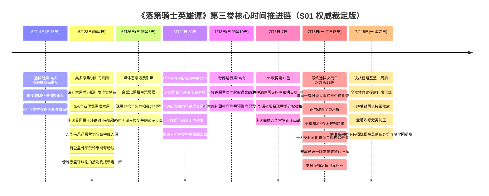

# 第三卷卷内时间线：全量锚定与时序坐标

> **公历推演权威校准**：全卷日期与个人战次严格以 [S01 赛程裁定](../世界书规则/选拔赛2013赛程裁定.txt) 为唯一权威标准。  
> 既往旧表采用的“机械每三天一场严格闭环”、6/3 珠雫战、6/9 奥多摩、6/21 终战及 6/28 任命已全量废止并全面校准为正典日历。  
> **核心基准链**：6/14 珠雫对刀华（R14）→ 6/23 奥多摩事件与一辉被带走 → 6/26 拘禁三天食堂风波 → 6/29 一辉第17战 → 6/30 黑铁严牢房探视 → 7/3 第十天第18战 → 7/5 第19战 → 7/7 拘押两周决斗宣告与刀华夜访 → 7/8 星期一（平日）终战决斗一刀罗刹胜刀华 → 7/15 昏睡一周后代表队任命仪式（海之日）。

---

## 一、大周期背景与选拔战赛程推演链（西历 2013 年）

破军学园七星剑武祭代表选拔战实行“积分淘汰制，一人最多二十场”。以第一卷选拔战首日开幕（4月22日周一）、一辉首战桐原（4月23日周二）、第二卷五月常规二/五排期与六月初前中段赛程为基准，第三卷选拔战后半程与拘押赛程按 [S01 赛程裁定](../世界书规则/选拔赛2013赛程裁定.txt) 严格对齐如下：

| 场次/节点 | 公历日期（2013年） | 星期 | 原著对应卷章与关键原话佐证 | 事实状态 |
|---|---|---|---|---|
| **第 14 战通知** | **6 月 13 日** | **周四** | 第二卷终章 L316：傍晚抽签简讯送达，通知珠雫第十四场对阵东堂刀华。 | `extracted` |
| **第 14 战（R14）** | **6 月 14 日** | **周五** | **第三卷序章～第一章**：正午第一对决场黑铁珠雫 vs 东堂刀华。珠雫底牌尽出惜败；赛后学生会茶会，刀华委托一辉与史黛菈协助调查奥多摩设施巨人异变。 *注：播报中的“十五战全胜”系原著文本内部冲突笔误，S01 严格遵从第十四场通知排期。* | `extracted` |
| **第 15 战（R15）** | 6 月 17 日 | 周一 | 常规正选赛程推进日。 | `proposed` |
| **第 16 战（R16）** | **6 月 20 日** | **周四** | 一辉与学生会主力完成第 16 战，一辉战绩结算至 **16 胜 0 败**。 | `extracted` |
| **奥多摩集训与被捕** | **6 月 23 日** | **周日** | **第三卷第二章**：原著显式标记**「时间到了隔周的星期天」**（`MAT-003#L98`）！午间野餐；午后暴雨史黛菈初次感冒高烧，木屋悉心照料宽衣；岩石巨人袭击，一辉〈犀击〉破敌，御祓泡沫展因果干涉〈绝对不确定性〉，东堂刀华〈疾风迅雷〉引〈雷切〉斩断中继人偶；幕后暗线平贺玲泉左手烧焦断臂与黑影男子（王马）；傍晚赤座守带晚报（偷拍校内树林接吻照）突袭，以伦理委员会名义强行带走一辉。 | `extracted` |
| **常规第 17 战** | 6 月 24 日 | 周一 | 选拔战普通选手第 17 场默认排期。一辉被押送至联盟日本分部地下十楼审讯室接受残酷疲劳讯问。 | `proposed` |
| **拘禁第三天** | **6 月 26 日** | **周三** | **第三卷第三章**：原著显式标记**「拘禁起来，已经过了三天」**（`MAT-003#L226`，6/23 被捕后第 3 天正是 6/26）！外界造谣媒体引爆；史黛菈在食堂自责动摇提及分手，珠雫以〈宵时雨〉冰枪轰飞史黛菈撞碎墙壁怒斥喝醒；黑乃时间倒带修复墙壁，约谈史黛菈宣告绝不判一辉不战而败，并制定等法米利昂国王来访反击方略。 | `extracted` |
| **常规第 18 战** | 6 月 27 日 | 周四 | 选拔战普通选手第 18 场默认排期。 | `proposed` |
| **一辉第 17 战（R17）** | **6 月 29 日** | **周六** | 一辉在羁押期间改期进行的第 17 场选拔战。在分部模拟训练场打响，一辉克服疲劳取得**第十七胜（17 胜 0 败）**。 | `proposed` |
| **黑铁严探视牢房** | **6 月 30 日** | **周日** | **第三卷第三章**：一辉在牢房意象训练高喊「请把女儿交给我吧」，黑铁严推门而入（`MAT-003#L890`）。严亲口提及**「听说你的战绩至今是十六胜零败」**，一辉答**「加上昨天在这里进行的比赛结果，总共是十七胜」**（`MAT-003#L988-990`，严来访正是第17战次日 6/30）！严道出冷酷阶级齿轮论逼一辉放弃骑士之道，一辉精神崩溃无声落泪；严回顶楼默许赤座在食物中投放宪兵自白剂。 | `extracted` |
| **一辉第 18 战（R18）** | **7 月 03 日** | **周三** | **第三卷第三章**：原著显式标记**「带走一辉之后的第十天」**（`MAT-003#L1298`，6/23 之后第 10 天正是 7/3）！联盟日本分部进行一辉第 18 战（对无名 E 级），折木有里监督裁判；折木回校向珠雫、有栖院透露一辉脸色极差、持续剧烈咳嗽，病况异常。一辉取得**第十八胜（18 胜 0 败）**。 | `extracted` |
| **一辉第 19 战（R19）** | **7 月 05 日** | **周五** | 一辉在重度肺炎、高烧、缺氧与自白剂毒害中拼死咬牙拿下第 19 场，战绩达成 **19 战 19 胜 0 败**。 | `proposed` |
| **拘押两周与决斗敲定** | **7 月 07 日** | **周日** | **第三卷第三章尾声至第四章前段**：原著显式标记**「讯问开始后已经过了两周」**（`MAT-003#L1404`，6/23 至 7/7 正好整整两周）！一辉缺氧昏迷被踩后脑勺流鼻血；赤座抛出古老习俗“决斗”陷阱，对手更换为破军最强东堂刀华，并向法米利昂国王谎报已定决斗封死一辉退路；深夜刀华在学生会室私会珠雫劝一辉弃权被拒，泡沫握手开解刀华做自己。 | `extracted` |
| **第 20 战 （选拔决战·平日）** | **7 月 08 日** | **周一** | **第三卷第四章**：原著显式写明当天为**「平日」**（工作日）！ 1. 清晨一辉在风雪大雪幻觉中一步步咳血徒步爬坡赶往破军；正门珠雫接住倒下的一辉，破军全员齐声呐喊赋予一辉背负的重担；史黛菈 3 秒极速夺金获得代表权赶到迎接一辉； 2. 正午第一训练场决战，解说唱名双方**「同样战绩为十九战十九胜零败！」**；92 岁二战传奇〈斗神〉南乡寅次郎亲临见证； 3. 刀华堂堂正正以最强雷切迎战；一辉于生死刹那超越极限，将一刀修罗一分钟压缩至一刹那爆发，创出体能暴涨数百倍的终极禁招——**〈一刀罗刹（Itto Rasetsu）〉**！一击斩碎名刀〈鸣神〉绝杀刀华！ 4. 一辉以 **20 战 20 胜 0 败全胜登顶**破军！赛后通道一辉向史黛菈求婚「我希望你能成为我的家人」，史黛菈应允成为新娘；一辉休克昏迷；史黛菈施展〈抽足〉反手拳将企图行凶的赤座守当场揍飞轰向擂台中央骨折抽搐！ | `extracted` |
| **代表队任命仪式** | **7 月 15 日** | **周一 （海之日）** | **第三卷终章**：原著显式标记**「在那之后，一辉整整睡了一个星期。当一连串事件解决后过了一周——全校学生聚集在平时甚少使用的体育馆里，进行正式的任命仪式」**（`MAT-003#L2`、`L16`）！7/8 决战后昏睡整整 7 天正是 **7 月 15 日（周一·海之日）**！ 1. 新宫寺黑乃宣布六位正式代表名单，并当众任命黑铁一辉为**代表选手团团长**； 2. 东堂刀华亲手将破军校旗郑重托付给一辉，全校齐声雷鸣欢呼**〈无冕剑王（Another one）〉**；一辉向史黛菈低语「被人认同这件事，意外令人开心呢」； 3. 同日傍晚，高架桥下有栖院凪以特殊通讯器联络神秘人，揭晓其“杀人馆”最高分合格者代号**〈黑蔷薇〉/〈黑影凶手〉**，宣告全国大赛真正的主角是反体制集团**「晓」**。 | `extracted` |

---

## 二、卷内核心时间节点全量锚定（Anchor `T01` ～ `T08`）

```mermaid
timeline
    title 《落第骑士英雄谭》第三卷核心时间推进链（S01 权威裁定版）
    6月14日(五 正午) : 选拔战第14战 深海魔女vs雷切 : 珠雫底牌尽出惜败重创 : 学生会室茶会委托奥多摩调查
    6月23日(隔周日) : 奥多摩集训山间暴雨 : 废弃木屋悉心照料发烧史黛菈 : 5米岩石傀儡围攻木屋 : 泡沫显因果干涉绝对不确定性 : 刀华疾风迅雷雷切斩断中继人偶 : 百公里外平贺玲泉断臂暗线 : 傍晚赤座守以偷拍接吻晚报带走一辉
    6月26日(三 拘留3天) : 媒体恶意污蔑引爆 : 食堂史黛菈自责动摇 : 珠雫冰枪当头棒喝轰碎墙壁 : 黑乃时间倒带修复并约谈定反击策
    6月29日-30日 : 6/29分部模拟战取得第17胜 : 6/30黑铁严亲临牢房对峙 : 严道出阶级齿轮论逼其退学 : 一辉信仰崩溃无声落泪 : 严默许赤座在食物中投放自白剂
    7月3日(三 拘留10天) : 分部进行第18战 : 一辉克服重度虚脱取得第18胜 : 折木裁判回校向珠雫预警病况异常
    7月5日-7日 : 7/5取得第19胜 : 7/7拘押满两周赤座宣布明日决斗陷阱 : 刀华深夜私会珠雫求弃权被拒 : 泡沫鼓励刀华堂堂正正出战
    7月8日(一 平日正午) : 最终选拔决战日 双方皆19胜 : 清晨一辉风雪大雪幻觉中挣扎登山 : 正门破军全员声援 : 史黛菈3秒夺金赶到迎接 : 一刀罗刹斩断雷切与鸣神20胜登顶 : 赛后通道一辉求婚史黛菈应允 : 史黛菈抽足揍飞赤座守
    7月15日(一 海之日) : 决战昏睡整整一周后 : 全校体育馆授旗任命仪式 : 一辉受封团长接掌校旗 : 全场欢呼无冕剑王 : 傍晚高架桥下有栖院揭晓黑蔷薇身份与晓学园前瞻
```

---

### `T01` 选拔战第 14 战·深海魔女 VS 雷切（西历 2013 年 6 月 14 日·星期五·正午至午后）

- **时间状态**：`extracted`
- **章节范围**：序章至第一章（`MAT-003#L3–L2210`）
- **时序标志**：承接第二卷终章抽签结果（6月13日傍晚简讯）。代表选拔战中盘高潮。
- **核心事件**：
  1. 序章回溯珠雫童年受宠扭曲、兄长一辉以严厉耳光打醒并引导习武，成为其灰暗童年唯一救赎；五年来苦练魔导只为与兄长并肩登顶；
  2. 正午第一对决场，珠雫迎战破军第一王者东堂刀华；
  3. 战术攻防：珠雫以〈障波水莲〉超纯水绝缘隔绝雷击，夺取热量展开绝对零度冰封与水蒸气大爆炸；刀华施展古流步法〈抽足〉滑入潜意识盲区两度近身划伤珠雫；
  4. 绝境反击：珠雫展开〈白夜结界〉白雾夺去视野，凝聚高压水刃〈绯水刃〉突刺；刀华以电磁生物感应〈闪理眼〉感知神经信号，在白雾中以十步超音速居合〈雷切〉秒杀斩碎水流刀刃与浓雾，珠雫重创倒地，右手仍死死扣住刀华脚腕，虽败犹荣；
  5. 赛后有栖院在保健室拥抱痛哭的珠雫；西京宁音向一辉演示〈抽足〉揉胸史黛菈，解密其师门为 92 岁老骑士〈斗神〉南乡寅次郎；
  6. 刀华摘镜解密〈闪理眼〉原理；学生会室杂乱打闹后，刀华邀请一辉与史黛菈协助调查奥多摩集训场出没的“四公尺巨人”异变。
- **出场人物**：黑铁珠雫、东堂刀华、黑铁一辉、史黛菈·法米利昂、有栖院凪、新宫寺黑乃、西京宁音、御祓泡沫、贵德原彼方、碎城雷、兔丸恋恋、日下部加加美。
- **地点**：破军学园·第一对决场、保健室、学生会办公室。

---

### `T02` 奥多摩集训、病榻宽衣与石傀儡突袭（西历 2013 年 6 月 23 日·星期日·正午至傍晚）

- **时间状态**：`extracted`
- **章节范围**：第二章前中段（`MAT-003#L2211–L4550`）
- **时序标志**：原文明确标记：*“时间到了隔周的星期天。”*（`MAT-003#L98`）。此时一辉选拔战已达 16 胜 0 败。
- **核心事件**：
  1. 黑铁严在新宿联盟分部长室与赤座守暗中筹谋除名一辉之计；
  2. 星期天午间，一辉与史黛菈随学生会抵达奥多摩集训场野餐做乡村咖喱；泡沫向一辉揭开刀华与自己出身于贵德原财团旗下“若叶之家”育幼院的身世，点明刀华强大的泉源是“善意”与背负孩子们的期望，一辉自省己身之剑不曾寄宿他人期待；
  3. 午后山区搜索，史黛菈因日本夏季高温湿热初次感冒高烧瘫软，一辉公主抱护送至紧急避难木屋；
  4. 窗外雷暴大雨，一辉生火为虚脱的史黛菈脱去湿透丝袜与衬衫，解开前扣式胸罩；史黛菈流露软弱询问「你想……跟我做吗？」，一辉以负责态度坦言希望以正当顺序堂堂正正面对其双亲与世人，两人谈及七星剑武祭后一同回法米利昂与黑铁家见父母；
  5. 地鸣震动，五公尺岩石巨人砸碎木屋！一辉开〈一刀修罗〉救出史黛菈，以第一秘剑·〈犀击〉对物奥义贯穿粉碎巨人；
  6. 碎石化为数十具魔力丝线操纵的石人偶围攻；史黛菈带病挥动〈妃龙罪剑〉击碎五具；御祓泡沫登场头颅被砸烂粉碎，施展因果干涉绝技〈绝对不确定性（Black Box）〉将攻击强行扭转为失败安然无恙；
  7. 东堂刀华赶到，识破钢丝使者以“中继人偶（hub）”操纵的铁律，以〈疾风迅雷〉极速突进，以必杀〈雷切〉一刀两断中继人偶，气爆粉碎全场傀儡；刀华公主抱将高烧史黛菈转移至钟乳洞避雨。
- **出场人物**：黑铁一辉、史黛菈·法米利昂、东堂刀华、御祓泡沫、贵德原彼方、碎城雷、兔丸恋恋、黑铁严、赤座守。
- **地点**：奥多摩集训场营地、深山避难小木屋、钟乳洞。

---

### `T03` 幕后暗线交锋与赤座守突袭非法羁押（西历 2013 年 6 月 23 日·星期日·傍晚）

- **时间状态**：`extracted`
- **章节范围**：第二章尾段（`MAT-003#L4551–L4761`）
- **核心事件**：
  1. **幕后黑手暗线**：操纵傀儡的幕后术士身处百公里外阴暗房间，其左手被刀华顺着丝线导流的高压电流彻底烤焦脱落；该高大男子自称属于〈军队〉的〈小丑（pierrot）〉平贺玲泉；黑影潜伏者（黑铁王马）现身与其交谈，提及“猫/史芬克斯”；
  2. 雨停黄昏，一辉背着退烧史黛菈返回山麓，碎城雷赠予家传跌打伤药；
  3. 伦理委员长赤座守率众突袭，出示当晚各大报纸头条——暗中偷拍的一辉与史黛菈在**破军校内林中广场夜晚训练时的接吻照片**，配以“诱骗皇女打假赛”、“黑铁家证实品行恶劣”等恶毒谣言；
  4. 赤座宣布召开内部调查会议验证骑士资质，以涉嫌除名处分强行将一辉从众人眼前羁押带走，一辉平静迎战。
- **出场人物**：平贺玲泉、黑影潜伏者（黑铁王马）、赤座守、黑铁一辉、史黛菈、学生会干部。
- **地点**：秘密室内暗室、奥多摩集训场山麓宿舍前。

---

### `T04` 拘禁调查、食堂冰枪棒喝与父子阶级论决裂（西历 2013 年 6 月 24 日 至 7 月 3 日）

- **时间状态**：`extracted`
- **章节范围**：第三章前中段（`MAT-003#L4762–L6300`）
- **时序推进链**：
  1. **6 月 24 日～25 日（审讯开端）**：地下十楼审讯室红衣委员会 U 型长桌围攻，强迫一辉持续站立受审，朝六晚十一，一日两根随身粮棒并故意断水；一辉堂堂正正肯定与史黛菈真心相爱；
  2. **6 月 26 日（拘禁第 3 天·食堂风波）**：加加美透露伦理委员会以 KOK 报道权要挟报社；史黛菈深陷自责说出「我是不是跟一辉分手比较好」，珠雫暴怒拔刀，一记冰枪将史黛菈连人轰碎墙壁撞飞至室外，厉声怒斥喝醒其软弱；黑乃时间倒带修复墙壁，约谈史黛菈立誓绝不判一辉不战而败，并商定等三周后法米利昂国王来访反戈一击；
  3. **6 月 29 日（R17·第十七胜）**：一辉在分部模拟训练场打响改期比赛，折木有里裁判，取得**第十七胜（17 胜 0 败）**；
  4. **6 月 30 日（黑铁严牢房对峙）**：一辉意象训练模拟面对法米利昂国王，严推门而入；严核实其昨日取得第 17 胜并称赞其了不起；一辉期盼父亲认同询问若七星夺冠能否认同自己；严冷酷道出“阶级齿轮论”——组织需要公开明晰的阶级，弱者硬做出成果只会让下层滋生妄想破坏秩序，命令一辉放弃骑士之道；一辉发现父亲甚至对自己毫无厌恶、仅视如草芥路石，精神支柱崩塌无声痛哭；严回顶楼默许赤座在食物中投放宪兵自白剂；
  5. **7 月 03 日（拘留第 10 天·R18·第十八胜）**：分部进行一辉第 18 战（对无名 E 级），折木有里裁判；一辉剧烈咳嗽艰难取胜（**18 胜 0 败**）；折木回校向珠雫、有栖院预警一辉病况绝非普通感冒，疑遭人为残害。
- **出场人物**：黑铁一辉、赤座守、黑铁严、史黛菈、黑铁珠雫、有栖院凪、日下部加加美、新宫寺黑乃、折木有里。
- **地点**：骑士联盟日本分部地下十楼牢房与审讯室、破军学园食堂与理事长室。

---

### `T05` 决斗陷阱敲定与刀华前夜私会（西历 2013 年 7 月 5 日 至 7 月 7 日）

- **时间状态**：`extracted`
- **章节范围**：第三章尾声至第四章前段（`MAT-003#L6301–L6720`）
- **时序推进链**：
  1. **7 月 05 日（R19·第十九胜）**：一辉在药物毒害与高烧剧咳中坚韧拿下第 19 场，达成 **19 战 19 胜 0 败**；
  2. **7 月 07 日（拘留满两周·决斗宣告）**：连续两周高强度折磨使一辉罹患重度肺炎、严重缺氧与身心崩溃；审讯中一辉体力不支倒地，被踩后脑勺流鼻血；赤座守抛出以古老骑士习俗“决斗”决定一切的陷阱，将最终战对手变更为全胜学生会长东堂刀华，并向法米利昂国王谎报已定决斗封死一辉退路，一辉被迫应战；
  3. **7 月 07 日深夜（刀华私会珠雫）**：刀华收到对战变更通知，自知一辉重病甚至可能在决战中失手将其斩杀，于学生会室深夜私见珠雫请求其劝一辉弃权；珠雫深知兄长决意，耗尽力气请求考虑一晚；御祓泡沫握住刀华的手鼓励她做自己、堂堂正正迎战。
- **出场人物**：黑铁一辉、赤座守、东堂刀华、黑铁珠雫、御祓泡沫。
- **地点**：分部地下审讯室、破军学生会办公室。

---

### `T06` 决战破军之巅·一刀罗刹秒杀雷切登顶（西历 2013 年 7 月 8 日·星期一·平日清晨至正午）

- **时间状态**：`extracted`
- **章节范围**：第四章主体（`MAT-003#L6721–L8655`）
- **时序标志**：原著明确写明当天是**「平日」**（工作日）！双方解说唱名战绩皆为**「十九战十九胜零败！」**。
- **核心事件**：
  1. 清晨赤座故意不备车，一辉在严重肺炎、药物中毒与自白剂引起的寒冬风雪幻觉中，重温幼年无援练剑、初中被折断全指、高中遭桐原凌虐之苦，凭借脑海中史黛菈的红发热度与约定，一步步咳血徒步爬坡赶往破军；
  2. 抵达正门前脱力倒下，被珠雫温暖接住；加加美、绚濑、恋恋、碎城、折木等破军全员齐聚大门大声呐喊声援；一辉彻底领悟自己亦背负着败者与伙伴的愿望，精神涅槃突破；
  3. 史黛菈以 3 秒刷新纪录速胜夺金获得代表权，手持奖牌狂奔而至迎接一辉并呼喊「一起踏上骑士的高峰」；一辉誓言带胜而归；
  4. 正午第一对决场，92 岁二战传奇〈斗神〉南乡寅次郎亲临见证爱徒刀华与老友龙马后裔之战；万人看台舆论被破军声援彻底扭转；
  5. 战术对决：刀华拒绝避战，堂堂正正以不败交叉距离迎战；一辉开场爆发〈一刀修罗〉，以第七秘剑·〈雷光〉超电磁极速突进；
  6. 极意突破：面对刀华毫无保留的必杀〈雷切〉，一辉于生死毫秒间开创将一分钟全部魔力体力浓缩为**一瞬间（一秒）**爆发的终极禁招——**〈一刀罗刹（Itto Rasetsu）〉**！体能爆发暴涨数百倍，一击彻底斩碎名刀〈鸣神〉，刀华倒地！一辉以 **20 战 20 胜 0 败全胜登顶**破军！
  7. 赛后通道求婚：一辉在选手通道倒在史黛菈怀中深情求婚「我希望你能成为我的家人」，史黛菈含泪答应「我会成为一辉的新娘」；一辉休克昏迷；赤座守拔出手斧灵装企图行凶，史黛菈以〈抽足〉反手拳一拳将赤座如卡车撞飞般轰飞至赛场中央骨折抽搐。
- **出场人物**：黑铁一辉、东堂刀华、史黛菈、黑铁珠雫、南乡寅次郎、西京宁音、新宫寺黑乃、赤座守、破军全体师生。
- **地点**：破军校门前坡道、第一对决场擂台、选手通道。

---

### `T07` 代表队任命仪式与加冕无冕剑王（西历 2013 年 7 月 15 日·星期一·海之日）

- **时间状态**：`extracted`
- **章节范围**：终章前段（`MAT-003#L8656–L8874`）
- **时序标志**：原文明确标记：*“在那之后，一辉整整睡了一个星期。当一连串事件解决后过了一周——”*（7/8 决战昏睡 7 天正是 **7 月 15 日周一·海之日**）。
- **核心事件**：
  1. 法米利昂国王获悉决斗真相大怒问责，伦理委员会与造谣媒体全面失势，赤座守彻底垮台；国王声明保留至七星赛后当面考核，一辉声誉全面平反；
  2. 全校学生齐聚体育馆举行正式任命仪式，新宫寺黑乃宣布六位正式代表名单：
     - 一年级 A 级：史黛菈·法米利昂
     - 三年级 D 级：叶暮牡丹
     - 三年级 B 级：贵德原彼方
     - 三年级 C 级：叶暮桔梗
     - 一年级 D 级：有栖院凪（请假缺席）
     - 一年级 F 级：黑铁一辉
  3. 黑乃宣布全胜战绩的黑铁一辉出任**代表选手团团长**；
  4. 卸任团长东堂刀华郑重将破军校旗移交托付给一辉，期许其带领大家登上七星之巅；一辉高举校旗，全校雷鸣般齐声欢呼**〈无冕剑王（Another one）〉**；一辉对史黛菈低语「被人认同这件事，意外令人开心呢」。
- **出场人物**：黑铁一辉、史黛菈·法米利昂、东堂刀华、贵德原彼方、叶暮姐妹、新宫寺黑乃、破军全体学生。
- **地点**：破军学园·大体育馆。

---

### `T08` 高架桥下的暗杀者与晓学园前瞻（西历 2013 年 7 月 15 日·傍晚）

- **时间状态**：`extracted`
- **章节范围**：终章尾声（`MAT-003#L8875–L8920`）
- **核心事件**：
  1. 欢庆仪式同日傍晚，缺席仪式的有栖院凪在杳无人烟的高速公路高架桥下以特殊终端联络神秘人；
  2. 神秘人揭晓有栖院真实身份为暗杀组织“杀人馆（Killing House）”历代最高分合格者，代号**〈黑蔷薇〉/〈黑影凶手〉**；
  3. 两人谈及黑铁王马对珠雫落选的冷淡评价，并宣告全国七星剑武祭真正的主角是反体制势力——**「晓」**。
- **出场人物**：有栖院凪、晓学园神秘联络人。
- **地点**：东京都内·高速公路高架桥下。

---

## 三、第三卷时间锚定速查与 MVU 契约映射表

在 SillyTavern 剧情推进与 MVU 状态控制器中，当前卷设定为 `3`，场景时间与状态标记严格按照下表注入：

| 章节键 | 标准化场景地点 | 规范化时间坐标（S01权威标准） | 核心已发生事件事实锚 |
|---|---|---|---|
| **序章** | 第一对决场选手通道 / 擂台候场 | 西历 2013 年 6 月 14 日（星期五）·正午前（选拔战第 14 战揭幕日） | `珠雫幼年耳光回忆`、`五年来为兄修武`、`第十四战候场对峙东堂刀华` |
| **第一章** | 第一对决场擂台、学生会办公室 | 西历 2013 年 6 月 14 日（星期五）·正午至午后（选拔战第 14 战及赛后） | `深海魔女对雷切`、`抽足潜意识盲区`、`闪理眼识破白夜结界`、`超音速雷切绝杀`、`南乡寅次郎名号初现`、`奥多摩巨人委托` |
| **第二章** | 联盟分部长室、奥多摩山地小木屋、钟乳洞 | 西历 2013 年 6 月 23 日（星期日）·正午野餐至傍晚黄昏（隔周星期天） | `第十六胜`、`乡村咖喱与若叶之家善意剑理`、`史黛菈初次感冒高烧`、`木屋宽衣烤火与见父母之约`、`第一秘剑犀击破石巨人`、`泡沫因果干涉绝技`、`刀华疾风迅雷雷切破中继人偶`、`平贺玲泉断臂暗线`、`偷拍接吻晚报与一辉被捕` |
| **第三章** | 联盟地下十楼审讯室/牢房、破军食堂 | 西历 2013 年 6 月 24 日 至 7 月 7 日（羁押整整两周期） | `疲劳审讯与断水`、`食堂史黛菈自责与珠雫冰枪棒喝`、`第17与18胜`、`黑铁严阶级齿轮论`、`一辉信仰崩塌落泪`、`自白剂药物毒害`、`赤座决斗陷阱与刀华夜访珠雫` |
| **第四章** | 破军校门前坡道、第一对决场万人看台 | 西历 2013 年 7 月 8 日（星期一·平日）·清晨至正午（最终决战日） | `风雪大雪幻觉中挣扎登山`、`破军全员正门声援`、`史黛菈3秒夺金赶到`、`南乡寅次郎现场见证`、`双方十九胜`、`一刀罗刹秒杀雷切绝杀鸣神`、`二十战全胜登顶`、`通道深情求婚新娘应允`、`史黛菈抽足揍飞赤座守` |
| **终章** | 破军大体育馆、都内高架桥下暗渠 | 西历 2013 年 7 月 15 日（星期一·海之日）·上午至傍晚（昏睡一周后） | `一辉受任代表队团长`、`刀华移交托付破军校旗`、`全校加冕无冕剑王`、`各大学园全国代表集结`、`有栖院黑蔷薇真面目`、`晓学园暗线浮出` |
