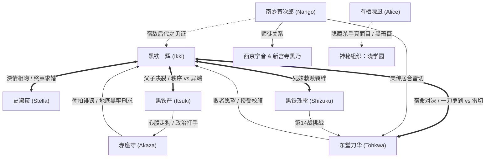

# 第三卷出场人物索引

> **纳入标准**：第三卷中明确具名、或具备独立对白、战力机制、核心过往与推动主线功能的人物。重点对**当前世界书条目库中尚未收录的新角色**展开详尽外貌、身份与能力拆解。

---

## 一、 第三卷全新出场人物（条目库缺失重点）

| 人物 ID | 显示名 | 身份与称号 | 首次登场 | 核心外观与体态特征 | 固有能力 / 灵装 / 战力机制 | 剧情功能与性格阵营 |
|---|---|---|---|---|---|---|
| `char-torajiro-nango` | **南乡寅次郎** | 原日本代表 / 现役最年长骑士 /〈斗神（God of War）〉 | CH-01 提及，CH-04 正式登场 | 现年 92 岁。身材矮小干瘪、秃顶长眉、胡须拉碴、满脸皱纹堆叠犹如干货；看似风中残烛，但眼睑深处会骤然爆发出如苍鹰捕猎般的凌厉精光。 | **拔刀术世界顶点**。东堂刀华超音速居合〈雷切〉的原创鼻祖；洞察力入木三分，一眼看穿一辉与刀华交战的毫秒级胜负手；身负世界顶级体能与深不可测之剑道神域。 | **正义/武道超然立场**。西京宁音与新宫寺黑乃之师，东堂刀华之秘传剑术师父，大英雄黑铁龙马一生的最大劲敌与莫逆之交。性格放浪好色、言语轻浮（常性骚扰女徒弟被宁音暴打），但大智若愚、武德崇高，亲临决战见证新时代诞生。 |
| `char-itsuki-kurogane` | **黑铁严** | 国际魔法骑士联盟日本分部部长 / 黑铁家当代当主 | CH-02 登场，CH-03 牢房对峙 | 身材高大笔挺、面容冷峻如生铁浇铸、下颌如斧凿刀劈；留有打理极整齐的深黑短发，一双**如死寂深灰生铁般的冰冷眼瞳**，不带丝毫人类温情；常着黑色高级三件套西装。 | **联盟最高权力掌控者 / 高阶骑士**。虽未直接出刀，但浑身散发着如西伯利亚冻土般令人窒息的上位政治家与资深武人威压。 | **冷酷政治家 / 纯血秩序捍卫者**。一辉、王马、珠雫之生父。其行事非出市井私怨，而是出于维护“现代魔法骑士秩序”的绝对信念：坚信唯有高魔力精英能维系国家安全，认定 F 级逆袭会动摇联盟权威基石。在黑牢以政治利益冷酷逼迫一辉退学，被一辉坚决回绝。 |
| `char-mamoru-akaza` | **赤座守** | 骑士联盟日本分部伦理委员长（执行官）/ 黑铁分家当家 | CH-02 登场，贯穿 CH-03 至 CH-04 | 身材微胖浮肿、油头粉面、身着考究西服；长着一张看似有福相的富态圆脸，但一笑便露出**极其阴鸷、可疑而滑溜黏腻的令人作呕笑容**；眼神满是投机者的毒蛇精光。 | **行政权力 / 政治打手**。非一线战斗型伐刀者，擅长利用国家机构审查权、操纵媒体黑料、制造假新闻与法纪陷阱。 | **反派打手 / 阴险小人**。黑铁家宗家的忠实鹰犬。负责做一切上不得台面的脏活：偷拍一辉与史黛菈接吻、炮制丑闻专刊、在地下黑牢对一辉实施剥夺睡眠/绝食等卑劣刑求；操纵公开处刑战企图借刀华之手虐杀一辉。一辉绝杀胜出后心理防线彻底崩溃。 |

---

## 二、 卷内既有人物（战力进化与重大机制质变）

| 人物 ID | 显示名 | 卷内战力与机制重大质变 | 核心主线事件与心境发展 |
|---|---|---|---|
| `char-tohkwa-todo` | **东堂刀华** | 完整解密破军最强战力：固有灵装日本刀〈鸣神〉，电磁生物感应〈闪理眼〉，十步必杀超音速拔刀居合〈雷切〉，〈疾风迅雷〉，〈建御雷神〉。 | 第 14 战雷切秒杀珠雫；奥多摩协助一辉；最终战摒弃赤座的政治指令，摘下眼镜全力拔刀迎战一辉，战败后亲手托付破军校旗。 |
| `char-ikki-kurogane` | **黑铁一辉** | **开创终极禁招〈一刀罗刹（Itto Rasetsu）〉**：将一刀修罗全部魔力体能极限压缩为**一击（一秒 / 一瞬间）**爆发，极速超常人体魄数百倍！一刀斩断雷切！ | 奥多摩与史黛菈接吻互定终身；地下黑牢硬抗赤座刑求与黑铁严威逼；决战绝境创出一刀罗刹绝杀刀华登顶；受封代表队团长并公开向史黛菈求婚；正名〈无冕剑王〉。 |
| `char-stella-vermillion` | **史黛菈·法米利昂** | 龙威与皇室炽炎威慑；在奥多摩流露脆弱娇软一面，与一辉达成灵魂伴侣契约。 | 淋雨发烧受一辉照料并深情拥吻；一辉被捕后为之一掷千金与狂怒奔走；决战看台带领全场声援一辉；终章激动泪崩接受一辉当众求婚。 |
| `char-sizuku-kurogane` | **黑铁珠雫** | 展现水系魔导巅峰：〈水色轮回〉、绝对零度热量剥夺、水蒸气爆炸、水雾折射视觉遮蔽与隐身刺杀。 | 第 14 战底牌尽出虽败犹荣；在病榻上得知哥哥受难心急如焚；虽落选七星代表但被全校公认为无冕之星。 |
| `char-alice-arisuin` | **有栖院凪** | **惊天身份揭晓**：暗杀组织“杀人馆”历代最高分合格者，代号**〈黑蔷薇〉/〈黑影凶手〉**，操控影子的顶级刺客。 | 平日作为温暖知心室友奔走营救一辉；终章在高架桥下卸下伪装，冰冷联络反体制势力“晓学园”，揭露其为渗透破军的潜伏者。 |
| `char-foam-mifune` | **御祓泡沫** | **因果干涉神技全貌展示**：〈无法观测（Fifty-Fifty）〉，将一切攻击伤害、物理冲击或异常状态强行化为虚无对半。 | 第二章奥多摩轻松化解巨石傀儡暴动；平时看似轻浮幼稚的白发正太，实为深不可测的学生会副会长。 |
| `char-kurono-shinguji` | **新宫寺黑乃** | 政治手腕与师门羁绊：硬顶联盟总部的除名施压；邀请师父南乡寅次郎亲临赛场；确保一辉登台资格。 | 誓死捍卫破军独立办学自治权；赛后反将赤座守与黑铁严一军，确立一辉团长地位。 |

---

## 三、 第三卷角色关系网络

