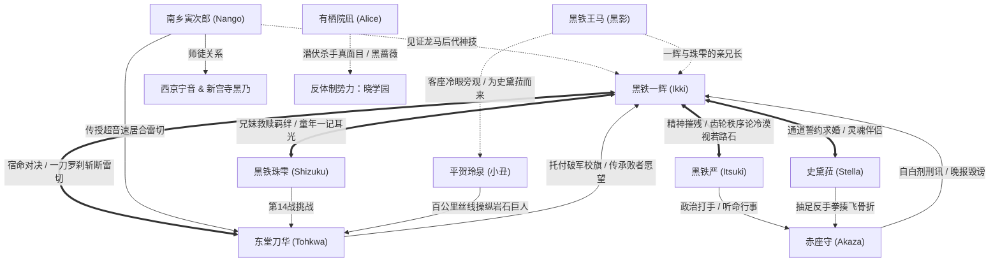

# 第三卷出场人物索引

> **纳入标准**：第三卷中明确具名、或具备独立对白、战力机制、核心过往与推动主线功能的人物。重点对**第三卷新登场人物（含暗线核心人物）**展开详尽外貌、身份与能力拆解，并根据原著放大镜核实修正所有战力与剧情事实。

---

## 一、 第三卷全新出场人物（含暗线与关键配角）

| 人物 ID | 显示名 | 身份与称号 | 首次登场 | 核心外观与体态特征 | 固有能力 / 灵装 / 战力机制 | 剧情功能与性格阵营 |
|---|---|---|---|---|---|---|
| `char-torajiro-nango` | **南乡寅次郎** | 原日本代表 / 现役最年长骑士 /〈斗神（God of War）〉/〈浪速之虎〉 | CH-01 提及，CH-04 正式现身观战席 | 现年 92 岁。身材矮小干瘪、秃顶长眉、胡须拉碴、满脸皱纹堆叠犹如干货；看似风中残烛，但双眸深处会骤然爆发出如苍鹰捕猎般的凌厉精光。 | **拔刀术世界顶点**。超音速居合〈雷切〉原型奥义〈音切〉的原创鼻祖；洞察力入木三分，一眼看穿一辉自创〈一刀罗刹〉的压缩爆发本质（“把整整一分钟的爆发力压缩进这一刀，将骨头当成火药炸开”）。 | **正义/武道超然立场**。西京宁音与新宫寺黑乃之师，东堂刀华之秘传剑术师父，大英雄黑铁龙马一生的最大劲敌与莫逆之交。性格放浪好色、言语轻浮（常性骚扰女徒弟被宁音暴打），但大智若愚、武德崇高，亲临决战见证新时代诞生。 |
| `char-itsuki-kurogane` | **黑铁严** | 国际魔法骑士联盟日本分部部长 / 黑铁家当代当主 /〈铁血〉 | CH-02 登场，CH-03 牢房探视 | 身材高大笔挺、面容冷峻如生铁浇铸、下颌如斧凿刀劈；留有打理极整齐的深黑短发，一双**如死寂深灰生铁般的冰冷眼瞳**，不带丝毫人类温情；常着高级黑色三件套西装。 | **联盟最高权力掌控者 / 高阶骑士**。散发着令空气凝固的上位政治家与深资武人威压。 | **冷酷政治家 / 纯血秩序捍卫者**。一辉、王马、珠雫之生父。其行事非出于私怨，而是出于维护社会阶级稳定的绝对工具理性：坚信社会由 99% 的齿轮与 1% 的天才构成，F 级无才者硬得出成果只会滋生下层不切实际的妄想破坏秩序。在黑牢以冷酷的“齿轮毒素论”要求一辉退学，其如待路石般的绝对冷漠彻底粉碎了一辉渴望得到父亲认同的精神支柱。 |
| `char-mamoru-akaza` | **赤座守** | 骑士联盟日本分部伦理委员长（执行官）/ 黑铁分家当家 | CH-02 登场，贯穿 CH-03 至 CH-04 | 身材微胖如酒桶浮肿、油头粉面、身着赤红西装；长着一张看似有福相的惠比寿神圆脸，但一笑便露出**极其阴鸷、滑溜黏腻的恶毒神色**；眼神满是投机者的毒光。 | **持有手斧型态固有灵装**。擅长动用行政审查权、操纵媒体黑料、使用战后禁用的宪兵自白剂进行精神刑讯。在第四章通道企图拔出手斧袭击昏迷的一辉，被史黛菈施展古流步法〈抽足〉反手一拳轰飞砸入擂台，全身多处骨折抽搐瘫倒。 | **反派打手 / 阴险小人**。黑铁宗家忠实走狗。负责一切脏活：借破军林中广场接吻照炮制晚报丑闻、在特别拘留所动用强光/剥夺睡眠/自白剂残暴折磨一辉；将最终战推上全国直播企图公开处刑。随着一辉获胜自身政治生涯彻底毁灭而发疯。 |
| `char-reisen-hiraga` | **平贺玲泉** | 机关傀儡师 /〈小丑（pierrot）〉/ 晓学园成员 | CH-02 暗线正式登场 | 身体高大，面容轻浮阴冷；身体经过非人的人偶机械改造。 | **灵装为傀儡丝线**。能自数百公里外通过中继傀儡远距离操纵奥多摩的大群岩石巨人；在奥多摩左手被刀华的超高压雷电顺丝线电焦炭化后，右手轻动将焦黑左臂完整切断脱落，毫无痛感且谈笑风生。 | **反体制暴徒 / 晓学园核心执行者**。自称属于〈军队〉，性格扭曲以玩弄人心为乐。在第二章结尾暗处测试傀儡性能，为七星剑武祭前夜祭做准备。 |
| `char-ouma-kurogane` | **黑铁王马** | 黑铁家长男 / 初代〈无冕剑王〉/〈风之剑士〉/ 晓学园客座 | CH-02 结尾以高大黑影现身 | 身材异常高大魁梧、伫立在阴暗中散发极度凌厉霸道的凶险剑气。 | **操纵风之力量的极致剑士**。实力深不可测，黑铁家公认的最强天才。 | **纯粹求道者 / 晓学园客座成员（Guest）**。一辉与珠雫的亲兄长。第二章暗线现身于平贺玲泉身后，轻蔑俯视小丑断手，直言参与晓学园只是为了与强敌（红莲皇女史黛菈）交手，轻蔑称莎拉为“用胶水黏翅膀的猫”，并在小丑调侃时冷酷离去。平贺玲泉在其离开后感叹其应多学学“单纯的弟弟（一辉）”。 |

---

## 二、 卷内既有人物（战力进化与重大机制质变）

| 人物 ID | 显示名 | 卷内战力与机制重大质变 | 核心主线事件与心境发展 |
|---|---|---|---|
| `char-tohkwa-todo` | **东堂刀华** | 完整解密破军最强战力：固有灵装日本刀〈鸣神〉，电磁生物神经与水分子感应〈闪理眼〉，十步必杀超音速拔刀居合〈雷切〉，古流步法〈抽足〉，〈疾风迅雷〉，〈建御雷神〉。 | 第 14 战以雷切正面击破珠雫；奥多摩协助清剿傀儡；最终战摘下眼镜摒弃私心以纯粹武道全力迎战一辉，鸣神折断战败后，在 7/15 大典亲手托付破军校旗。 |
| `char-ikki-kurogane` | **黑铁一辉** | **开创终极禁招〈一刀罗刹（Itto Rasetsu）〉**：突破极限将一刀修罗一分钟全部力量压缩为仅仅**一击（一刹那）**爆发，极速超常人体魄数百倍！一刀斩断鸣神与雷切！一击后骨骼肌肉撕裂休克。 | 奥多摩木屋悉心照料发热史黛菈并许下拜访双方父母承诺；特别拘留所硬抗赤座刑求与自白剂；面对父亲黑铁严的“齿轮论”精神支柱粉碎无声落泪；决战绝境创出一刀罗刹绝杀刀华登顶（20胜0败）；**赛后在通道门外向史黛菈求婚**；7/15 受封代表队团长，正名〈无冕剑王〉。 |
| `char-stella-vermillion` | **史黛菈·法米利昂** | 龙威与炽炎；掌握古流步法〈抽足〉（仅凭原理即可实战重现）。 | 奥多摩因不耐湿热高烧瘫软受一辉照料；接吻照片被做文章引发轩然大波；决战抢麦带领万人声援一辉；**在赛后通道含泪答应一辉的求婚**；随后以〈抽足〉反手一拳将持手斧偷袭的赤座守打飞几十米砸入擂台骨折抽搐。 |
| `char-sizuku-kurogane` | **黑铁珠雫** | 展现水系魔导巅峰：固有灵装小太刀〈宵时雨〉、〈冻土平原〉、〈水牢弹〉、〈障波水莲〉（纯水绝缘）、水分身、〈白夜结界〉（大雾遮蔽）、〈绯水刃〉。 | 序章揭露童年被一辉一记耳光拯救的心路历程；第 14 战战至最后一刻抓紧刀华脚踝虽败犹荣；在保健室有栖院怀中痛哭；决战前夜斥责刀华必须全力以赴。 |
| `char-alice-arisuin` | **有栖院凪** | **真实身份惊天揭晓**：暗杀组织“杀人馆”历代最高分合格者，代号**〈黑影凶手（Black Sister）〉与〈黑蔷薇（Black Rose）〉**，操控影子的顶级刺客。 | 平日作为温柔室友安抚珠雫、奔走调查营救一辉；终章在高架桥下卸下伪装，以冷酷真容与反体制势力“晓学园”通话，揭露其为潜伏者。 |
| `char-foam-mifune` | **御祓泡沫** | **因果干涉神技展示**：〈绝对不确定性（Black Box）〉/ 称号〈无法观测（Fifty-Fifty）〉，将一切物理冲击与命运因果强行抹消归零。 | 第二章奥多摩巡逻中以因果干涉轻松化解岩石巨人暴动，一拳粉碎巨石傀儡；平时看似轻浮幼稚的小学生外貌，实为深不可测的学生会副会长。 |
| `char-kurono-shinguji` | **新宫寺黑乃** | 政治手腕与师门羁绊：硬顶联盟总部的除名施压；邀请恩师南乡寅次郎亲临赛场；确保一辉选拔赛正当权利。 | 誓死捍卫破军独立办学自治权；任命一辉为破军代表团队长。 |

---

## 三、 第三卷角色关系网络（正典校准版）

```mermaid
graph TD
    A["黑铁一辉 (Ikki)"] <==>|"通道誓约求婚 / 灵魂伴侣"| B["史黛菈 (Stella)"]
    A <==>|"精神摧残 / 齿轮秩序论冷漠视若路石"| C["黑铁严 (Itsuki)"]
    C -->|"政治打手 / 听命行事"| D["赤座守 (Akaza)"]
    D -->|"自白剂刑讯 / 晚报毁谤"| A
    B -->|"抽足反手拳揍飞骨折"| D
    
    A <==>|"宿命对决 / 一刀罗刹斩断雷切"| E["东堂刀华 (Tohkwa)"]
    E -->|"托付破军校旗 / 传承败者愿望"| A
    
    F["南乡寅次郎 (Nango)"] -->|"传授超音速居合雷切"| E
    F -->|"师徒关系"| G["西京宁音 & 新宫寺黑乃"]
    F -.->|"见证龙马后代神技"| A
    
    H["黑铁珠雫 (Shizuku)"] -->|"第14战挑战"| E
    A <==>|"兄妹救赎羁绊 / 童年一记耳光"| H
    
    I["有栖院凪 (Alice)"] -.->|"潜伏杀手真面目 / 黑蔷薇"| J["反体制势力：晓学园"]
    
    K["平贺玲泉 (小丑)"] -->|"百公里丝线操纵岩石巨人"| E
    L["黑铁王马 (黑影)"] -.->|"客座冷眼旁观 / 为史黛菈而来"| K
    L -.->|"一辉与珠雫的亲兄长"| A
```
