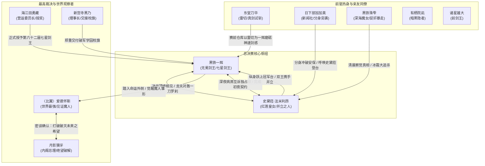

# 《落第骑士英雄谭》第九卷：出场人物全量索引与阵营图谱

本索引严格遵循 `character-visual-lore-dossier` 规范与工程基线，整理第九卷具名登场、主导决战、参与颁奖盛典或承担关键世界线见证的全部角色。严格锚定第九卷文本，严禁跨卷时间线剧透。

---

## 一、 阵营分布总览

```text
┌─────────────────────────────────────────────────────────────────────────┐
│ 破军学园 (Hagun Academy)                                                │
│ - 黑铁一辉（落第骑士/无冕剑王/一刀罗刹破限/荣膺第六十二届七星剑王）         │
│ - 史黛菈·法米利昂（红莲皇女/自知巨龙极境/七星剑武祭亚军/并立之人）          │
│ - 黑铁珠雫（深海魔女/赛前探视/清晨捉奸暴走狂追史黛菈/看台欢送）             │
│ - 有栖院凪（黑爱丽丝/陪伴珠雫/医务室看护与调侃）                           │
│ - 东堂刀华（雷切/前学生会长/赛前空仓库以鸣神雷切真剑为一辉热身）            │
│ - 诸星雄大（前七星剑王/焦土之乱幸存者/陪同刀华为一辉加油助威）              │
│ - 日下部加加美（新闻社/分身突入颁奖台/促成双王并立永恒名场面）              │
│ - 兔丸恋恋（速度中毒/学生会主力/清晨新干线赶赴大阪巨蛋）                   │
│ - 碎城雷（粉碎之壁/学生会重装防御/同行助阵）                              │
│ - 贵德原彼方（学生会书记兼会计/优雅助阵）                                  │
│ - 新宫寺黑乃（理事长/世界第三/为一辉郑重交接破军校旗）                      │
│ - 西京宁音（特聘讲师/世界第四/见证徒弟史黛菈与一辉巅峰碰撞）                │
├─────────────────────────────────────────────────────────────────────────┤
│ 晓学园 (Akatsuki Academy) / 解放军 (Rebellion) 与超常观察者             │
│ - 〈比翼〉爱德怀斯（世界最强剑士/世界三大魔人之一/看台注视一辉觉醒并赞叹）   │
│ - 月影獏牙（内阁总理大臣/看台与比翼密会/确认一辉开辟对抗绝望的新未来）      │
│ - 莎拉·布拉德莉莉（染血达文西/看台为一辉与史黛菈真诚鼓掌祝贺）              │
│ - 风祭凛奈（魔兽使/看台傲娇声称要挖角一辉当执事）                          │
│ - 夏洛特·科黛（凛奈女仆/面无表情低吼侍奉）                                │
├─────────────────────────────────────────────────────────────────────────┤
│ 竞争对手与赛事营运要员                                                  │
│ - 仓敷藏人（剑士杀手/贪狼学园前八强/强装不悦现身观众席见证）                │
│ - 绫辻绚濑（最后武士之女/破军选拔选手/强占藏人亲友票入场为恩人一辉祝贺）    │
│ - 海江田勇藏（营运委员长/亲自主持颁奖盛典并授予一辉剑王证书）              │
│ - 饭田播报员（现场热血实况转播/宣告新任七星剑王诞生）                      │
└─────────────────────────────────────────────────────────────────────────┘
```

---

## 二、 核心登场人物多维矩阵

| 人物标识 ID | 姓名 / 常用称号 | 阵营 / 身份 | 灵装与核心能力 | 卷内核心事件与命运转折 | 原文对应章节与行号基线 |
|---|---|---|---|---|---|
| `CHAR-001` | **黑铁一辉**<br>〈无冕剑王 / 七星剑王〉 | 破军学园一年级<br>大赛总冠军 | 固有灵装：〈阴铁〉<br>核心：〈一刀修罗〉、〈一刀罗刹〉、神速剑理、踏入命运外侧（魔人雏形） | 赛前接受刀华【雷切】热身；总决赛战胜史黛菈登顶七星之巅；深夜病房告白并完成初夜；颁奖台上高举校旗，与史黛菈并立接受全国欢呼。 | 第十四章 L540-1150<br>终章（前） L2468-3669<br>终章（后） L6137-7827 |
| `CHAR-002` | **史黛菈·法米利昂**<br>〈红莲皇女〉 | 破军学园一年级<br>大赛亚军 / 皇女 | 固有灵装：〈妃龙罪剑〉<br>核心：〈自知巨龙〉、〈妃龙羽衣〉、〈燃天焚地龙王炎〉 | 决赛倾尽真龙之力与一辉鏖战至力竭；深夜回应一辉爱意完成初夜契约；次日被珠雫狂怒追杀；颁奖典礼跃上冠军台成就【并立之人】；订下一周后法米利昂机票。 | 终章（前） L2468-3590<br>终章（后） L6137-7827 |
| `CHAR-003` | **东堂刀华**<br>〈雷切〉 | 破军学园三年级<br>原学生会长 | 固有灵装：〈鸣神〉<br>核心：闪电拔刀术〈雷切〉、远距离雷刃〈雷鸥〉 | 赛前清晨在地下空仓库现身，为消除一辉心跳复苏后的微弱迟滞感，主动拔刀实战试斩，引导一辉将神速剑感打磨至完美无瑕。 | 第十四章 L546-1150 |
| `CHAR-004` | **日下部加加美**<br>〈新闻社王牌〉 | 破军学园一年级<br>一辉与史黛菈好友 | 固有能力：分身制造（多体重影） | 颁奖典礼最高潮时，召唤数十个分身强行突破安保封锁突入战圈，大声喝止史黛菈待在亚军席，促成史黛菈跃上冠军台成就永恒“并立之人”。 | 终章（后） L1616-1690 |
| `CHAR-005` | **黑铁珠雫**<br>〈深海魔女〉 | 破军学园一年级<br>一辉亲妹 | 固有灵装：〈宵时雨〉<br>核心：水与冰霜操控 | 赛前探望一辉安危；决赛全程揪心观战；次日清晨敏锐识破一辉与史黛菈的深夜初夜秘密，暴走掀起冰霜暴风追杀史黛菈；颁奖时由衷为兄长鼓掌。 | 终章（前） L3550-3564<br>终章（后） L1156-1288, L1570 |
| `CHAR-006` | **〈比翼〉爱德怀斯**<br>〈Edelweiss〉 | 国际最强散人<br>世界三大魔人之一 | 双剑术天花板<br>核心：零与一百无声神速剑 | 隐匿于观众席中全程观战，亲眼见证一辉以【一刀罗刹】跨出命运外侧进入魔人领域，向月影总理感叹新时代的未来已经诞生。 | 终章（前） L3602-3654 |
| `CHAR-007` | **月影獏牙**<br>（内阁总理大臣） | 日本政府最高首脑 | 非战斗系未来视 | 看台上与爱德怀斯并肩观战，见证一辉突破命运桎梏，欣慰地确认自己所预见之“充满绝望与破灭的未来”终于出现了能够打破宿命的真正希望。 | 终章（前） L3630-3668 |
| `CHAR-008` | **有栖院凪**<br>〈黑爱丽丝〉 | 破军学园一年级 | 固有灵装：〈暗黑隐者〉 | 身体恢复后陪伴珠雫探望一辉，在医务室一眼识破两人暧昧气氛并调侃，在颁奖典礼看台上为一辉送上欢呼。 | 终章（后） L1182-1200, L1568 |
| `CHAR-009` | **诸星雄大**<br>〈前七星剑王〉 | 武曲学园三年级 | 固有灵装：长枪〈虎王〉 | 陪同刀华为一辉进行赛前试剑打气；看台见证一辉夺冠，爽朗宣布明年准备复读继续挑战被队友吐槽。 | 第十四章 L546-600<br>终章（后） L1586-1594 |

---

## 三、 人物因果与羁绊网络 (Mermaid Topology)



---

## 四、 本卷人物成长与精神嬗变深度总结

1. **黑铁一辉：从“底层挣扎者”向“命运主宰者与伴侣核心”的终极蜕变**  
   第九卷见证了一辉在三个维度的全面成熟：在武道上，他面对天生魔力差距不再产生丝毫劣等感，凭借踏入“命运外侧”的超常悟性斩出〈一刀罗刹〉夺得剑王桂冠；在心理与情感上，他彻底摒弃了不切实际的自我压抑，坦承对史黛菈的强烈独占欲与渴求，完成了由青涩少年向担当男人的转变；在社会身份上，他真正成为肩负破军与日本学生骑士领袖的真正英雄。

2. **史黛菈·法米利昂：从“单向期待的皇女”向“并立一生的爱人”**  
   史黛菈在决战中展现了无懈可击的王者尊严，即使败北亦不流一滴眼泪，将其全数转化为明年变强的养分。当她跳上最高领奖台与一辉紧紧相拥时，完成了轻小说女性角色罕见的尊严升华——她绝非等待英雄施舍怜悯的附庸，而是拥有同等骄傲、能与英雄并肩俯瞰天下的“并立之人”。

3. **东堂刀华与前辈骑士的传承气度**  
   东堂刀华在决战清晨不顾自身名位，甘愿作为一辉的磨刀石拔刀相助，展现了破军学园代代相承的崇高武德；诸星雄大等昔日死敌在看台上的真挚祝福，印证了一辉这一路走来不仅战胜了对手，更以其纯粹的剑道感染并赢得了整个世代强者的由衷敬意。
