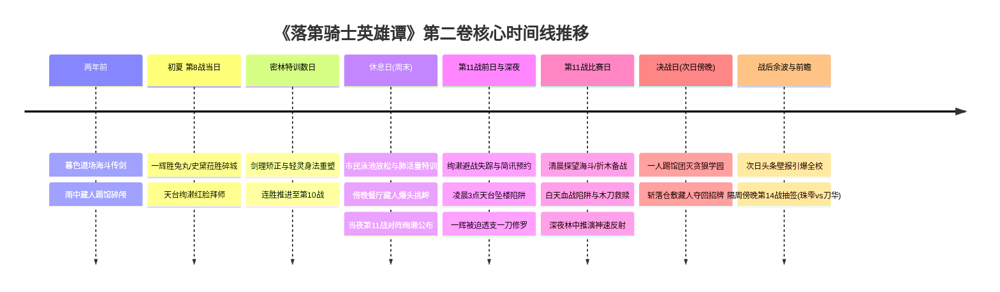

# 第二卷卷内时间线：全量锚定与时序坐标

> **权威材料依据**：`落第骑士英雄谭 第二卷 gbk.txt`（`MAT-002`，7,640 行全量原著正文）  
> **时间规范原则**：严格基于原著显式时间词、比赛场次推移、日月星辰昼夜、学期进程与相对间隔，不捏造虚假公历年月日。  
> **事实状态标定**：`extracted`（原文显式字句确认）、`proposed`（卷内情节连续逻辑推导）。

---

## 一、大周期背景与学期时间基准

| 时间维度 | 原著显式判定 | 原文出处与行号 | 叙事与世界观定位 |
|---|---|---|---|
| **起始季节** | **初夏（约 5 月中下旬）** | L343 (`MAT-002#L343`)：*“季节进入初夏，新生枝芽逐渐茂密且显得活力十足。”* L1025 (`MAT-002#L1025`)：*“日本的初夏相当闷热……”* L1566 (`MAT-002#L1566`)：*“身穿一袭凉爽的白色洋装，非常适合现在的初夏时节。”* | 破军学园春学期进行中，距离 4 月初春假入学已过一个半月。 |
| **选拔战跨度** | **选拔战开幕已逾一个月** | L341 (`MAT-002#L341`)：*“从七星剑武祭代表选拔战开始，已经过了一个多月。”* L553 (`MAT-002#L553`)：*“代表选拔战开始后，已经过了一个月，已经筛选出不少有力选手。”* | 第一卷第四章周一开幕、周二一辉胜桐原。本卷起点已大幅推进，非开幕次日。 |
| **战绩起点** | **八战八胜零败** | L63 (`MAT-002#L63`)：*“他至今的战绩为八战八胜零败……”* L247 (`MAT-002#L247`)：*“【史黛菈】至今八战八胜零败！全都是因为对手主动弃权，不战而胜！”* | 一辉已连胜 7 场无名/上位对手；第二卷第一章打响其个人的第 8 战。 |
| **赛程上限** | **一人最多二十场** | L3014 (`MAT-002#L3014`)：*“选拔战一人最多只有二十场。”* | 采用总积分筛选机制，输掉一场将面临代表权极度危险的容错劣势。 |

### 1.1 第一卷时间锚与选拔战赛程推演链

- **第一卷基准时间锚**：
  - 破军学园开学典礼在 4 月中旬；
  - 购物中心解放军事件发生在周日；
  - 选拔战首日为周一（4 月 22 日，珠雫胜管、史黛菈胜桃谷）；
  - 一辉首战桐原为周二（4 月 23 日，一刀修罗一战成名）。
- **“每 3 天一场”与黄金周休假推演链**：
  - **第 1 战**：4 月 23 日（一辉胜桐原，战绩 1 胜 0 败）
  - **第 2 战**：4 月 26 日（战绩 2 胜 0 败）
  - **黄金周休假期（约 4 月 27 日至 5 月 6 日）**：日本法定连休，学校不上课，选拔赛执行委员会暂停排期。
  - **第 3～8 战（假期后密集排期）**：约 5 月 7 日至 5 月 18 日前后，一辉连胜累积至 8 胜 0 败。
  - **第 9 战（第二卷第一章）**：约 **5 月 20～22 日前后**。此时距离开赛（4 月 22/23 日）正好过去一个月（约 30 天）；关东气候正式转入初夏闷热期，史黛菈换穿凉爽白色洋装；当日一辉在第七场比赛击破校内第三兔丸恋恋斩获**九连胜**，史黛菈在第八场正面以龙炎炸飞碎城雷斩获**九连胜**；绚濑天台红脸拜师，开启特训。
  - **特训数日至第 10 战**：约 **5 月 23～24 日前后**（一辉取得选拔战第十胜，绚濑亦取得第十胜，相约次日去泳池）。
  - **休息日（泳池水帘初吻与家庭餐厅爆头）**：约 **5 月 25 日**（仅一辉、史黛菈、绚濑三人同行；深夜第 11 战抽签揭晓）。
  - **天台逢魔坠楼与第 11 战（师徒对决）**：约 **5 月 28 日**（比赛日凌晨 3 点天台救人透支一刀修罗，白天正赛木刀救赎取得第 11 胜）。
  - **决战仓敷藏人（奥多摩踢馆）**：第 11 战次日傍晚（约 **5 月 29 日傍晚**）。
  - **终章隔周傍晚（第 14 战抽签）**：约 **6 月初（约 6 月 3～5 日傍晚）**，绚濑自首停学十天，海斗苏醒，珠雫抽中东堂刀华。

---

## 二、卷内核心时间节点全量锚定（Anchor `T01` ～ `T13`）

---

### `T01` 回忆层·暮色道场的绝技传承（两年前·约西历 2011 年暮春黄昏）

- **时间状态**：`extracted`（追忆回溯）
- **章节范围**：`CH-00` 序章（L3–L59）
- **时序标志**：*“在染上一片暮色的道场内……”*（L16）
- **核心事件**：“最后武士”绫辻海斗深知自身因病日渐衰弱，在黄昏暮色中的道场内将绫辻一刀流终极奥义托付给幼年绚濑。
- **人物出场**：幼年绫辻绚濑、绫辻海斗。
- **地点**：奥多摩·绫辻道场。
- **时间锚定意义**：确立绚濑深藏心底的执念起点与武道初心。

---

### `T02` 回忆层·雨中惨案与道场陷落（两年前·约西历 2011 年雨天）

- **时间状态**：`extracted`（两年前关键事实揭秘）
- **章节范围**：`CH-03` 第三章（L3657–L4591）
- **时序标志**：*“就在两年前的那个雨天……”*（L3657）、*“两年前的那一天，绚濑失去了一切。”*（L4591）
- **核心事件**：贪狼学园仓敷藏人登门踢馆。海斗为维护道场尊严与其对决，被藏人以残忍的斩击将头盖骨连同意识一并击碎，瘫痪昏迷成为植物人。藏人强占道场招牌并勒令所有人次日搬离。
- **人物出场**：绫辻海斗、仓敷藏人、绫辻绚濑（少年）。
- **地点**：绫辻道场。
- **时间锚定意义**：揭开绚濑为何承受极端精神重压与藏人作为主要反派的罪恶根源。

---

### `T03` 选拔战第 9 战当日·下午（约 5 月下旬）：学生会两连战与天台红脸拜师

- **时间状态**：`extracted`
- **章节范围**：`CH-01` 第一章（L60–L815）
- **时序标志**：*“接下来，今日的第七场比赛正式开始——！”*（L61）、*“今日第八场比赛……”*（L247）、*“代表选拔战开始后，已经过了一个多月……”*（L341）
- **核心事件**：
  1. 一辉在当日第七场比赛中（一辉个人第 9 战），以纯粹武技反制突破破军校内排行第三的二年级 C 级骑士〈速度中毒〉兔丸恋恋，斩获**个人第九胜（九连胜，9 胜 0 败）**；
  2. 紧接着第八场比赛（史黛菈个人第 9 战），史黛菈对阵校内第四的三年级 C 级学生会书记〈破城舰〉碎城雷；史黛菈单手硬接斩马刀〈蓄锐之斧〉并蛮力压制，抓其领口零距离引爆龙炎将其炸飞十米昏厥焦黑，裁判判负，史黛菈同样斩获**个人第九胜（九连胜，9 胜 0 败）**；
  3. 比赛结束后，三年级前代表选手绫辻绚濑深受震撼，克服严重的男性恐惧症，在校舍顶楼向一辉红脸鞠躬拜师学剑。
- **人物出场**：黑铁一辉、兔丸恋恋、史黛菈·法米利昂、碎城雷、绫辻绚濑、折木有里、日下部加加美。
- **地点**：第一训练场、校舍顶楼天台。
- **状态转移**：一辉与史黛菈九连胜震动全校；一辉与绚濑确立师徒指点关系。

---

### `T04` 特训展开期·第 9 战傍晚至特训数日（约 5 月下旬）：剑理改造与身法重构

- **时间状态**：`extracted`
- **章节范围**：`CH-01` 第一章（L816–L1546）
- **时序标志**：*“今天的比赛已经结束了，之后刚好还有晚餐前的训练。”*（L997）、*“昨天的剑招演练中，绚濑也表现得非常好……”*（L1061）、*“她与一辉一同锻炼数日……”*（L1554）
- **核心事件**：
  1. 一辉带领绚濑在后山密林空地展开高强度指导；
  2. 一辉以“完全掌握”看破绚濑机械模仿海斗刚猛发力的巨大破绽，度身定制适合女性骨骼柔韧与重心虚实转换的轻灵剑法；
  3. 绚濑剑技突飞猛进，对一辉产生崇拜与依赖；史黛菈暗中吃醋暴走。
- **人物出场**：黑铁一辉、绫辻绚濑、史黛菈。
- **地点**：后山树林空地、第四训练场周边。
- **状态转移**：绚濑剑法发生质变，师徒信任牢固确立。

---

### `T05` 特训收官·第 10 战当日傍晚（约 5 月下旬）：约定次日泳池放松

- **时间状态**：`extracted`
- **章节范围**：`CH-02` 第二章（L1547–L1562）
- **时序标志**：*“昨天一辉轻松得到代表选拔战的第十胜，他在临走之前，这么对绚濑说道：『我们明天去游泳池吧。』”*（L1548–L1550）、*“而一辉知道休息日时，有个最适合的锻炼项目。”*（L1560）
- **核心事件**：经过数日特训，一辉在选拔赛中轻松取得**第十战胜利（10 战 10 胜 0 败）**；鉴于绚濑连日肌肉酸痛疲劳，一辉约定次日休息日（周末）前往游泳池，通过水中浮力与呼吸进行深层恢复与肺活量特训。
- **人物出场**：黑铁一辉、绫辻绚濑。
- **地点**：破军学园训练场、校门前。
- **状态转移**：一辉总战绩推进至十战十胜。

---

### `T06` 休息日（周末）·白天至傍晚（约 5 月下旬）：泳池水帘初吻与家庭餐厅啤酒瓶爆头

- **时间状态**：`extracted`
- **章节范围**：`CH-02` 第二章（L1563–L2739）
- **时序标志**：*“今天则是为了进行这项锻炼，才要前往游泳池……”*（L1562）、*“到了早上……”*（L1566）、*“（……这一晚真是好比逢魔时刻。）”*（L2802）
- **核心事件**：
  1. **上午至下午（市民泳池与水帘初吻）**：仅一辉、史黛菈、绚濑三人同行。绚濑穿深蓝修身连体泳衣，史黛菈穿白色比基尼。绚濑察觉两人交往一个月毫无亲密进展，故意制造独处；两人在儿童泳池蘑菇伞水帘后深情相拥，完成真正意义上的初吻；
  2. **傍晚（站前家庭餐厅）**：三人聚餐时遭遇贪狼学园王牌仓敷藏人及其门徒；
  3. 藏人当众辱骂绫辻道场与海斗为“被我打成植物人的垃圾”，狂暴用实心啤酒瓶猛砸一辉后脑，酒瓶碎裂、啤酒与鲜血流满一辉面庞，并吐口水侮辱；
  4. 一辉为避免史黛菈受处分并保全大局死按史黛菈硬抗；学生会副会长御祓泡沫发动〈绝对不确定性〉因果抹消治愈伤口。
- **人物出场**：黑铁一辉、史黛菈、绫辻绚濑、仓敷藏人、御祓泡沫。
- **地点**：市民室内游泳池、站前家庭餐厅。
- **状态转移**：矛盾彻底引爆；藏人彻底触犯一辉践踏他人心血与眼泪的绝对逆鳞。

---

### `T07` 聚餐归途当夜（约 5 月 21 日深夜）：第 11 战抽签揭晓（黑铁一辉 vs 绫辻绚濑）

- **时间状态**：`extracted`
- **章节范围**：`CH-02` 第二章（L2844–L2970）
- **时序标志**：*“当他一看荧幕，寄件人是——『选拔战执行委员会』……”*（L2844）
- **核心事件**：在聚餐结束离开的夜路上，选拔战执行委员会发来简讯：**第十一场选拔战对阵为——黑铁一辉 vs 绫辻绚濑**。两人皆为十战十胜。绚濑被藏人以植物人父亲和道场招牌为质逼入绝境，失魂落魄告别。
- **人物出场**：黑铁一辉、绫辻绚濑、史黛菈。
- **地点**：学园站前街道。
- **状态转移**：师徒正式沦为决定命运的赛场死敌。

---

### `T08` 第 11 战前日（约 5 月 23 日清晨至傍晚）：绚濑避战与天台失踪简讯

- **时间状态**：`extracted`
- **章节范围**：`CH-02` 第二章（L2976–L3040）
- **时序标志**：*“直到比赛前一天的傍晚，绚濑仍然没有出现在一辉一行人面前。”*（L2976）、*“这封简讯是今天早上传来的。”*（L3036）、*“『明天凌晨三点，我会在总校舍屋顶上等你。』”*（L3034）
- **核心事件**：抽签后绚濑全天失踪避不见面。比赛前一日清晨，一辉收到绚濑发来的约见简讯，要求比赛当天凌晨三点在总校舍天台单独会面。
- **人物出场**：黑铁一辉、史黛菈、黑铁珠雫。
- **地点**：破军学园教室、第一学生宿舍 405 室。
- **状态转移**：绝望决裂的阴云笼罩师徒二人。

---

### `T09` 第 11 战比赛日·凌晨 3:00（约 5 月 24 日凌晨）：天台逢魔坠楼与透支一刀修罗

- **时间状态**：`extracted`
- **章节范围**：`CH-02` 第二章后段（L3051–L3483）
- **时序标志**：*“明天凌晨三点……”*（L3104）、*“她在深夜与一辉决裂之后，便回到自己的房间稍作休息。”*（L3489）
- **核心事件**：
  1. 凌晨 3:00 一辉如约登上顶楼天台；
  2. 绚濑故意制造跳楼坠楼险境，逼迫一辉在救人与保全状态间做抉择；
  3. 一辉为救绚濑被迫提前发动日限一次的杀招〈一刀修罗〉，虽然保全了绚濑，但一辉全身肌肉陷入撕裂性脱力、魔力彻底透支，校舍屋顶遭受严重破坏；
  4. 绚濑冰冷离去，一辉带着全身脱力的重度负状态迎接天明。
- **人物出场**：黑铁一辉、绫辻绚濑。
- **地点**：破军学园总校舍屋顶天台。
- **状态转移**：一辉身陷绝境，师徒信任降至冰点。

---

### `T10` 第 11 战比赛日·早晨至白天（约 5 月 24 日清晨至正午）：医院绝症宣告、血战陷阱与木刀救赎

- **时间状态**：`extracted`
- **章节范围**：`CH-03` 第三章（L3484–L5540）
- **时序标志**：*“与一辉决战的当天早上。”*（L3485）、*“今天可以自由出席。要出赛代表选拔战的学生，可以免除当天的课程。”*（L3549）、*“今天清晨，她以级任导师的身分，询问一辉破坏校舍的理由——”*（L5011）、*“今天的第六训练场·第一场比赛即将开始啦——！！”*（L4657）
- **核心事件**：
  1. **清晨（医院）**：绚濑探望病榻上的海斗，医生告知海斗身体已衰竭至极，恐熬不过今年冬天；
  2. **清晨（校内）**：一辉向班主任折木有里说明天台破坏事实，并预判绚濑赛场犯规，但断然拒绝“不战而胜”，要求堂堂正正出赛；
  3. **白天（第六训练场）**：第十一场选拔战开战。绚濑布设狂风与〈绯爪〉凝血陷阱疯狂围攻虚脱的一辉；
  4. 一辉洞悉绚濑内心泣血与真实悲鸣，以纯粹剑理看破破绽，以木刀正面斩中绚濑取胜；
  5. 赛后绚濑情绪彻底崩溃，跪地痛哭求助：“黑铁同学……请你帮帮我……！”一辉接纳并郑重起誓：“包在我身上，绫辻学姊！”
- **人物出场**：绫辻绚濑、黑铁一辉、折木有里、播报员矶贝、日下部加加美、史黛菈、黑铁珠雫。
- **地点**：破军学园附属医院、第六训练场。
- **状态转移**：绚濑心魔被一辉一剑斩断彻底解脱；一辉斩获**十一战全胜（11 胜 0 败）**。

---

### `T11` 比赛日深夜（约 5 月 24 日深夜）：密林苦练推演与史黛菈的深情守候

- **时间状态**：`extracted`
- **章节范围**：`CH-04` 第四章（L5541–L5659）
- **时序标志**：*“一辉与绚濑比赛当天的深夜。”*（L5542）、*“史黛菈口中的战斗，指的是明天与藏人的对决。”*（L5566）
- **核心事件**：
  1. 绚濑赛后将两年前海斗惨败及道场被夺的全部实情告知一辉与史黛菈；
  2. 一辉约定次日以道场招牌为赌注上门踢馆；
  3. 深夜一辉在密林空地通宵挥刀，推演破解藏人 0.05 秒〈神速反射〉的战术构想；
  4. 史黛菈穿透黑夜前来守候，给一辉送上毫无保留的信任。
- **人物出场**：黑铁一辉、史黛菈·法米利昂。
- **地点**：破军学园后山训练林地。
- **状态转移**：战术成型；一辉与史黛菈的情感羁绊更加坚韧。

---

### `T12` 决战日（第 11 战次日·约 5 月 25 日傍晚）：奥多摩道场修罗踢馆与斩灭神速反射

- **时间状态**：`extracted`
- **章节范围**：`CH-04` 第四章（L5660–L7249）
- **时序标志**：*“隔日傍晚。”*（L5660）
- **核心事件**：
  1. 傍晚，一辉手持木刀只身前往奥多摩绫辻道场；
  2. 面对贪狼二十余名门徒围攻，一辉宛如修罗降临，瞬间将整队门徒挑翻击溃，把断刀残骸掷在藏人脚下；
  3. 一辉对决仓敷藏人：藏人神速反射狂攻，一辉以天衣无缝化解，并在极限交锋中运用绚濑传授的绫辻一刀流奥义假动作封死反射死角，正面斩落狂犬；
  4. 藏人败北认输，道场招牌完璧归还，一辉将守护之功归于绚濑。
- **人物出场**：黑铁一辉、仓敷藏人、绫辻绚濑、贪狼学园门徒。
- **地点**：奥多摩·绫辻道场。
- **状态转移**：绫辻家两年前的耻辱与血仇彻底洗雪；藏人对一辉产生极高武者敬意。

---

### `T13` 终章余波与决胜前瞻：全校舆论狂潮（约 5 月 26 日清晨）与隔周第 14 战抽签（约 6 月 1～2 日傍晚）

- **时间状态**：`extracted`
- **章节范围**：`CH-05` 终章（L7250–L7594）
- **时序标志**：*“决斗结束的隔天，校内登出一张有此标题的壁报。”*（L7253）、*“与〈剑士杀手〉之间的决斗结束后，隔周的傍晚。”*（L7289）、*“黑铁珠雫选手，您的选拔战第十四场比赛对手已经正式决定。对手是三年三班，东堂刀华选手。”*（L7565）
- **核心事件**：
  1. **决斗次日（约 5 月 26 日清晨）**：新闻部特大壁报曝光踢馆击败贪狼王牌的战果，全校震撼，落第骑士的蔑称彻底消弭；
  2. 全校热议一辉与破军最强“雷切”东堂刀华究竟谁更强；
  3. **隔周的傍晚（决斗约 7 天后，约 6 月 1～2 日傍晚）**：绚濑向委员会自首作弊行为，免于退学但受十天停学处分；海斗奇迹般苏醒；
  4. 选拔战总赛程已激烈推进至**第十四场**；
  5. 珠雫在布告栏前接到官方简讯：第十四场对手正是东堂刀华。珠雫任凭魔力与情感炙热燃烧，露出寒冰狂笑，为第三卷决胜战拉开序幕。
- **人物出场**：黑铁一辉、史黛菈、日下部加加美、有栖院凪、黑铁珠雫、东堂刀华（提及）。
- **地点**：破军学园主校舍布告栏前。
- **状态转移**：第二卷圆满收官，正式锚定衔接第三卷学生会大战。

---

## 三、第二卷时间锚定速查与 MVU 契约映射表

在 SillyTavern 剧情推进中，当前卷设定为 `2`，当前章与事件记录严格遵循以下时间/地点锚点：

| 章节键 | 阶段建议地点 | 推荐时间描述 | 核心已发生事件键 |
|---|---|---|---|
| **序章** | 奥多摩绫辻道场 | 西历 2011 年暮春黄昏（两年前） | `海斗传剑` |
| **第一章** | 第五/第一训练场、主校舍顶楼、后山密林 | 西历 2013 年 5 月 14 日·初夏午后至傍晚 | `胜兔丸恋恋`、`绚濑拜师`、`密林身法特训` |
| **第二章** | 市民游泳池、站前家庭餐厅、主校舍天台 | 西历 2013 年 5 月 21 日（休息日）至 5 月 24 日凌晨 03:00 | `第十胜`、`泳池放松`、`藏人餐厅挑衅`、`天台逢魔坠楼` |
| **第三章** | 破军附属医院、第六训练场 | 西历 2013 年 5 月 24 日·清晨至正午 | `第十一战胜绚濑`、`绚濑心魔解脱` |
| **第四章** | 后山密林、奥多摩绫辻道场 | 西历 2013 年 5 月 24 日深夜至 5 月 25 日傍晚 | `密林通宵推演`、`踢馆团灭贪狼`、`斩落仓敷藏人` |
| **终章** | 主校舍走廊、布告栏前 | 西历 2013 年 5 月 26 日清晨至 6 月 1～2 日傍晚 | `踢馆战报引爆全校`、`绚濑自首停学`、`第十四战珠雫对刀华` |
