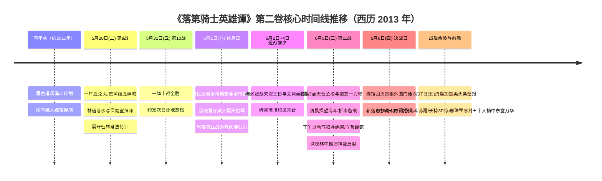

# 第二卷卷内时间线：全量锚定与时序坐标

> **公历推演已全面校准**：全卷日期与个人战次严格以 [S01 赛程裁定](../世界书规则/选拔赛2013赛程裁定.txt) 为唯一权威标准：5/28 第九战、5/31 第十战、6/1 泳池初吻与抽签、6/5 凌晨天台与正午第十一战、6/6 踢馆决战、6/7 头条壁报、6/13 隔周终章与第十四战抽签。

> **权威材料依据**：`落第骑士英雄谭 第二卷 gbk.txt`（`MAT-002`，7,640 行全量原著正文）  
> **时间规范原则**：严格基于原著显式时间词、比赛场次推移、日月星辰昼夜、学期进程与相对间隔，不捏造虚假公历年月日。  
> **事实状态标定**：`extracted`（原文显式字句确认）、`proposed`（卷内情节连续逻辑推导）。

---

## 一、大周期背景与学期时间基准

| 时间维度 | 原著显式判定 | 原文出处与行号 | 叙事与世界观定位 |
|---|---|---|---|
| **起始季节** | **初夏（西历 2013 年 5 月 28 日，开幕已逾一月）** | L343 (`MAT-002#L343`)：*“季节进入初夏，新生枝芽逐渐茂密且显得活力十足。”* L1025 (`MAT-002#L1025`)：*“日本的初夏相当闷热……”* L1566 (`MAT-002#L1566`)：*“身穿一袭凉爽的白色洋装，非常适合现在的初夏时节。”* | 破军学园春学期进行中，距离 4 月初春假入学已过一个半月。 |
| **选拔战跨度** | **选拔战开幕已逾一个月** | L341 (`MAT-002#L341`)：*“从七星剑武祭代表选拔战开始，已经过了一个多月。”* L553 (`MAT-002#L553`)：*“代表选拔战开始后，已经过了一个月，已经筛选出不少有力选手。”* | 第一卷第四章周一开幕（4 月 22 日）、周二一辉首胜桐原（4 月 23 日）。本卷起点已大幅推进，非开幕次日。 |
| **战绩起点** | **八战八胜零败** | L63 (`MAT-002#L63`)：*“他至今的战绩为八战八胜零败……”* L247 (`MAT-002#L247`)：*“【史黛菈】至今八战八胜零败！全都是因为对手主动弃权，不战而胜！”* | 一辉已连胜 8 场无名/上位对手；第二卷第一章打响其个人的第 9 战（斩获九连胜）。 |
| **赛程上限** | **一人最多二十场** | L3014 (`MAT-002#L3014`)：*“选拔战一人最多只有二十场。”* | 采用总积分筛选机制，输掉一场将面临代表权极度危险的容错劣势。 |

### 1.1 第一卷时间锚与选拔战赛程推演链

- **第一卷基准时间锚**：
  - 破军学园开学典礼在 4 月中旬；
  - 购物中心解放军事件发生在周日（2013 年 4 月 21 日）；
  - 选拔战首日为周一（2013 年 4 月 22 日，珠雫胜管、史黛菈胜桃谷）；
  - 一辉首战桐原为周二（2013 年 4 月 23 日，一刀修罗一战成名）。
- **五月赛程排期与第二卷公历推演链（遵循 S01 赛程裁定）**：
  - **第 1 战（R01）**：4 月 23 日（星期二）（一辉胜桐原，战绩 1 胜 0 败）
  - **第 2 战（R02）**：4 月 26 日（星期五）（战绩 2 胜 0 败，黄金周前最后一场）
  - **黄金周停赛期（4 月 27 日至 5 月 6 日）**：全段停赛 10 天，选拔赛执行委员会暂停排期。
  - **第 3～8 战（R03～R08，五月按每周二、五常规排期）**：
    - 5 月 07 日（二）R03（复赛，战绩合流为 3 胜 0 败）
    - 5 月 10 日（五）R04（4 胜 0 败）
    - 5 月 14 日（二）R05（5 胜 0 败）
    - 5 月 17 日（五）R06（6 胜 0 败）
    - 5 月 21 日（二）R07（7 胜 0 败）
    - 5 月 24 日（五）R08（8 胜 0 败，连胜达成）
  - **第 9 战（R09，第二卷第一章）**：**西历 2013 年 5 月 28 日（星期二）下午**。此时距离开幕（4 月 22 日）已逾一个月（36 天）；关东气候转入初夏闷热期，史黛菈身穿凉爽白色洋装；当日一辉在第七场比赛击破校内第三兔丸恋恋斩获**九连胜（9 胜 0 败）**，史黛菈在第八场正面以龙炎炸飞碎城雷斩获**九连胜**；林道落水，绚濑保健室拜师；傍晚至 5 月 30 日（四）密林身法特训。
  - **第 10 战（R10，第二卷第二章前置）**：**西历 2013 年 5 月 31 日（星期五）傍晚**。一辉取得选拔战第十胜（10 胜 0 败），绚濑亦获第十胜；相约次日休息日前往泳池。
  - **休息日（泳池水帘初吻与家庭餐厅爆头）**：**西历 2013 年 6 月 1 日（星期六，进入六月第一天）**。仅一辉、史黛菈、绚濑三人同行；儿童池蘑菇伞水帘定情初吻与深吻；傍晚家庭餐厅遭遇仓敷藏人啤酒瓶爆头，御祓泡沫抹消头伤；当夜抽签揭晓第 11 战黑铁一辉 vs 绫辻绚濑。
  - **避战三日与前夕**：**6 月 2 日（星期日）至 6 月 4 日（星期二）傍晚**。绚濑避不见面整整三日，艾莉丝预警背叛；6 月 4 日清晨绚濑简讯约见。
  - **天台逢魔坠楼与第 11 战（R11，师徒对决）**：**西历 2013 年 6 月 5 日（星期三）**。凌晨 03:00 天台断栏仰面坠楼，一辉透支一刀修罗垂直跑墙救人脱力；清晨医院宣告海斗病危，一辉向折木拒绝不战而胜；正午第六训练场一辉以第四秘剑·蜃气狼破烈风爪痕，幻想型态取胜（11 胜 0 败），起誓夺回招牌。
  - **密林推演**：**西历 2013 年 6 月 5 日（星期三）深夜**。后山密林通宵推演藏人 0.05 秒神速反射。
  - **决战仓敷藏人（奥多摩踢馆）**：**西历 2013 年 6 月 6 日（星期四）傍晚**（第 11 战次日）。一辉便利店塑料袋倒出十几部门徒手册，天衣无缝破神速反射斩翻藏人，夺回招牌。
  - **决斗次日头条壁报**：**西历 2013 年 6 月 7 日（星期五）清晨**。日下部加加美独家特大壁报曝光踢馆击败贪狼王牌实况照片，全校震撼。
  - **终章隔周傍晚（第 14 战抽签）**：**西历 2013 年 6 月 13 日（星期四）傍晚 17:00**（决斗隔周）。海斗苏醒电话催婚，长椅艾莉丝 3P 乱入，珠雫第六训练场冰封五十人，收到次日（6 月 14 日星期五）第 14 战对战东堂刀华通知。

---

## 二、卷内核心时间节点全量锚定（Anchor `T01` ～ `T13`）

```mermaid
timeline
    title 《落第骑士英雄谭》第二卷核心时间线推移（西历 2013 年）
    两年前（约2011年） : 暮色道场海斗传剑 : 雨中藏人踢馆碎颅
    5月28日(二) 第9战 : 一辉胜兔丸/史黛菈胜碎城 : 林道落水与保健室拜师 : 展开密林身法特训
    5月31日(五) 第10战 : 一辉十战全胜 : 约定次日泳池放松
    6月1日(六) 休息日 : 市民泳池水母冥想与水帘初吻 : 傍晚餐厅藏人爆头挑衅 : 当夜第11战对阵绚濑公布
    6月2日~4日 避战前夕 : 绚濑避战失踪三日与艾莉丝预警 : 绚濑简讯约见天台
    6月5日(三) 第11战 : 凌晨3点天台坠楼与透支一刀修罗 : 清晨探望海斗/折木备战 : 正午以蜃气狼胜绚濑/立誓踢馆 : 深夜林中推演神速反射
    6月6日(四) 决战日 : 踢馆团灭贪狼外围门徒 : 斩落仓敷藏人夺回招牌
    战后余波与前瞻 : 6月7日(五)清晨加加美头条壁报 : 6月13日(四)傍晚海斗苏醒/长椅3P惊魂/珠雫冰封五十人抽中东堂刀华
```

---

### `T01` 回忆层·暮色道场的绝技传承（两年前·约西历 2011 年暮春黄昏，梅雨前夕）

- **时间状态**：`extracted`（追忆回溯）
- **章节范围**：`CH-00` 序章（L3–L59）
- **时序标志**：*“在染上一片暮色的道场内……”*（L16）
- **核心事件**：“最后武士”绫辻海斗深知自身因病日渐衰弱、即将无法举剑，在黄昏暮色中的道场内将绫辻一刀流终极奥义托付给高一刚入学的女儿绚濑。
- **人物出场**：绫辻绚濑（高一刚入学，15~16岁）、绫辻海斗。
- **地点**：奥多摩·绫辻道场。
- **时间锚定意义**：确立绚濑深藏心底的执念起点与武道初心。

---

### `T02` 回忆层·雨中惨案与道场陷落（两年前·约西历 2011 年雨天）

- **时间状态**：`extracted`（两年前关键事实揭秘）
- **章节范围**：`CH-03` 第三章（L3657–L4591）
- **时序标志**：*“就在两年前的那个雨天……”*（L3657）、*“两年前的那一天，绚濑失去了一切。”*（L4591）
- **核心事件**：贪狼学园仓敷藏人登门踢馆。海斗为维护道场尊严与其对决，被藏人以残忍的斩击将头盖骨连同意识一并击碎，瘫痪昏迷成为植物人。藏人强占道场招牌并勒令所有人次日搬离。
- **人物出场**：绫辻海斗、仓敷藏人、绫辻绚濑（少年）。
- **地点**：绫辻道场。
- **时间锚定意义**：揭开绚濑为何承受极端精神重压与藏人作为主要反派的罪恶根源。

---

### `T03` 选拔战第 9 战当日·下午（西历 2013 年 5 月 28 日·星期二）：学生会两连战与保健室握手拜师

- **时间状态**：`extracted`
- **章节范围**：`CH-01` 第一章（L60–L815）
- **时序标志**：*“接下来，今日的第七场比赛正式开始——！”*（L61）、*“今日第八场比赛……”*（L247）、*“代表选拔战开始后，已经过了一个多月……”*（L341）
- **核心事件**：
  1. 一辉在当日第七场比赛中（一辉个人第 9 战），以千锤百炼武技反制突破破军校内排行第三的二年级 C 级骑士〈速度中毒〉兔丸恋恋（借 2 马赫惯性摔投砸地），斩获**个人第九胜（九连胜，9 胜 0 败）**；
  2. 紧接着第八场比赛（史黛菈个人第 9 战），史黛菈迎战校内第四的三年级 C 级学生会书记〈破城舰〉碎城雷；史黛菈单手硬接斩马刀〈蓄锐之斧〉十吨重劈并以纯粹蛮力反向压制，抓其衣领零距离引爆龙炎将其炸飞十米昏厥焦黑，裁判判负，史黛菈同样斩获**个人第九胜（九连胜，9 胜 0 败）**；
  3. 比赛结束后，暗中跟踪晨跑一周的三年级前代表选手绫辻绚濑手举树枝暴露，慌乱奔逃撞石落水溺昏；一辉等人救至保健室，在珠雫念诵江户残酷刑罚逼供声中醒来；一辉辨识其手掌竹刀老茧与姓氏，认出其为“最后武士”绫辻海斗之女并相约特训，绚濑克服男性恐惧症羞涩握手拜师。
- **人物出场**：黑铁一辉、兔丸恋恋、史黛菈·法米利昂、碎城雷、绫辻绚濑、黑铁珠雫、有栖院凪、折木有里、日下部加加美。
- **地点**：第五/第一训练场、校内林道水池、保健室。
- **状态转移**：一辉与史黛菈九连胜震动全校；一辉与绚濑确立师徒指点关系。

---

### `T04` 特训展开期·第 9 战傍晚至第三日傍晚（西历 2013 年 5 月 28 日至 5 月 30 日·星期四）：剑理改造与身法重构

- **时间状态**：`extracted`
- **章节范围**：`CH-01` 第一章（L816–L1546）
- **时序标志**：*“今天的比赛已经结束了，之后刚好还有晚餐前的训练。”*（L997）、*“昨天的剑招演练中，绚濑也表现得非常好……”*（L1061）、*“她与一辉一同锻炼数日……”*（L1554）
- **核心事件**：
  1. 一辉带领绚濑在后山密林空地展开高强度指导；
  2. 一辉以“完全掌握”看破绚濑机械模仿海斗刚猛发力的巨大破绽，度身定制适合女性骨骼柔韧与重心虚实转换的轻灵剑法；
  3. 绚濑剑技突飞猛进，对一辉产生崇拜与依赖；史黛菈暗中吃醋暴走。
- **人物出场**：黑铁一辉、绫辻绚濑、史黛菈。
- **地点**：后山树林空地、第四训练场周边。
- **状态转移**：绚濑剑法发生质变，师徒信任牢固确立。

---

### `T05` 特训收官·第 10 战当日傍晚（西历 2013 年 5 月 31 日·星期五）：约定次日泳池放松

- **时间状态**：`extracted`
- **章节范围**：`CH-02` 第二章（L1547–L1562）
- **时序标志**：*“昨天一辉轻松得到代表选拔战的第十胜，他在临走之前，这么对绚濑说道：『我们明天去游泳池吧。』”*（L1548–L1550）、*“而一辉知道休息日时，有个最适合的锻炼项目。”*（L1560）
- **核心事件**：经过数日特训，一辉在选拔赛中轻松取得**第十战胜利（10 战 10 胜 0 败）**；鉴于绚濑连日肌肉酸痛疲劳，一辉约定次日休息日（周末）前往游泳池，通过水中浮力与呼吸进行深层恢复与肺活量特训。
- **人物出场**：黑铁一辉、绫辻绚濑。
- **地点**：破军学园训练场、校门前。
- **状态转移**：一辉总战绩推进至十战十胜。

---

### `T06` 休息日（进入六月第一天）·白天至傍晚（西历 2013 年 6 月 1 日·星期六）：泳池水帘初吻与家庭餐厅啤酒瓶爆头

- **时间状态**：`extracted`
- **章节范围**：`CH-02` 第二章（L1563–L2739）
- **时序标志**：*“今天则是为了进行这项锻炼，才要前往游泳池……”*（L1562）、*“到了早上……”*（L1566）、*“（……这一晚真是好比逢魔时刻。）”*（L2802）
- **核心事件**：
  1. **上午至下午（市民室内温水泳池与水帘初吻）**：仅一辉、史黛菈、绚濑三人同行（珠雫当日有正赛，艾莉丝陪同观战）。史黛菈身穿黑绳比基尼，绚濑穿深蓝两件式修身运动泳装。一辉指导水母漂浮自我感知；绚濑察觉二人交往一月连手都没牵过，直球戳破史黛菈恋情并助攻独处；二人在儿童池蘑菇伞水帘后爆发情侣互吼，终迎定情初吻与炽热深吻；
  2. **傍晚（站前家庭餐厅）**：三人聚餐时遭遇贪狼学园王牌主力〈剑士杀手〉仓敷藏人及其混混门徒；
  3. 藏人当众辱骂践踏绫辻家，凶残抓起实心啤酒瓶砸碎在一辉后脑，啤酒与鲜血流满一辉面庞，并吐浓痰唾沫极尽侮辱；
  4. 一辉为避免史黛菈受处分被退学死死扣住史黛菈硬抗；学生会副会长御祓泡沫以〈绝对不确定性〉因果抹消一辉头皮撕裂伤与颅内出血，会计贵德原彼方散发浓郁鲜血芬芳震慑全场。
- **人物出场**：黑铁一辉、史黛菈、绫辻绚濑、仓敷藏人、御祓泡沫、贵德原彼方。
- **地点**：市民运动中心室内温水游泳池、站前家庭餐厅。
- **状态转移**：矛盾彻底引爆；藏人彻底触犯一辉践踏他人心血与眼泪的绝对逆鳞。

---

### `T07` 聚餐归途当夜（西历 2013 年 6 月 1 日·星期六深夜）：第 11 战抽签揭晓（黑铁一辉 vs 绫辻绚濑）

- **时间状态**：`extracted`
- **章节范围**：`CH-02` 第二章（L2844–L2970）
- **时序标志**：*“当他一看荧幕，寄件人是——『选拔战执行委员会』……”*（L2844）
- **核心事件**：在聚餐结束离开的夜路上，选拔战执行委员会发来简讯：**第十一场选拔战对阵为——黑铁一辉 vs 绫辻绚濑**。两人皆为十战十胜。绚濑深陷拯救父亲道场与背叛恩师的极端撕裂绝境，脸色惨白仓皇逃离。
- **人物出场**：黑铁一辉、绫辻绚濑、史黛菈。
- **地点**：学园站前街道。
- **状态转移**：师徒正式沦为决定命运的赛场死敌。

---

### `T08` 第 11 战前日（西历 2013 年 6 月 4 日·星期二傍晚）：绚濑避战三日与艾莉丝预警背叛

- **时间状态**：`extracted`
- **章节范围**：`CH-02` 第二章（L2976–L3050）
- **时序标志**：*“直到比赛前一天的傍晚，绚濑仍然没有出现在一辉一行人面前。”*（L2976）、*“这封简讯是今天早上传来的。”*（L3036）、*“『明天凌晨三点，我会在总校舍屋顶上等你。』”*（L3034）
- **核心事件**：抽签后绚濑整整三日避不见面。比赛前一日傍晚，史黛菈与珠雫斗嘴；有栖院凪（艾莉丝）敏锐指出绚濑正面对决绝无胜算，必定事先设局，劝一辉做好断交觉悟；一辉出示绚濑清晨发来的约见简讯（凌晨三点天台相见），坚信喜欢自己手掌老茧的纯粹剑士绝非卑鄙小人，执意赴约。
- **人物出场**：黑铁一辉、史黛菈、黑铁珠雫、有栖院凪。
- **地点**：第一学生宿舍 405 室前。
- **状态转移**：决战前夜暗流涌动。

---

### `T09` 第 11 战比赛日·凌晨 3:00（西历 2013 年 6 月 5 日·星期三凌晨）：天台逢魔坠楼与垂直踏墙救人

- **时间状态**：`extracted`
- **章节范围**：`CH-02` 第二章后段（L3051–L3483）
- **时序标志**：*“明天凌晨三点……”*（L3104）、*“她在深夜与一辉决裂之后，便回到自己的房间稍作休息。”*（L3489）
- **核心事件**：
  1. 凌晨 3:00 一辉如约登上主校舍天台，绚濑身穿浴衣、眼神空洞如玻璃珠；
  2. 绚濑拔出〈绯爪〉斩断铁栅栏两端，仰面倒栽葱从四层楼顶坠落；
  3. 一辉万分之一秒内开启日限一次的杀招〈一刀修罗〉，纵身跳下天台在垂直水泥外墙上急速俯冲飞奔追人捞入怀中；
  4. 面对撞地危机，一辉凌空翻滚全力蹬踏教学楼外墙，蹬裂一至四层水泥墙壁并震碎全窗，反冲三十米砸入中庭水池迫降保命；
  5. 绚濑冷笑宣告故意逼一辉透支一刀修罗的废招计谋，决绝离去；一辉全身脱力虚脱在池畔发出绝望咆哮。
- **人物出场**：黑铁一辉、绫辻绚濑。
- **地点**：破军学园主校舍屋顶天台、教学楼外墙、中庭水池。
- **状态转移**：一辉杀手锏提前耗尽，师徒信任彻底崩塌，带着全身肌肉撕裂脱力的重度负状态迎接天明。

---

### `T10` 第 11 战比赛日·早晨至白天（西历 2013 年 6 月 5 日·星期三清晨至正午）：医院绝症宣告、烈风爪痕与蜃气狼救赎

- **时间状态**：`extracted`
- **章节范围**：`CH-03` 第三章（L3484–L5540）
- **时序标志**：*“与一辉决战的当天早上。”*（L3485）、*“今天可以自由出席。要出赛代表选拔战的学生，可以免除当天的课程。”*（L3549）、*“今天清晨，她以级任导师的身分，询问一辉破坏校舍的理由——”*（L5011）、*“今天的第六训练场·第一场比赛即将开始啦——！！”*（L4657）
- **核心事件**：
  1. **清晨（医院）**：绚濑探望病榻上的海斗，医生告知海斗身体已衰竭至极，恐熬不过今年冬天；海斗潜意识不断呢喃“对不起”；
  2. **清晨（校内）**：一辉向班主任折木有里说明天台破坏事实并推断绚濑必在战圈作弊，但断然拒绝折木“不战而胜”的提议，坚持以纯粹骑士道在擂台上拯救朋友；
  3. **白天（第六训练场）**：第十一场选拔战开战。播报员矶贝与狂喷鼻血备足输血袋的折木老师解说；绚濑以〈绯爪〉概念操作引爆战圈百道真空陷阱〈烈风爪痕〉重创一辉；
  4. 一辉单膝跪地以〈阴铁〉刀柄双重防御化解反击，以剑心点破绚濑内心的泣血迷惘；
  5. 一辉全魔力放出获得极速爆发，以原创绝技〈第四秘剑·蜃气狼〉制造残像诱使绚濑斩空，切换〈阴铁·幻想型态〉斩尽绚濑体力取胜（11 胜 0 败）；
  6. 绚濑战意冰封认输，失声质问一辉为何帮助背叛者，一辉以“为朋友拭去眼泪，需要理由吗”击穿心防；绚濑痛哭握手求助，一辉郑重起誓夺回道场招牌。
- **人物出场**：绫辻绚濑、黑铁一辉、折木有里、播报员矶贝、日下部加加美、史黛菈、黑铁珠雫、有栖院凪。
- **地点**：宍户综合医院 515 病房、第六训练场。
- **状态转移**：绚濑心魔解脱寻回武道初心；一辉斩获**十一战全胜（11 胜 0 败）**。

---

### `T11` 比赛日深夜（西历 2013 年 6 月 5 日·星期三深夜）：密林苦练推演与海斗遗言之谜

- **时间状态**：`extracted`
- **章节范围**：`CH-04` 第四章（L5541–L5659）
- **时序标志**：*“一辉与绚濑比赛当天的深夜。”*（L5542）、*“史黛菈口中的战斗，指的是明天与藏人的对决。”*（L5566）
- **核心事件**：
  1. 绚濑赛后将两年前海斗惨败及道场被夺的全部实情告知一辉与史黛菈；一辉约定次日以道场招牌为赌注上门踢馆；
  2. 深夜一辉在后山密林空地挥刀苦练，推演破解藏人 0.05 秒〈神速反射〉的战术构想；
  3. 史黛菈穿透黑夜前来相伴守候，二人心意相通探讨海斗当年迎战心境，一辉调整至最佳状态迎战翌日决战。
- **人物出场**：黑铁一辉、史黛菈·法米利昂。
- **地点**：破军学园后山训练林地。
- **状态转移**：战术成型；一辉与史黛菈的情感羁绊更加坚韧。

---

### `T12` 决战日（第 11 战次日·西历 2013 年 6 月 6 日·星期四傍晚）：奥多摩道场修罗踢馆与斩灭神速反射

- **时间状态**：`extracted`
- **章节范围**：`CH-04` 第四章（L5660–L7249）
- **时序标志**：*“隔日傍晚。”*（L5660）
- **核心事件**：
  1. 傍晚，一辉、史黛菈、绚濑三人前往奥多摩旧绫辻剑道场；一辉手持木刀直指藏人鼻尖踢馆，藏人以肉掌当场捏碎木刀；
  2. 一辉将一路打倒的十数名外围门徒学生手册装在便利店塑料袋中倒在藏人面前示威，藏人喝退残存门徒，双方确立私营道场真刀死斗协议（大蛇丸 vs 阴铁）；
  3. 藏人以〈大蛇丸〉自由伸缩操纵之〈蛇骨刃〉与 0.05 秒〈神速反射〉疯狂压制；一辉切换小太刀术招架〈蛇咬〉，以持久战剧烈消耗藏人体力；史黛菈向绚濑点破海斗临终呢喃实为向未能尽兴一战的藏人道歉；
  4. 终局藏人祭出八斩合一之绝技〈八岐大蛇〉，一辉以〈模仿剑术〉推演融通绫辻一刀流终极奥义〈天衣无缝〉（剑尖固定于空间、零延迟反击）毫发无伤斩裂藏人身躯；
  5. 藏人在场内傲立不倒，认输放弃道场，步出大门走到场外庭院才失血昏迷；一辉力竭倒地，将道场招牌完好交还绚濑。
- **人物出场**：黑铁一辉、史黛菈·法米利昂、绫辻绚濑、仓敷藏人、贪狼学园门徒。
- **地点**：奥多摩·旧绫辻剑道场内与庭院。
- **状态转移**：绫辻道场招牌与武道名誉完璧归赵；藏人对一辉产生深刻敬意并约战七星剑武祭；绚濑重铸武道初心。

---

### `T13` 终章余波与决胜前瞻：全校舆论狂潮（西历 2013 年 6 月 7 日·星期五清晨）与决斗隔周第 14 战抽签（西历 2013 年 6 月 13 日·星期四傍晚 17:00）

- **时间状态**：`extracted`
- **章节范围**：`CH-05` 终章（L7250–L7594）
- **时序标志**：*“决斗结束的隔天，校内登出一张有此标题的壁报。”*（L7253）、*“与〈剑士杀手〉之间的决斗结束后，隔周的傍晚。”*（L7289）、*“黑铁珠雫选手，您的选拔战第十四场比赛对手已经正式决定。对手是三年三班，东堂刀华选手。”*（L7565）
- **核心事件**：
  1. **决斗次日（西历 2013 年 6 月 7 日·星期五清晨）**：日下部加加美独家特大壁报曝光踢馆击败贪狼王牌的现场实照，全校震撼，劣等生蔑称彻底消弭；
  2. 全校热议颠覆常识的〈落第骑士〉与破军最强“雷切”东堂刀华究竟谁更强；
  3. **隔周傍晚（西历 2013 年 6 月 13 日·星期四傍晚 17:00）**：绚濑自首作弊行为受十天停学处分（免退学）；海斗奇迹苏醒，打来电话大吼让一辉跟绚濑结婚继承道场，被羞怒暴走的绚濑大吼“你给我再睡两年吧”物理打倒；
  4. 后山长椅上一辉与史黛菈情深欲吻，有栖院凪（艾莉丝）突然贴脸嘟嘴索吻调侃“顺便来个 3P 嘛”，二人吓得双双滚落长椅；
  5. **第六训练场放学混战**：黑铁珠雫独自一人瞬间将五十名挑战骑士冻结成冰雕平原，在战圈中央查收官方简讯：第十四战对手正是三年级学生会长东堂刀华。珠雫在刺骨严寒中战意如火沸腾，放声发出妖艳绝美的寒冰狂笑，为第三卷决胜战拉开序幕。
- **人物出场**：黑铁一辉、史黛菈·法米利昂、绫辻绚濑（简讯/电话）、绫辻海斗（电话）、日下部加加美（壁报）、有栖院凪、黑铁珠雫、东堂刀华（提及）。
- **地点**：主校舍布告栏前、后山密林长椅、第六训练场。
- **状态转移**：第二卷圆满收官，正式锚定衔接第三卷学生会大战。

---

## 三、第二卷时间锚定速查与 MVU 契约映射表

在 SillyTavern 剧情推进中，当前卷设定为 `2`，当前章与事件记录严格遵循以下时间/地点锚点：

| 章节键 | 阶段建议地点 | 推荐时间描述 | 核心已发生事件键 |
|---|---|---|---|
| **序章** | 奥多摩绫辻道场 | 前置追忆【西历 2011 年暮春黄昏（两年前，梅雨前夕）】 $\to$ 现实切入【西历 2013 年 5 月 28 日（星期二）】 | `海斗传剑` |
| **第一章** | 第五/第一训练场、校内水池/保健室、后山密林 | 西历 2013 年 5 月 28 日（星期二）·初夏午后至傍晚 | `胜兔丸恋恋`、`绚濑拜师`、`密林身法特训` |
| **第二章** | 市民室内温水游泳池、站前家庭餐厅、主校舍天台 | 西历 2013 年 5 月 31 日（星期五，第 10 战当日）至 6 月 1 日（星期六休息日，泳池初吻与餐厅爆头），至 6 月 5 日（星期三）凌晨 03:00（第 11 战比赛日天台坠楼与透支一刀修罗） | `第十胜`、`泳池水帘初吻`、`藏人餐厅挑衅`、`天台逢魔坠楼救人` |
| **第三章** | 宍户综合医院、第六训练场 | 西历 2013 年 6 月 5 日（星期三）·第十一场选拔战比赛日·清晨至正午（插叙两年前约 2011 年梅雨雨天惨案） | `第十一战胜绚濑`、`蜃气狼`、`绚濑心魔解脱` |
| **第四章** | 后山密林、奥多摩绫辻道场 | 西历 2013 年 6 月 5 日（星期三）深夜（密林推演）至 6 月 6 日（星期四）傍晚（第 11 战次日·奥多摩绫辻道场踢馆决战） | `密林通宵推演`、`踢馆破神速反射`、`八岐大蛇对天衣无缝` |
| **终章** | 主校舍布告栏、后山长椅、第六训练场 | 西历 2013 年 6 月 7 日（星期五）清晨（踢馆次日全校头条壁报），至 6 月 13 日（星期四）隔周傍晚 17:00（海斗苏醒与第 14 战抽签） | `踢馆战报引爆全校`、`海斗苏醒催婚`、`长椅3P惊魂`、`珠雫冻结五十人`、`第十四战抽中刀华` |
