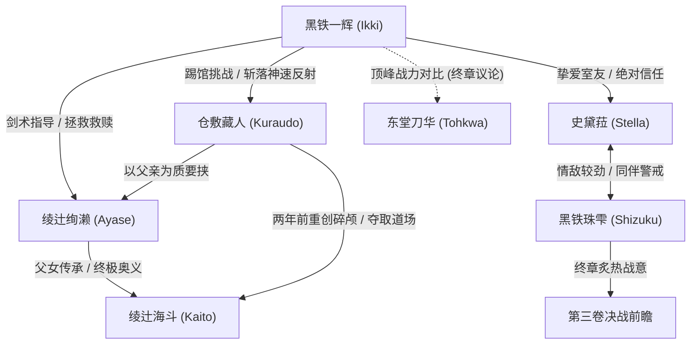

# 第二卷出场人物索引

> 纳入标准：第二卷中明确具名，或具备独立对白、战力机制、核心过往或推动剧情功能的人物。普通学生与观众按群体记录。

| ID | 显示名 | 别名/触发词 | 首次出现/提及 | 出现章节 | 身份类别 | 第二卷末状态 | 核心剧情功能与机制 |
|---|---|---|---|---|---|---|---|
| `char-ikki-kurogane` | 黑铁一辉 | 一辉；落第骑士；无冕剑王；阴铁；一刀修罗 | L60 | CH-01–CH-05 | 男主角/破军学生骑士 | 击溃藏人夺回道场，震撼全校 | 担任绚濑剑术导师；忍受啤酒瓶爆头；奥多摩踢馆以绫辻奥义斩落神速反射 |
| `char-ayase-ayatsuji` | 绫辻绚濑 | 绚濑；学姐；绯爪；绫辻一刀流；男性恐惧症 | L14（序章幼年）；L805（正式登场） | CH-00–CH-04 | 第二卷核心女主角/三年级学生骑士 | 心魔彻底解开，视一辉为恩师与拯救者 | 因父亲昏迷与道场被夺背负绝望；红脸拜师；第十一战设伏逼出一刀修罗；赛后哭求一辉 |
| `char-kuraudo-kurashiki` | 仓敷藏人 | 仓敷藏人；藏人；剑士杀手；Sword Eater；狂犬；豪鬼；神速反射 | L1950（登场） | CH-02–CH-04 | 贪狼学园王牌/主要对手 | 败于一辉，坦然认输并归还道场招牌 | 0.05秒〈神速反射〉；两年前碎颅重创海斗；家庭餐厅啤酒瓶爆头一辉；奥多摩道场正面对决战败 |
| `char-kaito-ayatsuji` | 绫辻海斗 | 海斗；最后武士；绫辻馆长 | L20（序章）；L4450（回忆） | CH-00；CH-03（回忆） | 绚濑父亲/一代剑术宗师 | 处于医院重度昏迷植物人状态 | 绫辻一刀流创始人；两年前在藏人挑战中为守道场遭碎颅重创；将终极奥义托付给绚濑 |
| `char-stella-vermillion` | 史黛菈·法米利昂 | 史黛菈；红莲皇女；法米利昂；妃龙罪剑 | L100 | CH-01–CH-05 | 主角/室友/恋人 | 选拔战连胜；坚定信任一辉踢馆 | 见证一辉指点绚濑产生吃醋娇嗔；餐厅中因一辉被侮辱暴怒拔剑；战前深夜给一辉毫无保留的信任 |
| `char-sizuku-kurogane` | 黑铁珠雫 | 珠雫；宵时雨；深爱兄长的妹妹 | L1250 | CH-01–CH-05 | 学生骑士/一辉妹妹 | 选拔战连胜，凝视新对阵露出寒冰狂笑 | 与史黛菈形成情敌竞争；暗中盯梢一辉与绚濑特训；终章铺垫第三卷殊死决斗 |
| `char-alice-arisuin` | 有栖院凪 | 有栖院；艾莉丝；珠雫室友 | L1600 | CH-01；CH-02 | 学生骑士/珠雫室友 | 协助调解日常，陪伴珠雫 | 在选拔战观战点评一辉战术；在校内提醒一辉警惕绚濑简讯圈套 |
| `char-utakata-misogi` | 御祓泡沫 | 御祓泡沫；副会长；五十五十；绝对不确定性 | L2450 | CH-02 | 学生会副会长/三年级学生骑士 | 保持超然中立，救助一辉 | 在站前家庭餐厅发动因果干涉绝技〈绝对不确定性〉瞬间抹消治愈一辉头部创口 |
| `char-yuri-oriki` | 折木有里 | 折木老师；一年一班导师 | L80 | CH-01；CH-03 | 教师/裁判解说 | 持续担任导师与比赛官方裁判 | 负责选拔战解说与规程宣布，见证一辉第七场与第十一场胜利 |
| `char-kagami-kusakabe` | 日下部加加美 | 加加美；新闻部王牌记者 | L85 | CH-01；CH-05 | 学生/新闻部 | 头条报道一辉踢馆击破贪狼王牌 | 持续追踪报道一辉的战绩逆袭，引爆全校关于一辉与东堂刀华谁更强的议论 |
| `char-tsukiyomi` | 月夜见三日月 | 月夜见；播报社实况员 | L62 | CH-01；CH-03 | 播报部/实况解说 | 现场主持选拔战 | 极具感染力地解说一辉与绚濑的比赛 |
| `char-tohkwa-todo` | 东堂刀华 | 东堂刀华；雷切；学生会长；破军最强 | L5537；L7273（提及） | CH-03；CH-05（提及/前瞻） | 学生会长/全国四强/终极对手 | 破军学园选拔战无可逾越之壁 | 在终章成为全校与一辉对比的焦点（“雷切与落第骑士谁更强”）；引出第三卷决战 |
| `char-yudai-moroboshi` | 诸星雄大 | 诸星雄大；浪速星屑；前任七星剑王 | L2050（提及） | CH-02（提及） | 上届七星剑王/武艺顶点 | 伏笔存在于对白中 | 作为去年战胜仓敷藏人并斩断其佩刀的传说级王者被提及，奠定全国高手的战力参照坐标 |

---

## 角色关键关系网

