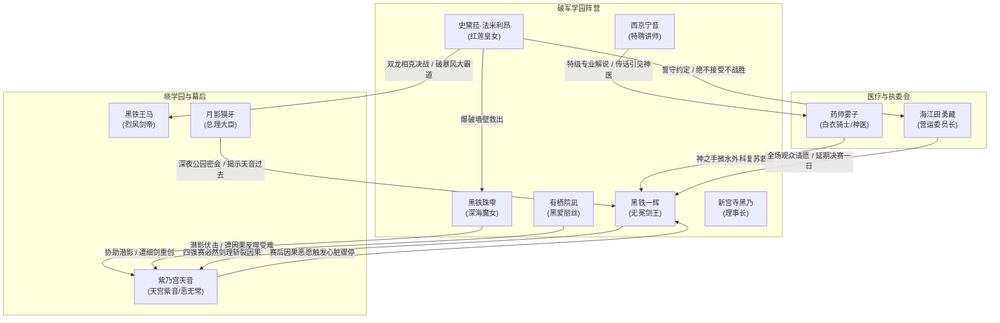

# 《落第骑士英雄谭》第八卷：出场人物全量索引与阵营图谱

本索引严格遵循 `character-visual-lore-dossier` 规范与工程基线，全面梳理第八卷具名登场、核心交锋或承担关键因果推进的全部角色。以四强准决赛、暗室伏击与幕后政治博弈为经纬，严格锚定第八卷文本，严禁跨卷时间线剧透。

---

## 一、 阵营分布总览

```text
┌─────────────────────────────────────────────────────────────────────────┐
│ 破军学园 (Hagun Academy)                                                │
│ - 黑铁一辉（落第骑士/无冕剑王/破解全肯定因果/杀入总决赛/赛后心跳骤停）      │
│ - 史黛菈·法米利昂（红莲皇女/觉醒自知巨龙/斩落烈风剑帝挺进决赛/拒绝不战胜）  │
│ - 黑铁珠雫（深海魔女/为护兄长舍身奇袭天音/遭受难钉刑/赛程禁赛三个月）     │
│ - 有栖院凪（黑爱丽丝/协助珠雫潜影突袭/遭受重创/守护珠雫）                 │
│ - 新宫寺黑乃（理事长/世界第三/协调大会运营与医疗抢救）                     │
│ - 西京宁音（特聘讲师/世界第四/夜叉姬/准决赛官方特邀特级解说）              │
├─────────────────────────────────────────────────────────────────────────┤
│ 晓学园 (Akatsuki Academy) / 解放军 (Rebellion) 与幕后赞助者             │
│ - 紫乃宫天音 / 天宫紫音（恶无常/因果干涉【女神过剩之恩宠】/被一辉斩落）    │
│ - 黑铁王马（烈风剑帝/自然干涉顶峰【暴风大霸道】/极速【天照】/惜败史黛菈） │
│ - 月影獏牙（内阁总理大臣/晓学园最高创立赞助者/非战斗系伐刀者/夜访一辉）    │
│ - 莎拉·布拉德莉莉（染血达文西/战败调养中/为一辉与史黛菈见证）              │
│ - 风祭凛奈（魔兽使/晓学园理事长代理/看台观战）                          │
│ - 夏洛特·科黛（凛奈女仆/寸步不离侍奉）                                  │
├─────────────────────────────────────────────────────────────────────────┤
│ 医疗团队、运营执委会与黑铁宗族                                          │
│ - 药师雾子（白衣骑士/世界第二医疗专家/神之手微水外科手术/复苏一辉心脏）   │
│ - 海江田勇藏（七星剑武祭营运委员长/裁决珠雫违规/批准决赛延期一日）        │
│ - 饭田播报员（现场实况主持人）                                          │
│ - 黑铁严（骑士联盟日本分部最高长官/黑铁家当家/看台冷峻审视双子决战）       │
│ - 黑铁龙马（已故前首席武士/一辉童年记忆精神支柱/回忆闪回）                │
└─────────────────────────────────────────────────────────────────────────┘
```

---

## 二、 核心登场人物多维矩阵

| 人物标识 ID | 姓名 / 常用称号 | 阵营 / 身份 | 灵装与核心能力 | 卷内核心事件与命运转折 | 原文对应章节与行号基线 |
|---|---|---|---|---|---|
| `CHAR-001` | **黑铁一辉**<br>〈无冕剑王 / 落第骑士〉 | 破军学园一年级<br>大会四强代表 | 固有灵装：〈阴铁〉<br>核心：〈一刀修罗〉、神速剑理（比翼模仿）、以纸斩铁圆周卸力 | 决意为珠雫讨还公道；看穿天音空虚本质；正面迎击因果反噬，以极微圆周调整抵消失误，以零逃逸概率之剑斩落天音；赛后心脏骤停濒死，经抢救复苏。 | 第十一章 L700-1082<br>第十三章 L3212-5684<br>间章 L5685-6333 |
| `CHAR-002` | **史黛菈·法米利昂**<br>〈红莲皇女〉 | 破军学园一年级<br>大会四强代表 | 固有灵装：〈妃龙罪剑〉<br>核心：〈妃龙羽衣〉、〈燃天焚地龙王炎〉、自知巨龙肉身融合 | 轰飞准备室墙壁救下受难珠雫；准决赛力抗黑铁王马暴风大霸道，以自知巨龙之躯硬接神速〈天照〉反手决胜斩；赛后拒绝不战胜夺冠，迫使执委会延期一日。 | 第十一章 L612-953<br>第十二章 L1139-3211<br>间章 L558-6333 |
| `CHAR-003` | **紫乃宫天音**<br>（真名：天宫紫音）<br>〈恶无常 / 厄运〉 | 国立晓学园一年级<br>大会四强正选 | 固有灵装：〈蔚蓝（Cerulean）〉（白银细剑）<br>核心：〈女神过剩之恩宠（Nameless Glory）〉 | 因扭曲童年极度嫉妒一辉；虐杀反击珠雫并钉刑羞辱；在准决赛全开因果干涉诱发一辉肉体故障与绝症骤停，终被一辉必然之剑劈裂胸膛败北。 | 第十一章 L188-646<br>第十三章 L3212-5684 |
| `CHAR-004` | **黑铁王马**<br>〈烈风剑帝〉 | 国立晓学园三年级<br>大会四强代表 | 固有灵装：〈龙爪〉（巨大野太刀）<br>核心：〈断空〉、〈暴风大霸道〉、神速剑理〈天照〉 | 准决赛与史黛菈展开自然干涉巅峰对决；引爆极大风暴与千米真空刃；虽然领悟与比翼同等之神速神技，但未能斩断巨龙皇女的根性意志，战败止步四强。 | 第十二章 L1139-3211 |
| `CHAR-005` | **黑铁珠雫**<br>〈深海魔女〉 | 破军学园一年级<br>大会八强代表 | 固有灵装：〈宵时雨〉<br>核心：〈水色轮回〉、〈血风惨雨〉、〈水牢弹〉 | 不惜退学与污名，为一辉暗杀天音；因果反噬导致绝招失效，惨遭天音暗影细剑穿刺钉于墙壁受难；赛后被判罚禁赛三个月，坚定守护一辉。 | 间章一 L3-57<br>第十一章 L2-678 |
| `CHAR-006` | **药师雾子**<br>〈白衣骑士〉 | 医疗界权威<br>世界排名第二医生 | 水系统自然干涉系顶级变异<br>核心：微观水流细胞手术、生体循环魔导外科 | 受西京宁音之邀火速驰援；在常规再生囊与时间冻结无法挽救一辉心脏骤停的绝境下，亲自主刀微水循环手术，成功将一辉自死亡深渊拉回。 | 间章二 L104-204 |
| `CHAR-007` | **月影獏牙**<br>（内阁总理大臣） | 日本政府最高首脑<br>晓学园创立黑手 | 非战斗系伐刀者<br>核心能力：未来视 / 宿命窥探 | 深夜在大阪公园密会一辉，揭露紫乃宫天音悲剧身世并劝一辉弃权无效；其行事动机实为对抗自身所预见之“充满绝望与破灭的世界未来”。 | 第十一章 L960-1082<br>第十三章 L620-702 |
| `CHAR-008` | **有栖院凪**<br>〈黑爱丽丝〉 | 破军学园一年级<br>解放军脱离者 | 固有灵装：〈暗黑隐者〉<br>核心：〈光影密道〉、〈缝影〉 | 忠诚陪伴珠雫潜入地下准备室实施刺杀，遭天音因果熄灯反制击晕；事后深感自责，在医务室全力照料珠雫与一辉。 | 第十一章 L8-300<br>间章二 L2-25 |
| `CHAR-009` | **西京宁音**<br>〈夜叉姬〉 | 破军学园特聘教师<br>现役世界第四 | 固有灵装：〈铁扇〉<br>核心：重力干涉、空间扭曲 | 担任准决赛特邀解说员，深度剖析史黛菈巨龙肉身与王马风暴的碰撞机理；协助联络药师雾子入场抢救一辉。 | 第十二章 L138-1600<br>间章二 L184-210 |
| `CHAR-010` | **新宫寺黑乃**<br>〈世界第三〉 | 破军学园理事长 | 固有灵装：两把自动手枪<br>核心：时间干涉（时间减速/逆转） | 处置准备室流血事件，竭力保护珠雫学籍；尝试以时间逆转挽救一辉但因超过生理承受极限数十秒而作罢，全力统筹营运委员会。 | 第十一章 L680-694<br>间章二 L68-90 |
| `CHAR-011` | **浅木椛**<br>〈鬼火〉 | 武曲学园三年级<br>壁报特刊精选 | 固有灵装：附火日本刀<br>核心：〈红莲蜷局〉、南乡流秘步〈抽足〉 | 虽在第七卷第二轮战惜败珠雫，但在第八卷《破军学园壁报》中正式由日下部加加美公开完整官方立绘与六维能力雷达（攻C防E魔D控B体C运D），揭示其绝技红莲蜷局与超越雷切的抽足精度。 | 第八卷附录壁报插画 / 人物条目 |

---

## 三、 人物间因果关系图 (Mermaid Topology)



---

## 四、 本卷人物成长与精神嬗变深度总结

1. **黑铁一辉：由“反抗命运的凡人”蜕变为“粉碎因果的剑神”**  
   在面对紫乃宫天音近乎全能的因果支配时，一辉没有被恐惧瘫痪，也没有依赖抽象的奇迹。他以极高的专注力，在千分之一秒内将因果诱发的所有身体协调偏差、肌肉断裂前兆转化为圆周卸力动作，并以绝对封死敌方所有规避维度的剑路，使胜利的物理概率直接锁死在 100%。一辉在此战中打破了“不可战胜的造物主剧本”，完成凡人武道的极致飞跃。

2. **史黛菈·法米利昂：从庞大魔力的“皇女”彻底蜕变为“自知巨龙”**  
   在面对冷酷无情的纯粹自然天灾黑铁王马时，史黛菈在西京宁音的启发下撕开人类脆弱认知的枷锁，彻底接纳体内寄宿的原初巨龙血脉。她以龙之肌骨正面承受连钢岩都能汽化的【天照】极速斩，以不灭的王者战意粉碎了同代最强剑士黑铁王马的神话，正式站上与一辉约定的最高峰。

3. **紫乃宫天音：由“高高在上的命运行刑者”坠落为“空虚嫉妒的迷途弃儿”**  
   天音的前半生被其逆天异能【女神过剩之恩宠】彻底毁坏，无论如何努力都被剥夺成就感，沦为没有实体存在感的虚无之人。他对一辉的虐待与挑衅，本质上是对“凭借凡骨肉身赢得众人认可的纯粹努力者”的极端病态嫉妒。当一辉揭穿其软弱并以铁剑斩碎其神话时，天音那被命运虚无冰封的灵魂第一次被现实的痛楚真实贯穿。
