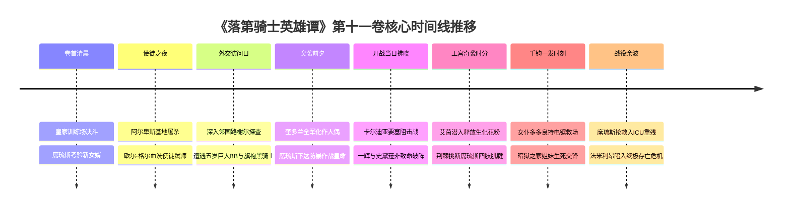

# 第十一卷卷内时间线：全量锚定与时序坐标

> **权威材料依据**：`落第骑士英雄谭 第十一卷 gbk.txt`（`MAT-011`，7,387 行全量原著正文）  
> **时间规范原则**：严格基于原著显式时间词、战争进程、昼夜推移与相对间隔，不捏造虚假公历年月日。  
> **事实状态标定**：`extracted`（原文显式字句确认）、`proposed`（卷内情节连续逻辑推导）。

---

## 一、宏观战争时序与地缘背景

| 时间维度 | 原著显式判定 | 原文出处与行号 | 叙事与地缘定位 |
|---|---|---|---|
| **卷首起始** | **抵达成婚提亲次日清晨** | L10–L28 (`MAT-011#L10`)：史黛菈归国态度冰冷，席琉斯国王暴怒将一辉拽至皇家训练场。 | 承接第十卷第三章求婚国营广播之后的清晨。 |
| **暗网反叛** | **阿尔卑斯深处风雪之夜** | L926 (`MAT-011#L926`)：风雪交加的阿尔卑斯地下使徒秘密基地。 | 欧尔·格尔与大教授清洗旧部，为发动欧洲大战排除阻碍。 |
| **外交探查** | **决斗数日后之午后** | L2059 (`MAT-011#L2059`)：第一皇女露娜艾丝率代表团搭乘专车访问路榭尔。 | 距离代表战正式开幕尚有数日，法米利昂试图与奎多兰和平谈判。 |
| **战争爆发** | **路榭尔政变次日拂晓** | L2724 (`MAT-011#L2724`)：边境雷达捕捉到奎多兰陆军全线开赴边境。 | 操偶大军跨境压境，卡尔迪亚市遭遇围攻。 |
| **王宫血案** | **卡尔迪亚城镇战交战当日下午** | L4273–L5800 (`MAT-011#L4273`)：前线激战正酣时，后方王城遭遇潜入刺杀。 | 席琉斯重创残废，皇室中枢瘫痪。 |

---

## 二、卷内核心时间节点全量锚定（Anchor `T01` ～ `T08`）

---

### `T01` 皇家训练场决斗·清晨：席琉斯的岳父考核
- **时间状态**：`extracted`
- **章节范围**：`CH-05` 第五章（L3–L925）
- **核心事件**：席琉斯国王难忍女儿归国后的冷漠眼神，将怨气爆发在一辉身上，要求在一对一决斗中亲自检验其武道品格。席琉斯释放烈火与重剑斩击，一辉沉着以第七秘剑与精妙防守应对，未损皇室颜面且展现出绝对靠谱的担当，席琉斯内心终被折服。
- **人物**：黑铁一辉、席琉斯·法米利昂、史黛菈、雅丝特雷亚王后、露娜爱丝皇女。
- **地点**：法米利昂王宫地下皇家竞技场。

---

### `T02` 解放军阿尔卑斯地下要塞·风雪深夜：使徒叛变与弑师血夜
- **时间状态**：`extracted`
- **章节范围**：`CH-06` 第六章（L926–L2058）
- **核心事件**：欧尔·格尔与大教授卡尔·伊格纳特借十二使徒集会之机发动突袭叛乱。〈独腕剑圣〉华伦斯坦拔剑制止，巨剑一击将石人偶劈碎并削平雪峰，但欧尔·格尔与大教授动用生化毒物、机械暗算与傀儡丝网将使徒骨干清洗。欧尔·格尔确立其法米利昂战役主力集团（艾茵、纳西姆、B.B等）。
- **人物**：欧尔·格尔、大教授、华伦斯坦、〈恶之华〉艾茵。
- **地点**：瑞士·阿尔卑斯山脉地下防空要塞。

---

### `T03` 访问奎多兰·午后：诡异空城与巨童暴走
- **时间状态**：`extracted`
- **章节范围**：`CH-07` 第七章（L2059–L2400）
- **核心事件**：第一皇女露娜艾丝率一辉、史黛菈抵达邻国首都路榭尔准备举行代表战战前会晤，却发现街头毫无生气、市民眼神呆滞。街头突遇身高逾两米半的巨汉B.B因恐惧大哭并本能挥拳砸塌建筑，一辉与史黛菈正欲拔剑制止。
- **人物**：黑铁一辉、史黛菈、露娜爱丝、B.B。
- **地点**：奎多兰王国首都路榭尔市商业街。

---

### `T04` 巷弄相逢·午后：旗袍黑骑士摘盔与大姐姐威严
- **时间状态**：`extracted`
- **章节范围**：`CH-07` 第七章（L2401–L2723）
- **核心事件**：褪去黑色重铠的〈黑骑士〉阿斯卡里德（艾莉丝·格尔）身穿高开叉旗袍从阴影中走出，摘下面具露出真容（与亲弟欧尔·格尔同款的左右蓝红异色双眸与冷峻瓜子脸），单手收回战斧枪，如大姐姐般严厉训诫安抚五岁心智的B.B，使其哭着逃走。艾莉丝警告一辉等人全城已被恶魔之丝操纵，劝其速速撤离。
- **人物**：艾莉丝·格尔（阿斯卡里德）、黑铁一辉、史黛菈、露娜爱丝。
- **地点**：路榭尔小巷。

---

### `T05` 边境危机动员·拂晓：席琉斯的“镇暴防暴”皇命
- **时间状态**：`extracted`
- **章节范围**：`CH-08` 第八章（L2724–L4272）
- **核心事件**：奎多兰上万正规军被欧尔·格尔完全以丝线剥夺自主意识，跨越边境线杀向法米利昂。军部请求火力全开歼敌，席琉斯国王断然拒绝屠杀无辜友邻，力排众议颁布皇命：“法米利昂军全员配备防暴盾牌、催泪弹与电击棍，以非致命压制守护和平”，震撼全军。
- **人物**：席琉斯、露娜爱丝、国防军将领、一辉、史黛菈。
- **地点**：法米利昂国防统帅部大厅。

---

### `T06` 卡尔迪亚要塞攻防·上午：前线非致命阻击战
- **时间状态**：`extracted`
- **章节范围**：`CH-09` 第九章（L4273–L5200）
- **核心事件**：卡尔迪亚市遭遇狂暴傀儡大军围攻。傀儡士兵因丧失痛觉疯狂冲锋，防暴盾墙频频告急。一辉与史黛菈作为先锋突入阵地，以近身快剑与震荡冲击斩断无形傀儡丝线，精准击昏敌兵，稳定前线阵脚。
- **人物**：黑铁一辉、史黛菈、法米利昂防暴步兵部队。
- **地点**：边境重镇卡尔迪亚市城门防线。

---

### `T07` 王宫潜入奇袭·下午：毒花麻痹与席琉斯惨遭挑筋
- **时间状态**：`extracted`
- **章节范围**：`CH-09` 第九章（L5201–L6400）
- **核心事件**：〈恶之华〉艾茵利用前线交战空虚，潜入法米利昂王宫。她释放改良毒花花粉，数秒内麻痹全王宫皇家卫兵。艾茵踏入王座厅面对席琉斯，利用荆棘鞭笞〈阿斯塔萝黛〉高速撕裂席琉斯双手与双脚肌腱，将其踩在脚下欲改造成生体花盆肥料，国王濒死重创。
- **人物**：艾茵·阿伯伦特、席琉斯国王、王宫禁卫军。
- **地点**：法米利昂王宫中央王座大厅。

---

### `T08` 女仆电锯救场·傍晚：暗狱之家师姐妹王宫生死交锋
- **时间状态**：`extracted`
- **章节范围**：`CH-09` 第九章（L6401–L7353）
- **核心事件**：伪装成女仆的多多良幽衣（菲亚）手持轰鸣链锯灵装〈掠地蜈蚣〉暴起斩断艾茵的荆棘。暗狱之家首席艾茵与四号菲亚展开师姐妹死斗；艾茵因刺客信用受阻且支援将至，留下戏谑狂笑退却。席琉斯被火速送医急救，法米利昂陷入主帅重残的绝境。
- **人物**：多多良幽衣（菲亚）、艾茵、席琉斯、雅丝特雷亚。
- **地点**：王座大厅废墟。
