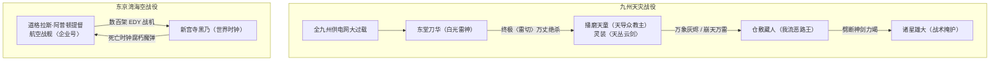

# 《落第骑士英雄谭》第十七卷：出场人物全量索引与阵营图谱

## 1. 阵营分布总览

第十七卷登场人物分为三大战略阵营：
1. **日本防卫与学生骑士联盟**：东堂刀华、仓敷藏人、诸星雄大、新宫寺黑乃、黑铁严、黑铁一辉（正太体型）、史黛菈·法米利昂、紫乃宫天音、海江田技师；
2. **大国同盟美利坚合众国入侵军**：道格拉斯·阿普顿提督（〈白鲸〉）；
3. **极恶邪教天导众天灾方**：播磨天童（〈大炎〉）。

---

## 2. 核心具名人物详细索引表

| 人物姓名 | 称号 / 别名 | 所属阵营 | 灵装 / 战力机制 | 卷内关键战绩与出场情节 | 终局生息状态 |
|---|---|---|---|---|---|
| **东堂刀华** | 〈雷切〉 | 破军学园三年级 / 学生会长 | 〈鸣神〉 〈建御雷神〉 终极〈雷切〉 | 本卷绝对核心主角。在福冈中央变电所刺入电缆，强行吸收全九州发电设备电网汇聚的天文级电能化身纯白雷神，于万米高空以终极〈雷切〉彻底斩灭播磨天童，一剑吹散覆盖整个九州的阴云！ | **存活（九州救世主）** |
| **仓敷藏人** | 〈剑士杀手〉 | 贪狼学园三年级 | 〈大蛇丸〉（双短刀） 我流〈恶路王〉 | 在九州灾害中心直面播磨天童，将天衣无缝升华为攻防一体的我流〈恶路王〉，以神速反射强行撕裂万象灰烬与落雷，生生劈碎天丛云剑，后魔力耗尽力竭倒地。 | **存活（力竭昏迷后获救）** |
| **诸星雄大** | 〈浪速之星〉 | 武曲学园三年级 | 〈虎王〉 | 协同九州防线，在藏人力竭后将其背至安全地带并分析战局，为刀华蓄力争取关键战术窗口。 | **存活** |
| **播磨天童** | 〈大炎〉 天导众教主 | 邪教天导众 | 〈天丛云剑〉 〈万象灰烬〉 〈崩天万雷〉 | 在九州引发全域极寒暴雪与雷火天灾，妄图以灾祸考验“天选英雄”；天丛云剑虽被藏人劈碎但其以天上魔力再度重构；最终被汲取全九州电网的东堂刀华以〈雷切〉彻底消灭。 | **彻底败亡（灰飞烟灭）** |
| **新宫寺黑乃** | 〈世界时钟〉 | 破军学园理事长 | 双枪灵装 〈倍速时间〉 〈死亡时钟〉 | 在东京湾前线单兵踏空迎战美军舰队，以十倍速高速移动闪避饱和炮火，用数万倍加速衰朽的〈死亡时钟〉连环摧毁数十架自律战机〈EDY〉。 | **存活（死守首都防线）** |
| **道格拉斯·阿普顿** | 〈白鲸〉 / 飞空提督 | 美利坚合众国海军 | 航空战舰〈企业号〉 活体金属细胞魔法 | 率领合众国航母群与庞大机械战机群强闯东京湾，企图以绝对武力压垮日本首都防线。 | **存活（交战中）** |
| **黑铁一辉** | 〈剑神〉 | 破军学园二年级 | 〈阴铁〉 | 身体尚未复原仍为小正太体型，归国参与高层防务研讨，分析双线作战困局。 | **存活** |
| **史黛菈·法米利昂** | 〈红莲皇女〉 | 法米利昂皇国第二皇女 | 〈妃龙罪剑〉 | 陪伴一辉归国，在东京指挥部随时准备投入一线防卫。 | **存活** |
| **紫乃宫天音** | 〈恶运〉 | 无所属 | 〈女神过剩之恩宠〉 | 卷首第四章现身展示因果干涉，揭示合众国入侵与天导众灾难背后的命运轨迹。 | **存活** |
| **黑铁严** | 〈铁血〉 | 国际魔法骑士联盟日本分部长 | 战略决策 | 坐镇综合指挥中心，沉着统筹东京湾首都保卫战与九州大炎讨伐战的双线资源调度。 | **存活** |

---

## 3. 双线战力对局图谱

