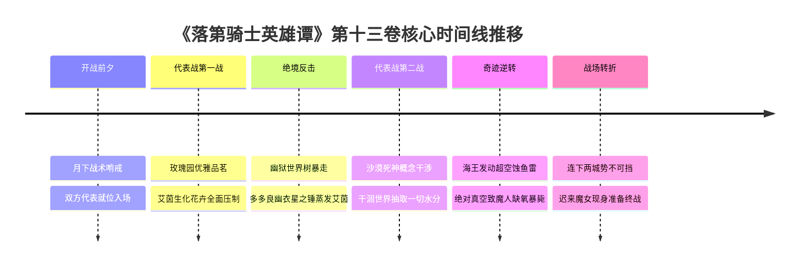

# 第十三卷卷内时间线：全量锚定与时序坐标

> **权威材料依据**：`落第骑士英雄谭 第十三卷 gbk.txt`（`MAT-013`，6,518 行全量原著正文）  
> **时间规范原则**：严格基于原著显式时间词、比赛场次推移、昼夜进程与战斗相对间隔，不捏造虚假公历年月日。  
> **事实状态标定**：`extracted`（原文显式字句确认）、`proposed`（卷内情节连续逻辑推导）。

---

## 一、代表战开战宏观进程

| 战役进度 | 核心战场 | 对阵双方 | 胜负与结局 |
|---|---|---|---|
| **第一战** | 路榭尔王城玫瑰园 | **〈恶之华〉艾茵·阿伯伦特 VS 多多良幽衣（四号菲亚）** | **多多良幽衣惨胜**（艾茵身化幽狱世界树被星之锤彻底蒸发解脱；幽衣断臂盲目失聪终生残废） |
| **第二战** | 路榭尔市区广阔战圈 | **〈沙漠死神〉纳西姆·萨利姆 VS 〈海王〉卡洛·阿尔巴** | **卡洛·阿尔巴胜**（以非魔人之躯利用超空蚀抽干战场氧气，致魔人纳西姆窒息休克暴毙，创以弱胜强奇迹） |

---

## 二、卷内核心时间节点全量锚定（Anchor `T01` ～ `T06`）

---

### `T01` 开战前夜·月下哨戒：最后的整备与无声压迫
- **时间状态**：`extracted`
- **章节范围**：间章至第十五章（L3–L1942）
- **核心事件**：路榭尔全城被夜幕笼罩，全境电波被强制接通国际转播。法米利昂代表队（一辉、史黛菈、多多良幽衣、艾莉丝等）进入待命阵地。双方暗哨在月光下的废墟街区展开试探性短兵相接。
- **地点**：路榭尔市区边缘与战地休息室。

---

### `T02` 代表战首战开幕·清晨：玫瑰园的恶魔茶会
- **时间状态**：`extracted`
- **章节范围**：`CH-16` 第十六章（L1943–L3833）
- **核心事件**：裁判正式宣布第一场个人战打响。暗狱之家首席艾茵身穿华美晚礼服，在路榭尔王城玫瑰园白铁桌前优雅冲泡玫瑰茶。面对手持电锯步入花园的多多良幽衣，艾茵亲昵称呼其为“可爱的爱哭鬼菲亚”，以戏谑语调劝其投降认作真正的妹妹。
- **地点**：奎多兰王城内部皇家玫瑰花园。

---

### `T03` 铁处女施虐与荆棘灌喉·上午：暗狱武技的极致压制
- **时间状态**：`extracted`
- **章节范围**：`CH-17` 第十七章前半（L3834–L4600）
- **核心事件**：艾茵施展〈多嘴郁金香〉、〈戳刺青竹〉与〈大胃王捕蝇草〉，以“快攻阻碍、慢攻挤压”的双重波状战术克制幽衣的瞬间反射判定。艾茵步步紧逼，以荆棘刺入幽衣咽喉并将其折磨至抽搐失禁，享受精神摧残的快感。
- **地点**：玫瑰园战圈核心。

---

### `T04` 世界树萌芽与星之锤蒸发·正午：一号艾茵的最终解脱
- **时间状态**：`extracted`
- **章节范围**：`CH-17` 第十七章后半（L4601–L5632）
- **核心事件**：艾茵被激怒，以全魔力催动深植于子宫的灵装〈阿斯塔萝黛〉，化身高达五十公尺的魔界巨木〈幽狱世界树〉，释放魔兽大军遮天蔽日。幽衣服下禁药〈天使碎尘〉突破神经死境，借由全行星公转动能引导绝对破坏力——**〈星之锤〉**！白光轰鸣中，幽衣含泪道别：“谢谢你，永别了，老姐。”艾茵与整座王城中庭被彻底蒸发为万丈深渊巨坑。幽衣失去一臂、一眼、一耳，当场陷入昏死。
- **地点**：王城玫瑰园遗址深渊巨坑。

---

### `T05` 代表战次战爆发·午后：荒漠概念与海王之戟
- **时间状态**：`extracted`
- **章节范围**：`CH-18` 第十八章前半（L5633–L6000）
- **核心事件**：第二场个人战打响：法米利昂代表〈海王〉卡洛·阿尔巴对决解放军魔人〈沙漠死神〉纳西姆·萨利姆。纳西姆发动概念干涉〈干涸世界〉，瞬间将战场数公里化为漫天黄沙，剥夺一切水分与生命体液，卡洛·阿尔巴的水流魔力遭遇极限压制。
- **地点**：路榭尔南区石造大广场。

---

### `T06` 超空蚀绝杀·午后：科学战术击溃魔人神话
- **时间状态**：`extracted`
- **章节范围**：`CH-18` 第十八章后半（L6001–L6421）
- **核心事件**：卡洛·阿尔巴不退反进，施展流体力学极致奥义——**〈超空蚀（Supercavitation）〉**。他操纵极速真空鱼雷撕裂大气，瞬间在纳西姆身体周围制造出**绝对真空死域**。由于魔人肉体仍是依靠视神经、肺部呼吸与氧气维持的碳基生物，纳西姆在绝对缺氧与超强负压下瞬间肺泡破裂、大脑严重缺氧昏厥休克，被水流重压彻底碾碎击败！全场震撼，创下凡人凭借物理机制正面猎杀魔人的惊天奇迹。
- **地点**：路榭尔南区真空残骸战圈。
