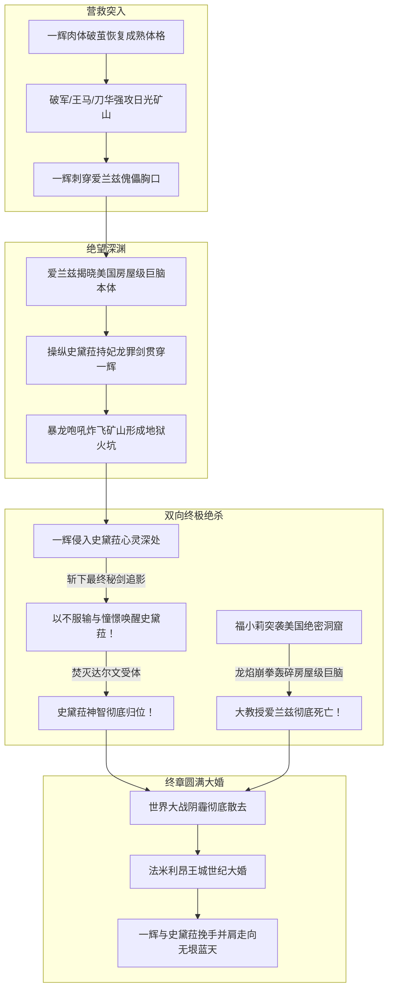

# 《落第骑士英雄谭》第十九卷：卷内时间线与关键事件锚点

## 1. 时间轴设计说明

本时间线针对《落第骑士英雄谭 第十九卷》（材料标识：`MAT-019`）进行高精度终章事件锚定。第十九卷剧情主要跨越**营救决战的致命48小时**（矿山突入、心灵斩击、大教授覆灭），以及大战平息数月后的**法米利昂王城世纪大婚典礼**。

---

## 2. 卷内时间轴事件清单（T01–T08）

| 节点编号 | 剧情时间 / 相对时间 | 涉及章节与行号 | 发生地点 | 核心参与人物 | 核心事件与因果逻辑 |
|---|---|---|---|---|---|
| **T01** | 史黛菈被掠后首日·深夜 | 间章 `L1–L182` | 栃木县日光市废弃矿山地底设施 | 卡尔·爱兰兹（大教授）、史黛菈·法米利昂 | **遭囚的母体与基因抽取**。史黛菈被浸泡在大型密闭培养容器中，大教授注入神经麻痹与虚假经验药物，妄图从其真龙超度觉醒肉身中提取再现基因。 |
| **T02** | 突袭前夕·黎明 | 第四章 `L183–L1200` | 破军学园战地医疗帐篷 | 黑铁一辉、黑铁珠雫 | **意志破茧与少年体格完全恢复**。后山自爆重伤的一辉在珠雫死命抢救下苏醒；强烈的救妻执念激发肉体深层细胞超常代谢，一辉**彻底脱离正太幼态，完全复原为成熟挺拔的少年剑神身躯**！ |
| **T03** | 营救行动打响·正午 | 第四章 `L1201–L2065` | 日光废矿入口与坑道 | 黑铁王马、东堂刀华、有栖院凪、黑铁一辉、珠雫、亚伯拉罕人偶群 | **日光矿山强攻**。破军与战友全员出击，王马与刀华硬撼五具亚伯拉罕掩护中军，一辉与珠雫突破至地下最底层核心实验室。 |
| **T04** | 最深层血战·午后 | 第五章 `L2066–L4060` | 日光废矿地下绝密主实验室 | 黑铁一辉、卡尔·爱兰兹（肉身傀儡）、史黛菈（被操纵） | **巨脑秘密与贯胸惨剧**。一辉以〈一刀罗刹〉贯穿爱兰兹胸膛，但爱兰兹揭示其真正的本体大脑早在数十年前就扩充如“独栋洋房”大小藏在美国；爱兰兹以神经受体操控史黛菈，反手以〈妃龙罪剑〉贯穿一辉胸口，并诱发〈暴龙咆吼〉将整座矿山炸为红土焦土！ |
| **T05** | 心灵世界破茧·午后决胜 | 第六章 `L4061–L5850` | 矿山焦土大坑 / 史黛菈意识空间 | 黑铁一辉、史黛菈、卡尔·爱兰兹（意识） | **心灵界最终秘剑〈追影〉与灵魂复苏**。一辉侵入史黛菈被洗脑认知为老妪的心灵深处，以斩绝一切的〈追影〉激发史黛菈心中不甘认输的永恒憧憬！史黛菈打破因果返老还童反弹追影，在现实中以真龙巨剑焚毁耳内爬出的达尔文细胞受体！ |
| **T06** | 异国越洋斩首·同一时刻 | 第六章 `L5851–L6373` | 美国境内爱兰兹绝密洞窟基地 | 福小莉（饕餮）、爱德怀斯（策应） | **巨脑容器粉碎与大教授灭亡**。福小莉在爱德怀斯指引下杀入美国蚁巢洞窟最深处，将偷学自史黛菈的真龙烈焰缠绕崩拳，一拳击穿并彻底焚毁浸泡在容器内的房屋级巨型活体大脑！卡尔·爱兰兹彻底灰飞烟灭！ |
| **T07** | 战后数月·毕业前夕 | 终章 `L6374–L6850` | 破军学园训练场与宿舍 | 黑铁一辉、日下部加加美 | **劲敌的新生之路**。加加美采访一辉，披露诸星雄大考入国防大学走向军队官僚将领之路、天音钻研因果剑术新路向、刀华与藏人领跑职业赛场；一辉收拾行李前往机场飞赴法米利昂。 |
| **T08** | 全剧最高潮·周末婚礼日 | 终章 `L6851–L7030` | 法米利昂皇国王城大圣堂 | 黑铁一辉、史黛菈、席琉斯、阿斯特蕾亚、多多良幽衣、莎拉等 | **落第骑士终局大婚**。史黛菈身着珍珠光泽纯白婚纱，一辉彻底斩除童年自卑阴暗心魔，两名真正平等的灵魂在亲友的盛大祝福下挽手并肩，阔步奔向无垠蓝天，全剧圆满落幕！ |

---

## 3. 终局战役因果图

