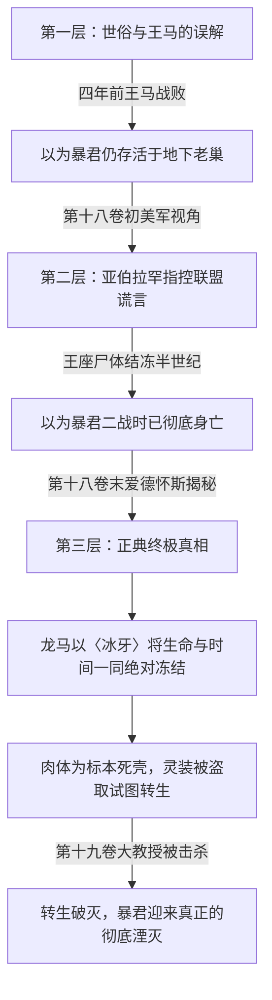

# 〈暴君〉亚当斯·盖堤亚（Adams Goetia / アダムス・ゲーティア）

> **所属势力/阵营**：跨国犯罪网络〈解放军（Rebellion）〉初代最高盟主 / 第二次世界大战幕后黑手 / 地下世界君临之王  
> **伐刀者等级/战力定位**：超 S 级 / 踏入〈魔人（Desperado）〉境界 / 二战暗中操纵战局的地下世界王者  
> **核心称号/二つ名**：〈暴君（Tyrant）〉 / 恶棍之王 / 解放军初代盟主  
> **全书登场与出处卷次**：初次提及于**第八卷**（黑铁王马回忆）；格局奠定于**第十卷**（世界三大势力均势）；暗线伏笔于**第十一卷**（使徒政变）；真身揭秘于**第十八卷**（寒冰王座与龙马之剑）；转生阴谋破灭与终极谢幕于**第十九卷**

---

## 一、 外貌生理与视觉核心特征 (Visual & Anatomical Dossier)

### 1.1 基础生理参数与体态轮廓
- **生前/二战全盛期霸主形态**：
  - 身材极为雄魁粗壮的中年男性，骨架宽大如山岳，肌肉密度远超常人，散发着君临地下世界、以暴力践踏一切规则的绝对暴君威压。
- **寒冰王座标本体态（第18卷～第19卷真相）**：
  - [`MAT-018#L170-198`] 静坐在数百米地底圆顶机库中央王座上的中年男人。
  - 全身彻底冰冻结霜，犹如一只被永恒凝固在琥珀中的**“昆虫类标本”**。
  - 胸膛正中央被一柄黑柄日本刀（黑铁龙马的半身灵装〈冰牙〉）笔直贯穿钉死在王座靠背上。
  - 面部凝固着临终被封印瞬间的表情：**双眼圆睁，眉峰倒竖，神情满是无尽的狂怒、不甘与极致震惊**。
  - 右手原先紧握着其自身灵装——一柄散发着不祥血光的双手巨剑〈噬血者〉（后被大教授盗走）。

### 1.2 头部与五官特征
- **毛发与面部轮廓**：深色短发，面部线条如刀劈斧削般冷硬刚毅，下颌线条粗犷，散发着纯粹的征服者气质。
- **眼神定格**：死死怒视前方虚空，即使被绝对零度时间冰封半个世纪，残存的杀意与怨毒依然让步入机库的来访者感到刺骨战栗。

---

## 二、 固有灵装、异能与战力体系 (Device & Elemental Manifestation)

### 2.1 固有灵装：〈噬血者（Blutsauger / 猎血之牙）〉
- **实体形态**：
  - [`MAT-018#L198`, `MAT-019#L99`] 通体呈现深红如凝固干涸鲜血的异形长剑/大剑。
  - 蕴藏着人类史上最庞大魔力的灵魂结晶，剑身内部流动着类似血液的魔力脉动，能够吞噬、汲取生物生机与灵魂组成资讯。
- **大教授盗取与转生素材**：
  - 第十八卷末尾被卡尔·爱兰兹从冰封尸体手中盗走，用于萃取暴君灵魂的组成资讯并编入达尔文生殖细胞（`MAT-019#L143`）。

### 2.2 伐刀绝技与魔人权能
1. **概念级异能·〈精神操控（Mind Control）〉**：
   - 超越常理认知的群体认知改写异能。二战时期暴君正是凭借此能力，**从幕后深邃夜幕中同时洗脑并掌控了同盟国与轴心国双方的最高政治中枢与军政统帅部**（`MAT-018#L116`），肆意扩大无差别灭绝屠杀与核战危机。
2. **踏入魔人境界（Desperado）**：
   - 摆脱了人类出生时先天因果律的魔力限制，拥有深不可测的毁灭性能量。在第十卷月影的政治视角中，与联盟的白胡公、同盟对外宣称的亚伯拉罕并列为三大势力相互抗衡的顶级魔人（第10卷 L1623-1633）。
3. **衍生克隆兵器（亚伯拉罕系列）**：
   - 大教授卡尔·爱兰兹以冰封暴君的遗体与灵装为素材，通过水系〈细胞魔法〉批量制造的无心智人造克隆体（大教授亲口说明其缺乏自我执念，无法成为真正的魔人）。

---

## 三、 核心公案考据：暴君到底“死没死”？

针对读者与角色普遍存在的“暴君不是早死了吗”之疑问，原著给出了层层递进、三次反转的严密证据链：

### 1. 第一层误解：四年前黑铁王马遭遇的“暴君”是谁？
- **事实真相**：`MAT-018#L1281-1293`
- 黑铁王马在第八卷声称“四年前在世界的尽头挑战暴君惨遭碾压，险些丧命后被爱德怀斯所救”。
- **第十八卷揭底**：王马当年闯入解放军禁地，遭遇并惨败的对手**根本不是暴君本尊，而是大教授制造的暴君 DNA 克隆人——〈超人〉亚伯拉罕·卡特**！王马被亚伯拉罕以念力与瞬间移动击溃，爱德怀斯赶到救下王马。

### 2. 第二层反转：亚伯拉罕控诉的“二战死亡说”是真的吗？
- **美军指控**：`MAT-018#L202-206`
- 亚伯拉罕在捷克基地向月影等人展示王座上的冰冻尸体，斥责联盟谎报暴君只是重伤，实质早已死亡半世纪，以此污蔑联盟隐瞒真相谋取私利。

### 3. 第三层终极真相：黑铁龙马半身之剑与时间的停滞
- **正典定论**：`MAT-018#L6089-6101`
- 亲历者南乡寅次郎与黑铁龙马亲传关门弟子爱德怀斯在王座前公开定论：
  > **「他没有死，而是整个人连同存在的时间，一起被冰冻起来。下手的人就是我的师傅───龙马师傅。」**
- 二战末期白胡公特务队突入王座，常规武力无法彻底杀死拥有魔人不灭特性的暴君。〈大英雄〉黑铁龙马拔出双刀灵装之一的**〈冰牙〉**刺穿暴君胸口，**将暴君的肉体、生命乃至其所处的“存在时间”一并绝对冻结停滞**！
- 龙马为此永久失去了一半灵装与战力，不得不引退。暴君因此处于“既非活着、亦非寻常死去，而是时间定格的永恒标本”。

### 4. 终局收束：第十九卷的彻底消亡
- **转生破灭**：大教授盗走灵装〈噬血者〉作为灵魂素材，企图在史黛菈体内进行生殖细胞转生，并宣称王座上的肉体只是一具无用空壳（`MAT-018#L6295`）。
- **彻底湮灭**：第十九卷史黛菈真龙火海烧尽达尔文细胞，福小莉轰破空洞一拳打爆大教授巨脑，暴君的灵魂转生彻底破产，灵装与灵魂组成资讯烟消云散，这位半个世纪前的黑暗霸主正式迎来不可逆的永恒消亡。

---

## 四、 全卷登场编年史 (Complete Chronological Arc)

### 4.1 第八卷：绝望的阴影与王马的梦魇
- **锚定行号**：`MAT-008#L1766-1800`、`L2864`、`L3024`
- **内容实录**：七星剑武祭半决赛前夕，黑铁王马向史黛菈公开道出〈暴君〉之名。王马将自身舍弃防御、解开〈天龙甲冑〉追求极速进化的动机归结于四年前败于“暴君”手下的无力恐惧（后坐实为克隆人亚伯拉罕）。

### 4.2 第十卷：世界三大阵营基石与战力标杆
- **锚定行号**：`MAT-010#L1625-1653`
- **内容实录**：月影总理向一辉揭开世界三大阵营格局（联盟白胡公、同盟超人、解放军暴君）。月影预言暴君寿数将尽，其离世将引发同盟与联盟的争抢，极可能成为第三次世界大战的导火索。

### 4.3 第十一卷：阿尔卑斯政变与空置的王座
- **锚定行号**：`MAT-011#L1829-1861`
- **内容实录**：欧尔·格尔与大教授血洗十二使徒旧部后，欧尔·格尔向恶之华与沙漠死神揭开惊人秘密：暴君根本不在总部，全组织只有风祭晄三、大教授与另一名心腹知晓暴君真身所在地。

### 4.4 第十八卷：地下冰座显现、刺客真相与爱德怀斯的揭秘
- **锚定行号**：`MAT-018#L100-220`、`L1281-1293`、`L6070-6295`
- **内容实录**：
  1. 亚伯拉罕带领月影等人进入地底机库，展现被日本刀钉在王座上的冰冻死尸；
  2. 王马与亚伯拉罕开战，揭露四年前打垮王马的正是克隆人亚伯拉罕；
  3. 南乡、爱德怀斯与福小莉赶到王座，爱德怀斯指出暴君是被龙马以〈冰牙〉冻结了生命与时间；
  4. 大教授趁乱抽走暴君灵装〈噬血者〉，将冰封肉身视为遗弃空壳引发塌方。

### 4.5 第十九卷：噬血者转生阴谋与永恒终结
- **锚定行号**：`MAT-019#L99-143`、`L6284-6332`
- **内容实录**：
  1. 大教授在日光秘密实验室解密：亚伯拉罕为暴君克隆体，而终极计划是以暴君灵装〈噬血者〉的灵魂资讯在史黛菈真龙母体内轮回转世；
  2. 一辉以〈追影〉破除心魔，福小莉击碎大教授巨脑本体，转生手术全盘瓦解，暴君罪恶的历史印记彻底被埋葬。

---

## 五、 官方文献核心证据摘录 (Canonical Quotes)

1. **第八卷第四章（王马提及暴君恐惧）**：
   > `MAT-008#L1780`：“这名伐刀者，他是地下世界的统帅，恶人们的〈盟主〉。〈暴君〉，就是他的绰号。”  
   > `MAT-008#L1786`：“「我被彻底击溃……我穷尽全力，却连抵抗都做不到。」”

2. **第十卷第一章（世界三大魔人之一）**：
   > `MAT-010#L1631`：“最后，〈解放军〉内便是那位从第二次世界大战前就长期君临地下世界，恶棍之王，──盟主〈暴君〉。”

3. **第十八卷第一章（被日本刀钉死在王座上的冰冻标本）**：
   > `MAT-018#L194`：“一柄日本刀钉住了〈暴君〉，他全身结冻，犹如虫类标本。王座上，是一具冰冻的死尸。尸体手握血红之剑，应该是自身的灵装(Device)，双眼圆睁，神情满是愤怒与震惊。”

4. **第十八卷第三章（爱德怀斯亲口解密：龙马的冰牙与时间的冻结）**：
   > `MAT-018#L6089`：“「他没有死，而是整个人连同存在的时间，一起被冰冻起来。下手的人就是我的师傅───龙马师傅。」”  
   > `MAT-018#L6099`：“现今〈联盟〉领袖，〈白胡公〉率领了特务部队，对上了〈暴君〉。当时龙马以形同半身的一柄〈冰牙〉，直接冰冻〈暴君〉的性命与时间，为战争画下句点。”

5. **第十九卷间章（灵装噬血者与克隆计划）**：
   > `MAT-019#L99`：“〈暴君〉的灵装（Device）──〈噬血者（Blutsauger）〉已经随时间一同冻结，因此保存下来。爱兰兹一见到那柄灵装，便以这曾经在世界掀起骇浪的庞大力量为范本……创造〈暴君〉的复制人，亚伯拉罕·卡特。”  
   > `MAT-019#L111`：“施展〈细胞魔法〉，将〈暴君〉的灵魂结晶──灵装〈噬血者〉编入人类的生殖细胞，以科学技术让〈暴君〉的灵魂轮回转世。”

---

## 六、 世界书配置规划（待用户审核，严禁直接写入 JSON）

- **建议触发词**：`["亚当斯·盖堤亚", "暴君", "Adams Goetia", "噬血者", "Blutsauger", "解放军盟主"]`
- **定位属性**：`order: 267`, `position: 4`, `selective: true`, `preventRecursion: true`。
- **跑团与设定功能**：作为落第世界二战秘辛、黑铁龙马退役真相、三大魔人历史背景以及第十八/十九卷核心大阴谋的历史锚点条目使用。
