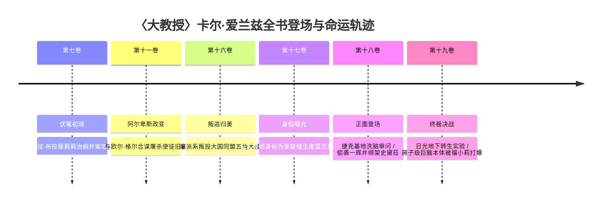

# 〈大教授〉卡尔·爱兰兹（Carl Ignaz / カール・アイランズ）

> **所属势力/阵营**：跨国犯罪集团〈解放军（Rebellion）〉最高干部〈十二使徒（Numbers）〉首席科学家 / 美利坚合众国联邦准备制度理事会（FRB）主席 / 美军尖端军事技术顾问  
> **伐刀者等级/战力定位**：世界最顶尖水术士 / 达尔文细胞生命科学家 / 战略兵器级生化母体  
> **核心称号/二つ名**：〈大教授（Grand Professor）〉 / 伪名〈爱兰兹·伯格（Islands Berg）〉  
> **初次提及与活跃卷次**：初次提及于**第七卷**（为莎拉治病）；政治暗流于**第十一卷**、**第十六卷**、**第十七卷**；正面现身于**第十八卷**；终极决战核心Boss于**第十九卷**（彻底覆灭）

---

## 一、 外貌生理与视觉核心特征 (Visual & Anatomical Dossier)

### 1.1 基础生理参数与体态轮廓
- **世俗伪装体态（第18卷～第19卷前期）**：
  - 身材消瘦枯槁、略显佝偻的古稀白人老者。
  - 骨架干瘪，看似风烛残年、弱不禁风，但眼神中透着对人体结构与神经生理极度透彻的冷酷解剖者气息。
- **达尔文生体装甲体态（第19卷第五章）**：
  - 由达尔文细胞构成的三至五米高畸形巨婴外壳。表面覆盖着半透明黏液与角质硬壳，体表嵌合着三十余只巨型变异螳螂镰肢与狂暴变异毒蜂巢穴，散发着反自然的生化异臭。
- **真身/洋房级巨脑体态（第19卷终局真相）**：
  - 他早已彻底剥离凡人脆弱肉身，其真正本体是一具**“足足有独栋洋房大小”**（数层楼高）的粉白超巨型大脑！
  - 浸泡于栃木县日光千米地下废矿巨型强化玻璃培养槽中，无数闪烁着电讯号的粗壮神经缆线与美军五角大楼全球指挥网络及核弹发射井直接物理相连。

### 1.2 头部与五官微表情
- **头部特征**：顶部完全光秃，后脑残留稀疏斑白的杂发。
- **牙齿与面部特写**：因常年嗜吸高纯度大麻，张嘴时暴露出满口被**大麻烟熏得焦黄发黑的枯黄烂牙**（`MAT-019#L1242` 原文显式特征）。
- **眼神与微表情**：嘴角常年挂着神经质的戏谑冷笑与挑衅假笑；双眼浑浊却如毒蛇般锐利，视所有凡人生灵为“实验素材与劣等胚胎”。

### 1.3 服饰装束变迁
- **世俗科研/政治装束**：身披宽大、泛黄且沾染试剂与神经液痕迹的白色研究人员长袍（白大褂），内着凌乱的高级西装衬衫与松垮领带。
- **终局生体核心**：无服饰，巨脑本体赤裸浸泡于泛着淡绿荧光的重水营养液槽中。

---

## 二、 固有灵装、异能与科技体系 (Device & Elemental Manifestation)

### 2.1 伐刀异能与固有绝技
- **水术士顶点与体液支配**：
  - 拥有世界最顶尖的水术士造诣，不仅能操控外在水体，更能以分子级微观精度操纵人体血液、淋巴液、脑脊髓液与细胞内液。
- **达尔文细胞魔法（Darwin Cells）**：
  - 结合伐刀异能与尖端生物学创造出的恶性拟态干细胞。具有无限增殖、极速肉体再生、跨物种基因嵌合与吸收进化之能。
- **终极奥义·〈完全结实（Perfect Fortune）〉**：
  - [`MAT-019#L2945`] 通过感知与预见敌人的理想未来，利用达尔文细胞即时重组自身肌肉与神经突触，强行具现化出“千锤百炼后未来全盛期姿态”的逆天战法（曾以此拟态出遥远未来的〈剑神〉黑铁一辉全盛体态施展猛攻）。

### 2.2 军事工业与人造兵器遗产
1. **人造魔人克隆军团·〈超人〉亚伯拉罕系列（Abraham Clone Series）**：
   - 提取美军魔人统帅亚伯拉罕·卡特的遗传因子，批量制造的无心智重装伐刀克隆人部队。
2. **机械士兵〈EDY〉**：
   - 将普通重装机械工业化量产为具备伐刀者破坏力的武装人形兵器。
3. **指向性强子炮〈强子加农炮（Hadron Cannon）〉**：
   - 超高能粒子贯穿武器，改写现代海空战规则。
4. **空中决战航母·改造版〈企业号（Enterprise）〉**：
   - 将美利坚合众国超级航空母舰注入反重力与高能结界，推进美国军事科技整整跨越一个世纪。

---

## 三、 从初登场至终局全景编年史 (Complete Chronological Arc)

### 3.1 第七卷：伏笔初现（初次提及）
- **锚定行号**：`MAT-007#L2462`、`L3210`
- **主线事件**：
  - 大阪选拔战终盘，彩色魔女莎拉·布拉德莉莉向黑铁一辉吐露加入解放军的缘由：她幼年罹患不治绝症，仰赖风祭晄三牵线，由〈解放军〉首席医生兼干部十二使徒之一的**〈大教授〉**施展绝密手术换得新躯体，因而欠下巨额医疗债务，沦为组织的挂名工具。

### 3.2 第十一卷：阿尔卑斯政变（暗中夺权）
- **锚定行号**：`MAT-011#L1021`、`L1861`
- **主线事件**：
  - 瑞士阿尔卑斯山脉解放军总部爆发弑师血案。欧尔·格尔与大教授早已暗中勾结，二人故意不在总部，避开独腕剑圣华伦斯坦的正面对决，借通风管神经毒气清洗旧部。
  - 正式确认：全组织仅风祭晄三、〈大教授〉以及另一人知晓沉睡盟主〈暴君〉的真正所在。

### 3.3 第十六卷～第十七卷：投美叛变与世俗惊天身份
- **锚定行号**：`MAT-016#L1086`、`MAT-017#L1834`
- **主线事件**：
  - 傀儡王死后，大教授率领残部潜逃回母国美国，与〈大国同盟〉全面合流。
  - 联盟统帅部情报解密：大教授在世俗社会的真实身份竟是掌控全球经济命脉的**美利坚合众国联邦准备制度理事会（FRB，美联储）主席——爱兰兹·伯格**！

### 3.4 第十八卷：正面现身、捷克审讯与突袭东京
- **锚定行号**：`MAT-018#L290`、`L368-380`、`L559`、`L1673`、`L6387`
- **主线事件**：
  - **捷克地下基地审问**：身裹白褂、吸食大麻的大教授正式正面出场，动用魔力探针昼夜洗脑折磨被拘禁的月影总理与风祭晄三，炫耀由其主导的强子加农炮与改造航母〈企业号〉。
  - **东京清晨突袭**：首都防卫战刚刚落幕，一辉与史黛菈在街头散步放松。大教授抓住防御真空骤然突袭，将一辉重创濒死，当场掳走〈红莲皇女〉史黛菈！

### 3.5 第十九卷：终极决战、真身暴露与彻底覆灭
- **锚定行号**：`MAT-019#L30-59`、`L1242`、`L2066-2945`、`L6060-6306`
- **主线事件**：
  - **日光秘密实验室**：大教授将史黛菈带至栃木县日光市废弃矿山地下千米空洞，展开以史黛菈为母体、结合达尔文细胞的“暴君灵魂转生手术”。
  - **人偶弑夫与绝技交锋**：操控失智的史黛菈刺穿一辉，发动达尔文生体大军与奥义〈完全结实〉，拟态一辉未来剑神体态压制全场。
  - **心灵解脱**：一辉施展第七秘剑〈追影〉深入史黛菈心灵斩破虚妄，史黛菈真龙火海将达尔文细胞焚尽瓦解。
  - **巨脑被打爆覆灭**：大教授恼羞成怒企图强行动用美国核武密码毁灭世界。潜入地底的神龙寺魔人仙人〈饕餮〉福小莉轰破空洞，亲眼见证并**一拳将大教授足有独栋洋房大小的超巨型大脑彻底轰成肉泥粉末**！狂妄一生的大教授当场毙命。

---

## 四、 官方文献核心证据摘录 (Canonical Quotes)

1. **第七卷第十章（莎拉的身世与旧疾治愈）**：
   > `MAT-007#L2462`：“我有一幅画，一定要完成……所以我接受了〈大教授Grand Professor〉的手术，以便治疗自己的旧疾，然后拍卖自己的画作支付治疗费。”

2. **第十八卷第一章（美联储主席身份与大麻黄牙登场）**：
   > `MAT-018#L368`：“他正是美利坚合众国的联邦准备理事会主席，和风祭晄三同为〈解放军〉最高阶干部〈十二使徒〉之一，〈大教授〉卡尔·爱兰兹。”  
   > `MAT-019#L1242`：“只见身裹白衣的秃头老人，〈大教授〉卡尔·爱兰兹俯视着影绘之鼠，露出大麻烟薰过的黄牙，挑衅地笑着。”

3. **第十九卷第五章（绝技〈完全结实〉宣告）**：
   > `MAT-019#L2945`：“预见、实现敌人的理想姿态──这就是〈大教授〉卡尔·爱兰兹的〈完全结实（Perfect fortune）〉！！”

4. **第十九卷第六章（福小莉目睹巨脑本体与粉碎）**：
   > `MAT-019#L6140`：“「哎呀！真让我吃惊！我第一次看到这么大的脑袋！这就是〈大教授〉阁下的本体呀！」”  
   > `MAT-019#L6286`：“严也接到美国方面的联系，〈大教授〉失控，想动用美国的核武，但是〈饕餮〉福小莉阻止了他。”

---

## 五、 战术博弈、致命弱点与世界书配置规划 (Tactical Blueprint)

- **战术优势面**：
  - 微观生物水分子绝对操控，对任何未踏入魔人境界的碳基生物具备压倒性生化压制力。
  - 拟态敌人全盛期体态与招式（〈完全结实〉），兼具极速肉体再生与克隆魔人炮灰护卫。
- **致命弱点与博弈盲区**：
  - **巨脑物理防御脆弱**：舍弃肉体换取庞大计算力的巨脑本体缺乏高阶武者近身格斗直觉，一旦外壳与生体护卫被突破，本体承受不住顶尖物理力量的一击重创。
  - **极致狂妄与掌控欲反噬**：沉迷于造物主优越感，过度低估了人类心灵与剑士羁绊的力量，导致对史黛菈的精神操控被一辉的〈追影〉瞬间攻破。
- **世界书配置规划（待用户审核，暂不写入 JSON）**：
  - 建议触发词：`["卡尔·爱兰兹", "大教授", "爱兰兹", "Carl Ignaz", "达尔文细胞", "完全结实"]`
  - 建议属性：`order: 265`, `position: 4`, `selective: true`, `preventRecursion: true`。
