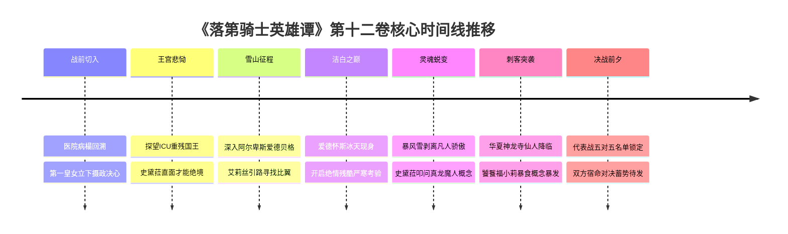

# 第十二卷卷内时间线：全量锚定与时序坐标

> **权威材料依据**：`落第骑士英雄谭 第十二卷 gbk.txt`（`MAT-012`，8,920 行全量原著正文）  
> **时间规范原则**：严格基于原著显式时间词、雪山特训周期、战争动员进程与相对间隔，不捏造虚假公历年月日。  
> **事实状态标定**：`extracted`（原文显式字句确认）、`proposed`（卷内情节连续逻辑推导）。

---

## 一、宏观时序与战争背景

| 时间维度 | 原著显式判定 | 原文出处与行号 | 叙事与地缘定位 |
|---|---|---|---|
| **回忆切入** | **卡尔迪亚战前一小时** | L10 (`MAT-012#L10`)：时间回到法米利昂军与奎多兰军交战前一小时，露娜艾丝在病床上听闻父亲出兵决定。 | 补全间章第一皇女的战前心路。 |
| **卷内起点** | **王宫血案次日清晨** | L174 (`MAT-012#L174`)：席琉斯国王在ICU重症监护室，全城挂起黄色警报。 | 承接卷十一王座遇袭后，王室全力抢救国王。 |
| **雪山征途** | **战后数日** | L1259 (`MAT-012#L1259`)：一辉、史黛菈在艾莉丝陪同下搭乘直升机转雪橇深入阿尔卑斯最高峰爱德贝格。 | 前往寻找世界第一的非正规伐刀者〈比翼〉爱德怀斯。 |
| **严寒特训** | **持续数日连续淬炼** | L2670–L5798 (`MAT-012#L2670`)：爱德怀斯施展“严寒考验”，史黛菈在雪暴中直面冻伤与濒死极限。 | 史黛菈由凡人骑士向真龙魔人跨越的决定性蜕变。 |
| **代表战锁定** | **代表战开战前三日** | L8400 (`MAT-012#L8400`)：奎多兰与法米利昂五年一度领土代表战正赛选手名单正式向国际联盟公布备案。 | 战火一触即发，全军就位。 |

---

## 二、卷内核心时间节点全量锚定（Anchor `T01` ～ `T07`）

---

### `T01` 战前回溯·医院病榻：第一皇女露娜艾丝的铁血誓约
- **时间状态**：`extracted`
- **章节范围**：间章（L3–L173）
- **核心事件**：在卡尔迪亚战役打响前一小时，露娜艾丝在病床上听闻传令兵报告父亲坚持采用非致命镇暴装备。她既为父亲高洁的仁慈震撼，又深知面对恶魔欧尔·格尔此举无异于自寻死路，决意以长女身份背负起王国的政治重担。
- **人物**：露娜艾丝·法米利昂、传令士兵。
- **地点**：卡尔迪亚市战地陆军医院。

---

### `T02` 王宫悲恸·次日清晨：席琉斯重残与史黛菈的心灵绝境
- **时间状态**：`extracted`
- **章节范围**：`CH-10` 第十章（L174–L1258）
- **核心事件**：席琉斯国王在ICU依靠呼吸机维持生命，四肢主要肌腱尽断，即使康复也再无法挥剑。露娜艾丝展现果决的政治手腕接管全军摄政。史黛菈跪在病房外痛哭，痛恨自己在敌国魔人与高位杀手面前的无力，深感常规A级魔力在世界规则级怪物面前如蝼蚁般脆弱。
- **人物**：史黛菈、黑铁一辉、露娜爱丝、雅丝特雷亚王后、席琉斯（昏迷）。
- **地点**：法米利昂皇家总医院ICU特别监护区。

---

### `T03` 雪山征途·数日后：踏向世界最强隐居地
- **时间状态**：`extracted`
- **章节范围**：`CH-11` 第十一章（L1259–L2669）
- **核心事件**：艾莉丝向一辉与史黛菈指出：唯有跨越命运外侧的魔人才能匹敌魔人。一辉曾领悟“盲区剑技”，而当世唯一能指引史黛菈完成蜕变的，唯有世界最强非正规伐刀者——〈比翼〉爱德怀斯。在艾莉丝带路下，三人克服高山反应与暴风雪，徒步登上海拔逾四千米的冰封绝巅爱德贝格。
- **人物**：黑铁一辉、史黛菈、艾莉丝·格尔。
- **地点**：瑞士·阿尔卑斯山脉极巅——爱德贝格峰（Edelberg）。

---

### `T04` 洁白之巅·正午：剑神比翼降临
- **时间状态**：`extracted`
- **章节范围**：`CH-11` 尾声至 `CH-12` 前段（L2500–L3000）
- **核心事件**：终年呼啸的暴风雪突兀停滞，身穿纯白无暇战袍、手持白银双剑的〈比翼〉爱德怀斯无声降临在悬崖巨石上。一辉再次见到曾赐予自己无声剑技的导师深鞠躬；史黛菈跪伏恳求传授打破魔力界限、觉醒魔人之道。
- **人物**：爱德怀斯、史黛菈、黑铁一辉、艾莉丝。
- **地点**：爱德贝格雪白孤峰平台。

---

### `T05` 严寒考验·连续数日：剥离凡人骄傲与龙之觉醒
- **时间状态**：`extracted`
- **章节范围**：`CH-12` 第十二章（L3001–L5798）
- **核心事件**：爱德怀斯冷酷剥夺史黛菈的所有供暖与灵装防护，要求其仅凭薄衫在零下四十度的超低温暴雪与狂风中打坐悟道。史黛菈四肢冻伤发黑、精神陷入濒死谵妄。在一辉生死相随的温暖注视下，史黛菈终于放下“身负庞大魔力的天才皇女”执念，彻底领悟身体内的暴烈龙炎不是燃料，而是“自身灵魂即为真龙概念”的魔人觉悟，体内沉睡的龙神因果开始松动觉醒！
- **人物**：史黛菈、爱德怀斯、黑铁一辉。
- **地点**：爱德贝格冰风死地。

---

### `T06` 刺客突袭·雪原黄昏：神龙寺仙人〈饕餮〉福小莉现身
- **时间状态**：`extracted`
- **章节范围**：`CH-13` 第十三章（L5799–L8399）
- **核心事件**：来自华夏道教圣地神龙寺的特异魔人——〈饕餮〉福小莉现身雪原突袭。她不仅拥有强悍绝伦的道家仙术体魄，更施展出能将光热、魔力甚至物理动能无差别吞噬转化为自身养分的“饕餮之噬”概念异能。冰天雪地中展开震撼的多方极速交锋，展示了亚洲神秘魔人体系的深不可测。
- **人物**：福小莉（饕餮）、史黛菈、一辉、爱德怀斯。
- **地点**：阿尔卑斯山脉背风雪谷。

---

### `T07` 决战前夕·开战前三日：五年一度代表战名单彻底锁死
- **时间状态**：`extracted`
- **章节范围**：`CH-14` 第十四章（L8400–L8876）
- **核心事件**：完成蜕变的史黛菈与一辉重返法米利昂大本营。国际魔法骑士联盟裁判团抵达，两国五年一度领土代表战正赛五对五名单正式完成官方锁死与公证公示。史黛菈作为副将、一辉作为大将，法米利昂阵营抱着背水一战的向死决心，正式迎接第十三卷的残酷死斗。
- **人物**：史黛菈、黑铁一辉、露娜爱丝、联盟裁判组。
- **地点**：法米利昂皇家国防统帅部与路榭尔决战会场。
