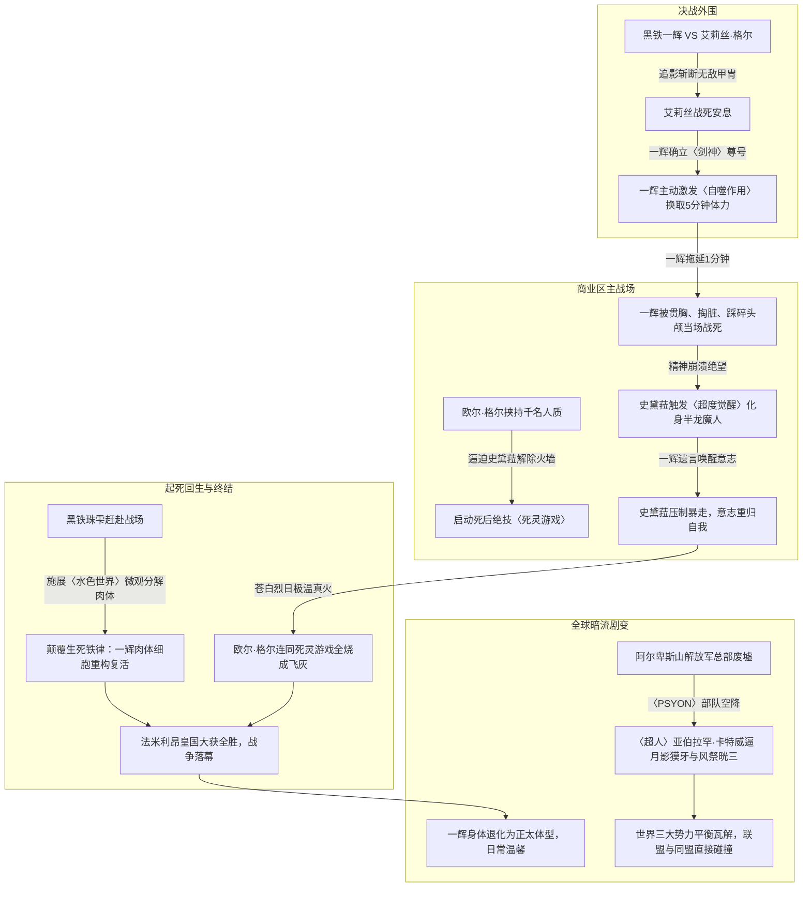

# 《落第骑士英雄谭》第十五卷：卷内时间线与关键事件锚点

## 1. 时间轴设计说明

本时间线针对《落第骑士英雄谭 第十五卷》（材料标识：`MAT-015`）进行高精度事件锚定。第十五卷时间跨度主要涵盖法米利昂王都决战最终日的**最后两个小时**（代表战外围决死斗、欧尔·格尔死灵反扑、史黛菈超度觉醒、一辉起死回生），以及战后数日内的**伤势治疗、政局交涉与日常温存**，卷末终章则通过倒叙锚定了决战两周前的**阿尔卑斯山合众国超能力部队空降事件**。

---

## 2. 卷内时间轴事件清单（T01–T09）

| 节点编号 | 剧情时间 / 相对时间 | 涉及章节与行号 | 发生地点 | 核心参与人物 | 核心事件与因果逻辑 |
|---|---|---|---|---|---|
| **T01** | 领土代表战最终日·黄昏后 | 第二十二章 `L48–L1815` | 路榭尔王都荒芜废墟中央 | 黑铁一辉、艾莉丝·格尔·阿斯卡里德、布马（解说） | **落第骑士 VS 黑骑士决死战**。艾莉丝过度催动〈强化再生〉导致肉体各器官崩坏；两人刀光交错间，一辉以毫厘之差的极限居合斩〈追影〉将艾莉丝连同〈无敌甲冑〉当场开膛破腹！艾莉丝在生命尽头向一辉道谢，含笑安息。 |
| **T02** | 决斗结束即刻（约数分钟内） | 第二十二章 `L1816–L1978` | 艾莉丝遗体旁 | 黑铁一辉、现场军医、转播解说 | **〈剑神〉尊号确立与自噬作用触发**。联盟确认艾莉丝死亡，一辉拂拭其遗容；此战震动联盟，一辉正式被冠以伴随终生的尊号**〈剑神〉**。面对体力枯竭，一辉主动强行催动细胞〈自噬作用（Autophagy）〉，牺牲体格骨肉换取维持5分钟战斗的能量。 |
| **T03** | 商业区战场·同一时间 | 第二十三章 `L1979–L2609` | 路榭尔商业区地表裂缝 | 欧尔·格尔、史黛菈·法米利昂、约翰王子、露娜艾丝 | **千名人质肉盾与〈死灵游戏〉发动**。欧尔·格尔操纵地下避难所的上千名国民走入史黛菈火墙，逼迫史黛菈撤除结界；欧尔·格尔趁机突袭重伤的约翰王子与露娜艾丝，史黛菈以身化盾挡下。欧尔·格尔亮出死后才能启动的最强绝技——〈死灵游戏〉！ |
| **T04** | 王都战场中央·战后数分钟 | 第二十四章 `L2610–L3790` | 商业区地面大裂坑 | 欧尔·格尔、黑铁一辉、西京宁音、史黛菈 | **一辉舍命掩护一分钟与惨烈阵亡**。化身操尸形态的欧尔·格尔狂暴出击；西京宁音以空间扭曲护卫群众；一辉挺身而出以惊神剑艺拖延时间，向史黛菈许下“不后悔与你相遇”的誓言；欧尔·格尔右手贯穿一辉胸口、扯出内脏，并当着史黛菈的面残忍踩碎一辉头颅！一辉当场战死！ |
| **T05** | 一辉战死后数秒 | 第二十四章 `L3791–L4085` | 战场正中央血泊 | 史黛菈、欧尔·格尔、西京宁音 | **巨龙泣血与〈超度觉醒〉**。目睹挚爱惨死，史黛菈精神防线彻底断裂，引发〈超度觉醒（Brute Soul）〉，生长出双利角、骨节龙翼与龙尾，化身半龙半魔形态；但在一辉临终遗言的指引下，史黛菈凭借坚韧爱意与怒火重新压制暴走，誓言亲手彻底超越一辉！ |
| **T06** | 决战最后数分钟 | 第二十四章 `L4086–L4300` | 战场中央一辉血泊旁 | 黑铁珠雫、史黛菈、欧尔·格尔、席琉斯国王 | **〈水色世界〉击碎生死因果**。黑铁珠雫作为支援医疗人员神兵天降。面对一辉四散的残肢碎肉，珠雫展开蓝色天使光翼施展改良绝技〈水色世界〉，将一辉完全分解为微观细胞重新构筑肉体，打破历史铁律实现死者复活！ |
| **T07** | 决战终局一瞬 | 第二十四章 `L4301–L4892` | 路榭尔上空至地表 | 史黛菈、欧尔·格尔、各国观战军民 | **终结杀戮戏曲·苍白白日之焰**。席琉斯人墙阻击欧尔·格尔；史黛菈翱翔苍穹，以超度觉醒之躯释放超越极限的白焰，将欧尔·格尔的最强绝技〈杀戮戏曲〉连同其死灵躯体彻彻底底烧毁殆尽，化作一捧白灰！法米利昂战争正式宣告胜利落幕！ |
| **T08** | 战后数日 | 第二十五章 `L4893–L6633` | 法米利昂皇立医院、私人停机坪 | 黑铁一辉、史黛菈、黑铁珠雫、席琉斯、阿斯特蕾亚、多多良幽衣 | **正太幼年化、病房热吻与幽衣离别**。一辉因自噬过度与细胞重构，身体暂时退化缩水成小学生模样。珠雫训斥悉心照料；史黛菈探病，两人忘情深吻被国王夫妇撞破现场；多多良幽衣大脑治愈后准备坐飞机离开，史黛菈送别并交换联系方式，幽衣心扉悄然敞开。 |
| **T09** | 决战落幕两周前（倒叙） | 终章 `L6634–L6718` | 阿尔卑斯山脉·解放军总部废墟 | 亚伯拉罕·卡特、风祭晄三、月影獏牙、风祭凛奈、夏洛特、莎拉 | **合众国正义空降·超人亚伯拉罕·卡特**。美利坚合众国最强超能力部队〈PSYON〉三架直升机空降，队长〈超人〉亚伯拉罕·卡特徒手缓降落地，代表合众国的“正义”逼问日本首相与风祭财团——世界两大阵营（联盟 VS 同盟）正面冲突的大幕彻底拉开！ |

---

## 3. 战场因果链路与战术复盘

