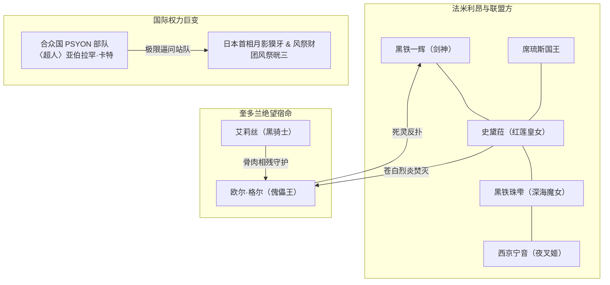

# 《落第骑士英雄谭》第十五卷：出场人物全量索引与阵营图谱

## 1. 阵营分布总览

第十五卷登场人物横跨四大主要势力：
1. **法米利昂皇国与日本代表方**：黑铁一辉、史黛菈·法米利昂、黑铁珠雫、西京宁音、席琉斯国王、阿斯特蕾亚王后、露娜艾丝皇女、丹达利昂局长；
2. **奎多兰王国与叛逆方**：欧尔·格尔（傀儡王）、艾莉丝·格尔·阿斯卡里德（黑骑士）、约翰·克里斯多夫（已解放）；
3. **第三方与流亡者**：多多良幽衣（前解放军/反叛者）；
4. **国际巨头与合众国同盟方**：亚伯拉罕·卡特（超人）、月影獏牙（日本首相）、风祭晄三（风祭财团总裁）、风祭凛奈、夏洛特·科黛、莎拉·布拉德莉莉。

---

## 2. 核心具名人物详细索引表

| 人物姓名 | 称号 / 别名 | 所属阵营 | 灵装 / 战力机制 | 卷内关键战绩与出场情节 | 终局生息状态 |
|---|---|---|---|---|---|
| **黑铁一辉** | 〈落第骑士〉 〈剑神〉 | 日本 / 法米利昂代表 | 〈阴铁〉 第七秘剑〈追影〉 自噬作用（Autophagy） | 在第二十二章中以毫厘之差的极限居合斩〈追影〉斩断艾莉丝的〈无敌甲冑〉，确立伴随余生的**〈剑神〉**尊号；在第二十四章为掩护史黛菈被欧尔·格尔穿胸、碎颅惨死；后被珠雫以〈水色世界〉分解重构复活，身体暂时退化为正太体型。 | **存活**（细胞重组复活，体格暂缩水） |
| **艾莉丝·格尔·阿斯卡里德** | 〈黑骑士〉 | 法米利昂（倒戈向弟弟） | 〈黑寡妇〉（无敌甲冑） 〈强化再生〉 | 为守护欧尔·格尔与一辉拼死决斗，过度催动〈强化再生〉致身体器官崩溃，被一辉以〈追影〉开膛剖腹。临终向一辉道谢，释怀安眠于其怀中。 | **战死（牺牲安息）** |
| **欧尔·格尔** | 〈傀儡王〉 | 奎多兰王国侵略军 / 解放军叛徒 | 〈地狱蜘蛛丝〉 〈死灵游戏〉 〈杀戮戏曲〉 | 挟持千名人质破除史黛菈火墙，发动死后绝技〈死灵游戏〉虐杀一辉并踩碎其头颅；最终被克服超度觉醒暴走的史黛菈以苍白白日烈阳彻底焚灭为一捧飞灰。 | **彻底败亡（灰飞烟灭）** |
| **史黛菈·法米利昂** | 〈红莲皇女〉 | 法米利昂皇国第二皇女 | 〈妃龙罪剑〉 〈超度觉醒〉（半龙魔人） 极温白日之焰 | 目睹一辉惨死后极度悲痛暴怒，触发〈超度觉醒（Brute Soul）〉化身半龙半魔形态；在一辉遗言与自身尊严支撑下恢复理智，释放苍白极炎将欧尔·格尔连同死灵躯体焚毁殆尽，斩获战争最终胜利。 | **存活**（魔人觉醒巩固） |
| **黑铁珠雫** | 〈深海魔女〉 | 破军学园 / 联盟医疗代表 | 〈宵雨〉 〈水色世界（Clearness World）〉 | 作为紧急医疗支援赶赴战场，施展跨越生死与自然法则的改写因果神技〈水色世界〉，将一辉完全分解为微观细胞重新构筑肉体，创造人类医学历史未曾涉足的复活奇迹。 | **存活** |
| **西京宁音** | 〈夜叉姬〉 | 破军学园教师 / 日本代表 | 〈铁扇〉 重力与空间扭曲 | 在战场高处洞悉全局，以空间扭曲精准偏折欧尔·格尔的范围斩击〈杀人戏曲〉，力保四周数十万无辜避难平民免遭切碎。 | **存活** |
| **多多良幽衣** | 〈染血达文西〉 | 前解放军 / 孤狼 | 〈地狱蜘蛛丝〉相关 | 重伤且大脑受损，在史黛菈恳求下由黑铁珠雫治好大脑。战后坐电动轮椅搭乘私人专机离开路榭尔，与史黛菈互留联系方式。 | **存活**（踏上独立旅程） |
| **席琉斯·法米利昂** | 法米利昂国王 | 法米利昂皇室 | 战斧与烈焰 | 率领卫队筑成人墙阻挡欧尔·格尔反扑保护珠雫与一辉；战后推开病房门目睹女儿史黛菈与一辉深吻，怒火中烧又啼笑皆非。 | **存活** |
| **阿斯特蕾亚** | 法米利昂王后 | 法米利昂皇室 | 辅助与治愈支持 | 始终温和体谅女儿，战后与丈夫一同撞破病房接吻现场，以标志性温暖笑容宽慰一辉与史黛菈。 | **存活** |
| **约翰·克里斯多夫** | 奎多兰第二王子 | 奎多兰王国（正统王室） | 黄金战车 | 摆脱傀儡操纵后身负重伤，在史黛菈掩护下幸免于难，战后成为奎多兰战后重建与两国修好的核心支柱。 | **存活** |
| **露娜艾丝·法米利昂** | 第一皇女 | 法米利昂皇室 | 政治内政谋划 | 在主战场伴随约翰身边，险遭欧尔·格尔偷袭，战后主持皇国防务与外交互动。 | **存活** |
| **亚伯拉罕·卡特** | 〈超人（The Hero）〉 | 美利坚合众国 / 〈PSYON〉队长 | 念动浮空 / 最强超能力 | 合众国首屈一指的至强者。在卷末终章徒手无降落伞缓降阿尔卑斯山，隔着护目镜以绝对霸道之势质问月影獏牙与风祭晄三阵营归属。 | **存活**（合众国领军人物） |
| **月影獏牙** | 日本首相 | 日本国政府 | 政治决策 | 秘密前往阿尔卑斯山解放军总部视察，直面亚伯拉罕·卡特代表合众国施加的霸权通牒。 | **存活** |
| **风祭晄三** | 风祭财团总裁 | 解放军幕后首脑 / 日本财阀 | 商业资本与秘密势力 | 身处阿尔卑斯山废墟，制止女儿等人无谓反抗，冷静面对合众国超能力特种部队的正面挑衅。 | **存活** |
| **风祭凛奈** | 〈浪速之星〉相关 / 财阀千金 | 风祭财团 / 破军学园学生 | 〈德米奥格之笔〉 | 卷末在阿尔卑斯山护卫父亲晄三，欲与美军特种部队交手被父亲劝止。 | **存活** |

---

## 3. 核心阵营冲突关系图

