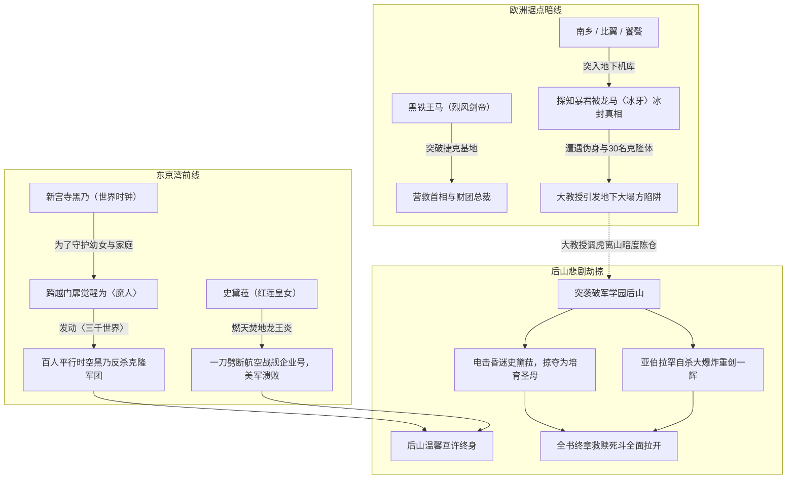

# 《落第骑士英雄谭》第十八卷：卷内时间线与关键事件锚点

## 1. 时间轴设计说明

本时间线针对《落第骑士英雄谭 第十八卷》（材料标识：`MAT-018`）进行高保真跨国多线时间锚定。第十八卷涵盖了**欧洲特种突袭**（捷克美军基地营救）、**东京湾防卫战最终决算**（黑乃魔人觉醒、史黛菈斩断企业号）、**二十米地下机库伏击战**（南乡等人直面暴君遗体与大教授陷阱），以及最终日傍晚破军后山的**悲剧突袭与史黛菈被劫**。

---

## 2. 卷内时间轴事件清单（T01–T08）

| 节点编号 | 剧情时间 / 相对时间 | 涉及章节与行号 | 发生地点 | 核心参与人物 | 核心事件与因果逻辑 |
|---|---|---|---|---|---|
| **T01** | 东京湾海战次日·黎明 | 第一章 `L522–L1500` | 捷克斯洛伐克·美军秘密特务基地 | 黑铁王马、夏洛特、亚伯拉罕·卡特、大教授（投影）、月影獏牙、风祭晄三 | **单骑突袭与雪耻之战**。黑铁王马单刀劈入美军基地营救遭受脑部洗脑拷问的月影与风祭；直面曾击败过自己的宿敌〈超人〉亚伯拉罕，王马凭纯粹霸烈体能生生甩开念力压制，洗刷心灵阴霾。 |
| **T02** | 同日早晨·东京湾前线 | 第二章 `L2353–L2850` | 东京湾近海海空 | 新宫寺黑乃、阿普顿提督、自卫队、EDY机械集群 | **企业号活体金属缠斗**。阿普顿融合活体金属令〈企业号〉能够瞬时排出受损舱段防御〈死亡时钟〉；合众国派出大批人造人亚伯拉罕克隆军团登陆压迫东京防线。 |
| **T03** | 东京湾激战正午 | 第二章 `L2851–L3850` | 东京湾湾岸避难所外线 | 新宫寺黑乃、折木有栖、亚伯拉罕克隆人、新宫寺拓海、新宫寺鸣 | **魔人觉醒·〈三千世界〉踏平敌阵**。面对战线崩溃与家人的生死危机，黑乃放下恐惧跨越命运之门**正式觉醒为〈魔人〉**！施展绝技〈三千世界〉同时在同一节点召唤数百个时空维度的自己，将数十名亚伯拉罕瞬息压制反杀！ |
| **T04** | 东京湾决胜一击 | 第二章 `L3851–L4785` | 东京湾万米长空 | 史黛菈·法米利昂、道格拉斯·阿普顿提督、黑铁严 | **龙王炎断天·企业号覆灭**。史黛菈张开实体火翼升空，高举极温白日巨剑施展〈燃天焚地龙王炎〉一刀将庞大的航空战舰〈企业号〉力劈两半！美军副司令官下达全面撤退指令；黑铁严以〈铁血炼成〉就地建立战地医院，正式宣告日本赢得卫国战争！ |
| **T05** | 同日下午·欧洲极秘据点 | 第三章 `L4786–L5800` | 某国地下20米深层密室机库 | 南乡寅次郎、爱德怀斯、福小莉、大教授爱兰兹（伪身）、30名亚伯拉罕 | **暴君冰封真相与肋骨陷阱**。南乡等人突入机库，揭示当年〈暴君〉实被黑铁龙马以〈冰牙〉冻结生命与时间的历史真相；大教授以巨型伪身突袭贯穿南乡肋部，并动用三十名亚伯拉罕引发地下大塌方企图活埋三大魔人！ |
| **T06** | 同日黄昏·东京破军学园后山 | 第三章 `L5801–L6320` | 破军学园后山树林浴室与斜坡 | 黑铁一辉（正太体型）、史黛菈·法米利昂 | **洗发温存与永恒承诺**。史黛菈为一辉洗发擦头，畅想未来婚后生女的幸福景象；一辉真诚回握其手，许诺相伴一生。两人在夕阳下的树林中深情相视。 |
| **T07** | 黄昏转入黑夜瞬间 | 第三章 `L6321–L6470` | 破军后山暗处 | 黑铁一辉、史黛菈、大教授爱兰兹、亚伯拉罕克隆体、黑铁珠雫 | **圣母被劫与自杀炸弹惨剧**。亚伯拉罕瞬移突入，以颈椎电击强行截断史黛菈意识；大教授现身宣称要夺走史黛菈作为“圣母”孕育究极生命体；残存无头亚伯拉罕死死抱住一辉肉身引爆剧烈大爆炸！一辉重伤坠入火海濒死，史黛菈被掳入茫茫夜空！ |
| **T08** | 大爆炸之后 | 第三章尾声至后记 | 破军后山焦黑废墟 | 黑铁一辉、黑铁珠雫 | **终章序幕拉开**。珠雫赶到现场目睹奄奄一息的兄长发出绝望哀鸣；全书由此进入终结一切的大结局篇章。 |

---

## 3. 战略碰撞与命运陷阱结构图

