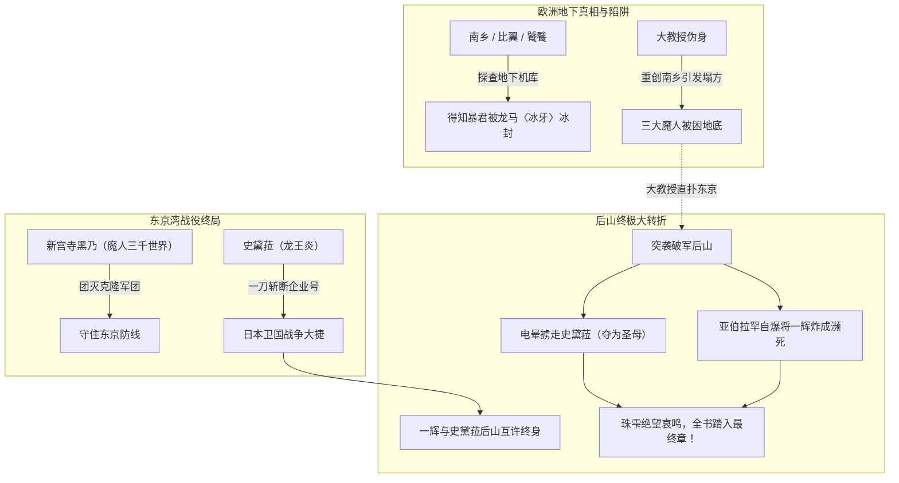

# 《落第骑士英雄谭》第十八卷：出场人物全量索引与阵营图谱

## 1. 阵营分布总览

第十八卷人物交锋达到全剧最高峰：
1. **日本防卫与破军联盟核心**：新宫寺黑乃（魔人觉醒）、黑铁一辉（正太体型）、史黛菈·法米利昂、黑铁王马、黑铁严、黑铁珠雫、折木有栖、新宫寺拓海、新宫寺鸣；
2. **国际反合众国潜入组（三大魔人）**：南乡寅次郎、爱德怀斯、福小莉；
3. **大国同盟侵略主力**：道格拉斯·阿普顿提督（〈企业号〉）；
4. **终极黑幕与人造人军团**：卡尔·爱兰兹（〈大教授〉）、亚伯拉罕·卡特（及数十名量产克隆体）；
5. **日本政经要人**：月影獏牙（首相）、风祭晄三。

---

## 2. 核心具名人物详细索引表

| 人物姓名 | 称号 / 别名 | 所属阵营 | 灵装 / 战力机制 | 卷内关键战绩与出场情节 | 终局生息状态 |
|---|---|---|---|---|---|
| **新宫寺黑乃** | 〈世界时钟〉 | 破军学园理事长 / 联盟代表 | 双枪灵装 **魔人绝技〈三千世界〉** | 卷内绝对MVP之一。为保护幼女小鸣与丈夫，跨越命运门扉**正式觉醒为〈魔人〉**；发动〈三千世界〉于同一时刻召唤数百个平行维度的自己，全歼突入东京防线的亚伯拉罕克隆军团。 | **存活（魔人觉醒达成）** |
| **黑铁王马** | 〈烈风剑帝〉 | 联盟A级骑士 | 〈龙爪〉（大太刀） 〈天龙甲胄〉 〈无空结界〉 | 孤身杀入捷克美军基地营救月影首相与风祭总裁，直面曾击败过自己的宿敌亚伯拉罕，凭借纯粹蛮霸体能挣脱念力束缚斩破心魔。 | **存活** |
| **史黛菈·法米利昂** | 〈红莲皇女〉 | 法米利昂皇国第二皇女 | 〈妃龙罪剑〉 〈燃天焚地龙王炎〉 | 东京湾决战以〈燃天焚地龙王炎〉一刀将航空战舰〈企业号〉劈成两半终结海战；在后山与一辉互许终身，不料被大教授偷袭电晕掳走作为“培育圣母”。 | **被俘（卷末被掳走）** |
| **黑铁一辉** | 〈剑神〉 | 破军学园二年级 | 〈阴铁〉 | 身体尚未恢复仍为正太体型；在后山与史黛菈洗发许诺相伴一生，突遭大教授偷袭；虽刺破亚伯拉罕头颈，但遭残躯死死锁住引爆自杀炸弹，身负绝重伤濒死倒在火海。 | **濒死重伤（陷入绝境）** |
| **卡尔·爱兰兹** | 〈大教授〉 | 解放军黑幕 / 疯狂科学家 | 细胞魔法 / 活体金属 / 魔法生物造物 | 幕后操纵者。以伪身重创南乡并将三大魔人诱入地下塌方陷阱；调虎离山突袭东京后山掳走史黛菈，策划培育“究极生命体”。 | **存活（终极反派现形）** |
| **亚伯拉罕·卡特** | 〈超人〉 / 人造人兵器 | 美利坚合众国 / 〈PSYON〉 | 念动力 / 瞬间移动 / 人体放电 / 自杀引爆 | 实为大教授以魔法生物技术培育的无心智人造人，存在大量克隆体；在后山电晕史黛菈，并以残躯自爆重创一辉。 | **本体/多具克隆体战损** |
| **南乡寅次郎** | 〈斗神〉 | 日本老一辈武宗 / 魔人 | 〈魔笛〉 | 与爱德怀斯、福小莉突袭地下设施调查暴君真相，被大教授以肋骨骨刃伪身刺穿受创。 | **负伤（脱险中）** |
| **爱德怀斯** | 〈比翼〉 | 世界最强魔人 / 孤高剑士 | 纯白双剑 | 随南乡潜入地下，敏锐察觉大教授的自毁陷阱并全力营救同伴。 | **存活** |
| **福小莉** | 〈饕餮〉 | 神龙寺仙人 / 魔人 | 暴食吞噬力场 / 巨龙代谢 | 随南乡潜入地下机库调查暴君遗体，以崩拳击穿防御。 | **存活** |
| **道格拉斯·阿普顿** | 〈白鲸〉 | 美利坚合众国海军提督 | 航空战舰〈企业号〉 | 率舰队突入东京湾，最终被史黛菈以〈燃天焚地龙王炎〉一刀劈沉企业号，作战惨败下令撤退。 | **战败败走** |
| **新宫寺拓海 & 鸣** | 黑乃的丈夫与幼女 | 民间市民 | 亲情纽带 | 在地下避难所深情支持黑乃，成为黑乃打破凡人界限觉醒魔人的关键心之锚点。 | **平安获救** |
| **黑铁严** | 〈铁血〉 | 国际魔法骑士联盟日本分部长 | 〈铁血炼成〉 | 统御东京防卫，战后以血肉炼成建立野战医院，宣告日本胜利。 | **存活** |
| **黑铁珠雫** | 〈深海魔女〉 | 破军学园一年级 | 治愈水魔法 | 卷末目睹后山大火中濒死的兄长，发出绝望哀号。 | **存活（极度悲痛）** |

---

## 3. 终局转折多方阵营博弈图

