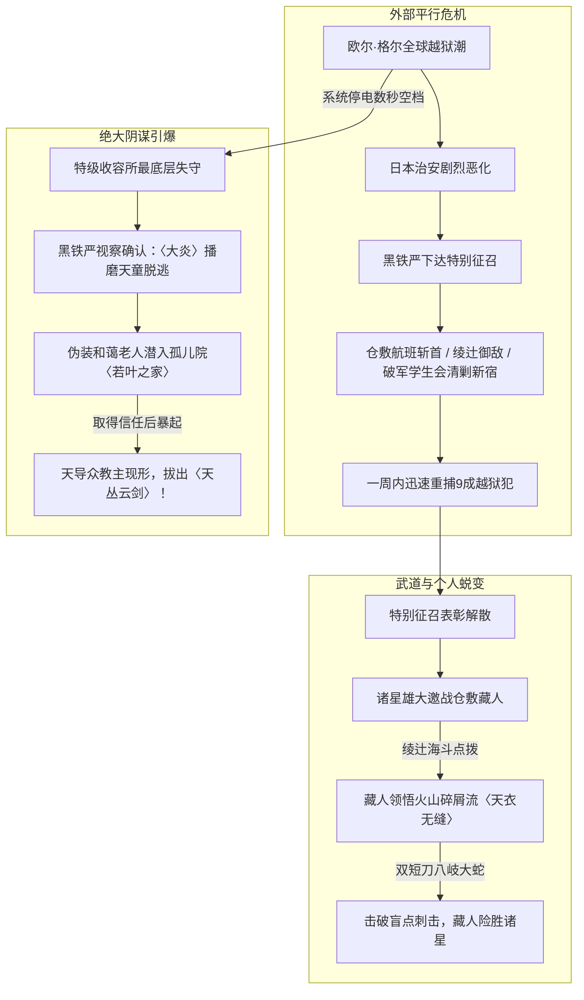

# 《落第骑士英雄谭》第十六卷：卷内时间线与关键事件锚点

## 1. 时间轴设计说明

本时间线针对《落第骑士英雄谭 第十六卷》（材料标识：`MAT-016`）进行多维度交叉事件锚定。第十六卷采用了**“战后准备 $\rightarrow$ 历史回溯平行叙事 $\rightarrow$ 现实危机引爆”**的复合时空架构：卷首终章Ⅱ承接法米利昂战后，正文第一章倒叙回溯至法米利昂开战期间日本本土的一周治安反恐实战，第二章聚焦特别征召结束当日的武道对决与收容所越狱，第三章则在数日后于东京都近郊孤儿院〈若叶之家〉集中引爆终极反派觉醒。

---

## 2. 卷内时间轴事件清单（T01–T10）

| 节点编号 | 剧情时间 / 相对时间 | 涉及章节与行号 | 发生地点 | 核心参与人物 | 核心事件与因果逻辑 |
|---|---|---|---|---|---|
| **T01** | 法米利昂战争落幕数日后 | 终章Ⅱ 思乡 `L3–L317` | 法米利昂皇都医院及迎宾馆 | 黑铁一辉、史黛菈、黑铁珠雫 | **思乡与正太一辉返乡整备**。一辉因自噬过度与细胞重构，身体暂时缩水成小学生体型，引来史黛菈与珠雫的怜爱与调侃；三人收拾行装，正式准备搭乘国际航班返回日本。 |
| **T02** | 国际格局剧变初期 | 序章 深渊熅火 `L318–L368` | 未知地底设施（深渊） | 大教授（解放军残党） | **深渊暗流谋划**。三大阵营恐怖平衡崩塌后，大教授在黑暗废墟中蛰伏，为即将卷入全球的全面混乱调配筹码。 |
| **T03** | 回溯·法米利昂开战同时期（第1天） | 第一章 `L369–L619` | 青森飞往东京羽田的万米客机 | 仓敷藏人、劫机犯015及暴徒同伙 | **高空劫机与闪电镇压**。欧尔·格尔收回蛛丝致使全球暴乱与越狱；罪犯015企图劫机飞往朝鲜并威胁机长，坐在普通客舱的〈剑士杀手〉仓敷藏人骤然暴起，以狠辣近身剑技瞬间团灭整伙劫机歹徒。 |
| **T04** | 回溯·治安战期间（第2–4天） | 第一章 `L620–L1663` | 绫辻剑术道场、新宿歌舞伎町地下斗技场 | 绫辻海斗、绫辻绚濑、碎城雷、桔梗、地下打手 | **道场保卫与歌舞伎町地下清剿**。黑铁严下达特别征召；绫辻道场父女携手击退寻衅暴徒；破军学园二年级碎城雷与桔梗在地下斗技场大显身手，顶住人数劣势压制黑帮。 |
| **T05** | 回溯·治安战末期（第5–7天） | 第一章 `L1664–L1983` | 新宿地下黑帮总部秘密逃生暗道 | 东堂刀华、贵德原彼方、御祓泡沫、黑帮头目亚科夫 | **破军学生会雷霆斩首**。在御祓泡沫的概率辅助下，东堂刀华与贵德原彼方强攻地下贵宾暗道，全歼以亚科夫为首的黑帮核心；一周之内，联盟日本分部配合学生骑士逮捕重捕9成以上越狱犯！ |
| **T06** | 特别征召结束当日·上午 | 第二章 `L1984–L2240` | 联盟日本分部大厦高级会议室 | 黑铁严代表、折木老师、东堂刀华、贵德原彼方 | **表彰大会与彼方调侃**。对策室宣布特别征召圆满结束；贵德原彼方神色暧昧地公开回忆被黑铁一辉抓胸部的感觉，惊得折木老师当场螺旋眼吐血倒地。 |
| **T07** | 特别征召结束当日·午后 | 第二章 `L2241–L3600` | 联盟大厦地下专用训练场 | 诸星雄大、仓敷藏人、东堂刀华、贵德原彼方 | **〈剑士杀手〉VS〈浪速之星〉**。诸星雄大为备战中国〈斗神杯〉，在赴华前邀战仓敷藏人；藏人展现由绫辻海斗启发、充满野性暴力的“火山碎屑流”版〈天衣无缝〉，以双短刀〈八岐大蛇〉跨越3米距离正面打破诸星的〈盲点刺击〉取胜！ |
| **T08** | 同一日·傍晚 | 第二章 `L3601–L4082` | 国际魔法骑士联盟·日本特别收容所 | 黑铁严、新宫寺黑乃、收容所所长 | **最恶极犯越狱·〈大炎〉脱逃**。黑铁严视察特级防线，得知早前系统电源曾发生数秒短暂当机；进入最深层冷冻拘禁室后，惊觉关押数十年的日本史上最恶魔人——**〈大炎〉播磨天童**已人间蒸发！ |
| **T09** | 战后数日 | 第三章 `L4083–L6700` | 东京都近郊福利院〈若叶之家〉 | 东堂刀华、贵德原彼方、御祓泡沫、孤儿院孩子们、伊藤太太、“播磨先生” | **若叶之家的偏见与神秘老人**。刀华三人返乡探望孤儿院，遭遇邻近恶劣妇人伊藤对“伐刀者孤儿”的偏见羞辱；一位自称“播磨先生”的慈祥老人现身提出举办公益扫除以改善邻里关系，成效显著，深受孩子信任。 |
| **T10** | 义工活动结束·傍晚斜坡 | 第三章 `L6701–L6971` | 若叶之家后山洋甘菊斜坡 | 东堂刀华、播磨天童 | **魔人教主现身·〈天丛云剑〉降临**。刀华感激老人善意并赠予特别征召报酬作为旅费；老人骤然暴起，撕下伪善假面，宣告自己正是天导众教主〈大炎〉播磨天童！碧绿雾状魔力爆发，青铜古神剑**〈天丛云剑〉**轰然降世！ |

---

## 3. 多线因果推进结构图

