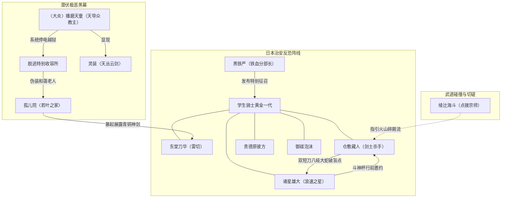

# 《落第骑士英雄谭》第十六卷：出场人物全量索引与阵营图谱

## 1. 阵营分布总览

第十六卷出场人物以**日本本土学生骑士与治安力量**为核心，并引申出潜伏已久的**邪教天导众阵营**：
1. **破军学园与联盟学生骑士**：东堂刀华、贵德原彼方、御祓泡沫、碎城雷、桔梗、折木有栖、新宫寺黑乃；
2. **贪狼学园与武曲学园劲敌**：仓敷藏人（贪狼）、诸星雄大（武曲）；
3. **传统武道界与市民**：绫辻海斗、绫辻绚濑、若叶之家院长与孤儿、伊藤太太；
4. **联盟管理层与军警高层**：黑铁严（日本分部长）；
5. **极恶反叛势力与邪教黑幕**：播磨天童（天导众教主·大炎）、大教授（解放军残党）、亚科夫（新宿黑帮）、越狱犯015；
6. **法米利昂返乡组（卷首登场）**：黑铁一辉（体格缩水）、史黛菈·法米利昂、黑铁珠雫。

---

## 2. 核心具名人物详细索引表

| 人物姓名 | 称号 / 别名 | 所属阵营 | 灵装 / 战力机制 | 卷内关键战绩与出场情节 | 终局生息状态 |
|---|---|---|---|---|---|
| **播磨天童** | 〈大炎〉 天导众教主 | 邪教天导众 / 特级脱狱魔人 | 〈天丛云剑〉 狂暴大炎与青翠魔力 | 日本史上最恶魔人，关押收容所数十年，趁系统断电数秒成功脱逃；化名“播磨先生”伪装成和蔼老人潜入孤儿院〈若叶之家〉，指导义工博取刀华信任；卷末在洋甘菊斜坡撕毁假面，亮出青铜古神剑〈天丛云剑〉暴起发难。 | **存活（反派极恶觉醒）** |
| **东堂刀华** | 〈雷切〉 | 破军学园三年级 / 学生会长 | 〈鸣神〉 〈雷切〉 〈电光〉 | 响应特别征召率队清剿新宿地下黑帮暗道；战后返乡探访抚养自己长大的〈若叶之家〉，尽心化解邻里偏见；卷末为老人送行并赠予旅费时，遭遇播磨天童的暴起突袭。 | **存活（身陷危机）** |
| **诸星雄大** | 〈浪速之星〉 | 武曲学园三年级 / 前七星剑王 | 〈虎王〉 〈帚星〉 〈虎噬〉 〈盲点刺击〉 | 即将代表日本赴中国出战世界级赛事〈斗神杯〉；在联盟地下训练场主动邀战仓敷藏人，以精湛长枪与盲点刺击压制对手，但最终被藏人的火山碎屑流〈天衣无缝〉击破防线败北，展现崇高武道气魄。 | **存活（备战斗神杯）** |
| **仓敷藏人** | 〈剑士杀手〉 | 贪狼学园三年级 | 〈大蛇丸〉（双短刀） 〈八岐大蛇〉 野性〈天衣无缝〉 | 在万米客机上瞬杀劫机犯015整伙歹徒；经绫辻海斗点拨，将纯粹凶暴与野性直觉融入剑中，形成“火山碎屑流”版天衣无缝，在地下切磋中以双短刀正面击破诸星雄大。 | **存活** |
| **贵德原彼方** | 〈腥红淑女〉 | 破军学园三年级 / 副会长 | 〈腥红之姬〉 | 参与特别征召斩首黑帮高层；在表彰会上故意以“回忆被黑铁学弟抓胸部的感觉”调侃折木老师引发骚动；陪同刀华回访贵德原财团资助的〈若叶之家〉。 | **存活** |
| **御祓泡沫** | 〈无法观测〉 | 破军学园三年级 / 书记 | 〈绝对不确定性（Fifty/Fifty）〉 | 在特别征召中作为破军团队的核心雷达与概率改写者，精准定位罪犯老巢；陪同刀华回访共同成长的若叶之家，以手枪手势吓退寻衅妇人。 | **存活** |
| **碎城雷** | 破军学园二年级学生骑士 | 破军学园 | 强化系灵装 | 响应特别征召投入新宿地下斗技场突击战，在敌众我寡的不利局面下沉着迎击，展现次世代主力素养。 | **存活** |
| **绫辻海斗** | 绫辻一刀流宗家 / 〈最后的武士〉 | 绫辻道场 | 绫辻一刀流真传 | 与女儿绚濑并肩守卫道场击退暴徒；此前专程探访仓敷藏人，点拨其“绫辻剑术只是道具，唯有将野兽的纯粹凶暴注入刀中才是属于你的天衣无缝”。 | **存活** |
| **绫辻绚濑** | 绫辻一刀流继承人 | 破军学园二年级 | 〈绯爪〉 | 与父亲共同迎击袭扰道场的越狱犯，展现坚实的防御反击剑理。 | **存活** |
| **黑铁严** | 〈铁血〉 | 国际魔法骑士联盟日本分部长 | 政治军事决断力 | 力排众议下达「特别征召」动员学生骑士，一周内平息国内九成越狱叛乱；视察特级收容所敏锐察觉断电异常，确认为〈大炎〉脱逃后紧急发布全球警报。 | **存活** |
| **新宫寺黑乃** | 〈世界钟〉 | 破军学园理事长 | 时空干涉 | 陪同黑铁严视察特别收容所，协助处理突发脱逃事态。 | **存活** |
| **折木有栖** | 破军学园教师 | 破军学园 | 教学教务 | 出席特别征召解散会，被贵德原彼方的大胆调侃惊吓过度当场吐血。 | **存活** |
| **黑铁一辉** | 〈剑神〉 | 破军学园二年级 | 〈阴铁〉 | 卷首终章Ⅱ登场，身体缩水为小正太体型，在史黛菈与珠雫照顾下收拾行李准备返回日本。 | **存活（体格退化中）** |
| **史黛菈·法米利昂** | 〈红莲皇女〉 | 法米利昂皇国第二皇女 | 〈妃龙罪剑〉 | 卷首终章Ⅱ登场，悉心看护小正太一辉，准备与其一同赴日。 | **存活** |
| **黑铁珠雫** | 〈深海魔女〉 | 破军学园一年级 | 〈宵雨〉 | 卷首终章Ⅱ登场，负责料理一辉身体代谢。 | **存活** |
| **大教授** | 解放军核心智囊 | 解放军（残党） | 脑髓意识体 | 序章在深渊设施中暗中策划下一阶段全球恐怖动乱。 | **存活** |

---

## 3. 日本本土局势与人物对立关系图

