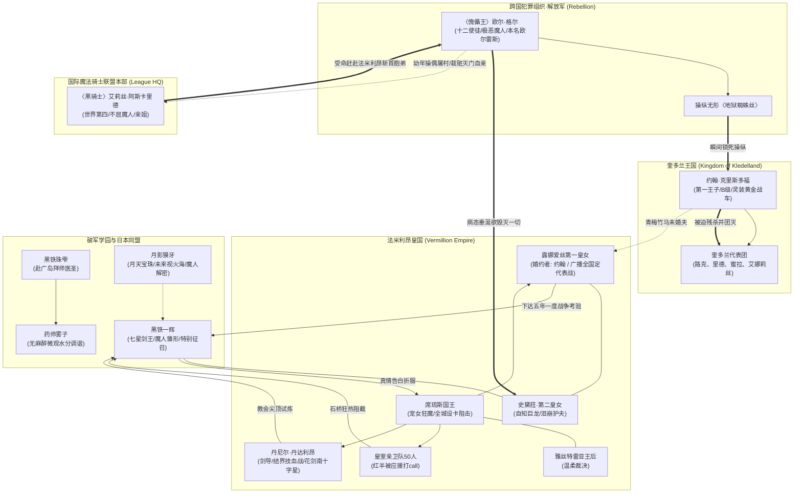

# 《落第骑士英雄谭》第十卷：出场人物全量索引与阵营图谱

本索引严格遵循 `character-visual-lore-dossier` 规范与工程基线，整理第十卷具名登场、主导国际博弈、参与皇国与王国惨案的全部角色。严格锚定第十卷文本，严禁跨卷时间线剧透。

---

## 一、 阵营分布总览

```text
┌─────────────────────────────────────────────────────────────────────────┐
│ 破军学园 (Hagun Academy) 与日本同盟阵营                                   │
│ - 黑铁一辉（七星剑王/踏入命运外侧/特召代表法米利昂出战/迎战岳父与剑圣）     │
│ - 史黛菈·法米利昂（自知巨龙/第二皇女/带婿归国/真情泪崩促成婚约）           │
│ - 黑铁珠雫（深海魔女/赴广岛拜师医圣/无麻醉承受微观体内水分重塑特训）        │
│ - 有栖院凪（黑爱丽丝/陪伴珠雫/大赛后暂时返乡）                             │
│ - 药师雾子（白衣骑士/廉贞学园三年级/广岛药师医院院长兼医圣/收珠雫为徒）     │
│ - 月影獏牙（内阁总理大臣/赠送豪华包机/揭晓魔人机密与东京毁灭未来视）        │
│ - 新宫寺黑乃（破军理事长/见证阿斯卡里德试探/揭露魔人境界隐秘）             │
│ - 西京宁音（世界第三/夜叉姬/日本两大魔人之一/指引徒弟迈向国际舞台）        │
│ - 诸星雄大（浪速之星/前七星剑王/举办“一等星”庆功宴并包场公共澡堂）          │
│ - 诸星小梅（雄大之妹/重获发声/点单服务）                                  │
│ - 日下部加加美（新闻社/大闹颁奖被罚补习三天/庆功宴致开场干杯词）            │
│ - 东堂刀华、贵德原彼方、城之崎白夜、浅木椛（大阪庆功宴同聚欢庆）            │
│ - 莎拉·布拉德莉莉、风祭凛奈、夏洛特·科黛（晓学园残留人员/融入庆功宴互动）   │
├─────────────────────────────────────────────────────────────────────────┤
│ 法米利昂皇国 (Vermillion Empire) 皇室与亲卫部队                          │
│ - 席琉斯·法米利昂（法米利昂现任国王/极度宠女/全城设卡阻击新女婿/被弹劾罚跪） │
│ - 雅丝特雷亚·法米利昂（法米利昂王后/温柔腹黑/严厉制裁丈夫胡闹）             │
│ - 露娜爱丝·法米利昂（第一皇女兼下任女王/果决霸气/广播全国定下五年代表战考验）│
│ - 丹尼尔·丹达利昂（联盟法米利昂分部长兼皇家剑术指导/灵装雄狮之心/血战结界） │
│ - 法米利昂皇室亲卫队（队长及50名队员/狂热打call应援/被一辉全数击晕）        │
├─────────────────────────────────────────────────────────────────────────┤
│ 奎多兰王国 (Kingdom of Kledelland) 国家代表队                           │
│ - 约翰·克里斯多福（奎多兰第一王子兼队长/露娜爱丝未婚夫/被提线木偶惨虐灭门） │
│ - 里德（重装骑士/新婚燕尔/率先被受控的约翰刺穿心脏阵亡）                    │
│ - 路克（称号“疾风”/双小刀骑士/高速突击遭隐形蛛网悬空封死贯穿阵亡）          │
│ - 蜜拉（双枪女骑士/奔逃遭约翰灵装绝技碾碎阵亡）                            │
│ - 艾娜莉丝（水分操控骑士/里德之妻/被蹄轹王道碾碎后遭亵渎）                 │
├─────────────────────────────────────────────────────────────────────────┤
│ 解放军 (Rebellion) 与国际魔法骑士联盟本部 (League Headquarters)          │
│ - 〈傀儡王〉欧尔·格尔（十二使徒之一/无形地狱蜘蛛丝/毁灭化身/制造路榭尔灭门）│
│ - 〈黑骑士〉阿斯卡里德（法国A级骑士/KOK世界第四/灵装无敌甲冑/奉命奔赴皇国）  │
│ - 英国联盟本部高级官员（向黑骑士简报全球昏厥疑云与下达镇压欧尔·格尔密令）   │
│ - 〈白胡公〉亚瑟·布莱特（联盟第一/背景提及）                                │
│ - 〈超人〉亚伯拉罕·卡特（大国同盟顶峰/背景提及）                            │
│ - 〈暴君〉法斯特（解放军盟主/寿命将尽/背景提及）                            │
└─────────────────────────────────────────────────────────────────────────┘
```

---

## 二、 核心登场人物多维矩阵

| 人物标识 ID | 姓名 / 常用称号 | 阵营 / 身份 | 灵装与核心能力 | 卷内核心事件与命运转折 | 原文对应章节与行号基线 |
|---|---|---|---|---|---|
| `CHAR-001` | **黑铁一辉**<br>〈无冕剑王 / 七星剑王〉 | 破军学园一年级<br>第十卷特别征召代表 | 固有灵装：〈阴铁〉<br>核心：〈一刀修罗〉、〈一刀罗刹〉、神速剑理、刀柄系绳飞刀技 | 庆功宴与〈黑骑士〉交手；听取月影魔人解密；赴法米利昂遭全国阻击，连破亲卫队与皇家剑导丹达利昂；误闯露娜艾丝更衣室；真情告白感动皇室；接下五年代表战夺冠军令。 | 第一章 L1120-1380<br>第三章 L1672-3273 |
| `CHAR-002` | **史黛菈·法米利昂**<br>〈红莲皇女〉 | 破军学园一年级<br>法米利昂第二皇女 | 固有灵装：〈妃龙罪剑〉<br>核心：〈自知巨龙〉、〈龙神附身【Dragon Spirit】〉 | 庆功宴狂吃十片大阪烧补充龙神附身消耗；带一辉归国遭父亲刁难，因委屈与自责在餐厅放声大哭；见证一辉求婚告白，二人携手迎战代表战。 | 第一章 L50-150<br>第三章 L1500-3273 |
| `CHAR-003` | **〈傀儡王〉欧尔·格尔**<br>（本名：欧尔雷斯·格尔 / Orles Gaule） | 〈解放军〉十二使徒<br>世界级极恶魔人<br>阿斯卡里德之胞弟 | 固有灵装：〈地狱蜘蛛丝【Black Widow】〉<br>核心：无形操线操控生人与尸体、〈人偶王国〉 | 幼年制造〈浴血十字架〉惨案操纵亲姐虐杀双亲与全村并栽赃；序章在东南亚断开全球1762具傀儡线；真身潜入奎多兰首都路榭尔，以无形毒丝操纵约翰残忍屠杀全体奎多兰代表并逼迫奸尸，开启血腥〈法米利昂战役〉。 | 序章 L1-83<br>第四章 L226-630 |
| `CHAR-004` | **黑铁珠雫**<br>〈深海魔女〉 | 破军学园一年级<br>一辉亲妹 | 固有灵装：〈宵时雨〉<br>核心：微观生命水分操控（修习中）、〈水色轮回〉 | 大赛后决意克服自身无能为力之感，赴广岛拜师药师雾子；因〈水色轮回〉致生体歪斜，自愿在无麻醉状态下被固定受术，开启极限调谐。 | 第一章 L125-150<br>第二章 L1-439 |
| `CHAR-005` | **露娜爱丝·法米利昂**<br>〈第一皇女〉 | 法米利昂皇国第一皇女<br>下任法米利昂女王 | 政治智谋与领袖魅力<br>下任王权继承者 | 暗中支持一辉，为一辉包扎伤口；率众严厉弹劾席琉斯国王；利用国营广播将一辉求婚传遍全境，借机订下“奎多兰代表战全胜夺冠”之严苛考验。 | 第三章 L2635-3273 |
| `CHAR-006` | **席琉斯·法米利昂**<br>〈红莲狂狮〉 | 法米利昂现任国王<br>史黛菈与露娜之父 | C级骑士<br>往昔英雄，现已年迈 | 极度溺爱幼女史黛菈，私调军队、亲卫队与重金悬赏阻止一辉进城；阴谋败露后被妻女按跪大理石地板弹劾；最后在广播与民意逼迫下承认婚约前提。 | 第三章 L1510-3250 |
| `CHAR-007` | **丹尼尔·丹达利昂**<br>〈皇家剑术指导〉 | 联盟法米利昂分部长<br>王家首席剑术导师 | 固有灵装：〈雄狮之心【Lionheart】〉（钝剑/花剑）<br>绝技：〈血战〉、〈南十字星〉 | 守卫王城教会屋顶，以绝对一对一决斗结界〈血战〉与柔韧回弹花剑压制一辉；被一辉刀柄缠绳飞刀之计击破；输后欣慰将史黛菈托付给一辉。 | 第三章 L2070-2620 |
| `CHAR-008` | **约翰·克里斯多福**<br>〈黄金战车〉 | 奎多兰第一王子兼团长<br>露娜爱丝未婚夫（B级） | 固有灵装：〈黄金战车【Chariot】〉<br>绝技：〈蹄轹王道【Circus Maximus】〉（空中化路极速冲锋） | 率领国家代表团苦练备战，批准一辉特别征召；集训场遭遇欧尔·格尔突袭，肉体遭傀儡丝操纵，被迫亲手残杀全队同僚，精神崩溃沦为玩偶。 | 第四章 L50-570 |
| `CHAR-009` | **〈黑骑士〉阿斯卡里德**<br>（真名：艾莉丝·格尔 / Iris Gaule） | 法国A级魔法骑士<br>KOK世界第四名（魔人）<br>欧尔·格尔之亲姐 | 固有灵装：〈无敌甲冑【Orichalcos】〉<br>核心：操纵〈不屈〉概念，肉体不可毁灭 | 幼年遭胞弟操纵手刃双亲并被诬陷，因保护弟弟本能觉醒魔人；后被雷薇以“大义灭亲”谎言收养；大阪街头试探一辉；在英国联盟总部接受紧急最高军令，作为知晓傀儡王恐怖的唯一宿敌，铁手套攥出鲜血，火速奔赴法米利昂。 | 第一章 L1120-1210<br>第四章 L631-685 |
| `CHAR-010` | **药师雾子**<br>〈白衣骑士〉 | 廉贞学园三年级<br>广岛药师医院院长兼医圣 | 固有灵装：手术刀型灵装<br>核心：生体水分子调控、细胞级干涉 | 庆功宴受众人感谢；在广岛特别病房以生体魔法为绝症患者延续尊严；地下实验室接纳珠雫求学，为其展开无麻醉体内微观修复。 | 第一章 L38<br>第二章 L1-439 |
| `CHAR-011` | **月影獏牙**<br>（内阁总理大臣） | 日本政府最高首脑 | 固有灵装：〈月天宝珠〉（读取因果、未来预知梦） | 赠送一辉与史黛菈国宾级专机；街头向一辉揭秘【魔人】与人权隐秘，以灵装展现东京毁灭炼狱，阐明世界三大阵营暗流。 | 第一章 L1215-1600 |

---

## 三、 人物因果与阵营博弈网络 (Mermaid Topology)


