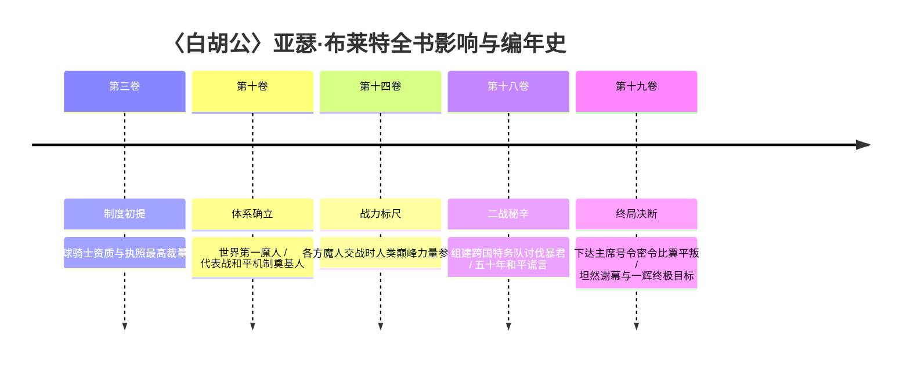

# 〈白胡公〉亚瑟·布莱特（Arthur Bright / アーサー・ブライト）

> **所属势力/阵营**：〈国际魔法骑士联盟（International Mage-Knight League）〉最高领袖（联盟总部长 / 盟主）  
> **伐刀者等级/战力定位**：超 S 级 / 魔人境界（Desperado） / 世界公认战力顶峰活传说  
> **核心称号/二つ名**：〈白胡公（White Beard）〉 / 骑士盟主 / KOK 世界排行第一位  
> **初次提及与活跃卷次**：初次提及于**第三卷**（骑士资格管理）；正史体系确立于**第十卷**（世界三大势力与代表战制度）；二战秘辛揭秘于**第十八卷**；终局决断（主席号令）与最高峰目标于**第十九卷**

---

## 一、 外貌生理与视觉核心特征 (Visual & Anatomical Dossier)

### 1.1 基础生理参数与体态轮廓
- **年龄与体魄**：
  - 年近八十岁（古稀至耄耋之年），自 KOK·A 级职业联盟发迹半个世纪以来参加所有联赛，稳坐第一名宝座（`MAT-019#L6681`）。
  - 历经半个世纪的风霜与征战，身形依然如悬崖苍松般挺拔魁梧，骨架宏大，毫无寻常耄耋老人的佝偻与迟缓，周身洋溢着如渊如海、深不可测的超然霸气。

### 1.2 头部与五官微表情
- **标志性须发（核心视觉特征）**：
  - 满头梳理整齐的浓密银白短发，下颚至脸颊蓄着极其浓密、打理考究且极具威仪的**纯白长胡须**（因而名震全球被称为“白胡公”）。
- **眼神与气度**：
  - 眼神深邃如寒潭古井，历经二战残酷杀戮与半世纪国际博弈后，兼具大英雄的凌厉威严与政治领袖的深谋远虑。
  - 平日神态平静自若，极少喜形于色；一旦涉及世界秩序与加盟国生灵，流露出如磐石般不可撼动的决断力。

### 1.3 服饰装束矩阵
- **最高领袖礼服形态**：
  - 身披象征国际魔法骑士联盟最高尊荣的纯白呢绒大氅，肩部配以纯金流苏肩章与金丝滚边刺绣，内衬笔挺深色双排扣统帅制服，领口佩戴代表全球魔法骑士最高统御权的十字星骑士勋章。

---

## 二、 权能地位、魔人境界与核心体系 (Authority & Power System)

### 2.1 魔人境界（Desperado）与世界第一峰
- **顶级魔人战力（战后均势顶点）**：
  - 打破因果律的联盟最强魔人代表。在第十卷曾被月影总理等人视作与〈同盟〉的〈超人〉亚伯拉罕·卡特、〈解放军〉的〈暴君〉亚当斯·盖堤亚维持均势的三大顶点（`MAT-010#L1625`、`MAT-014#L1741`）。但随着十八、十九卷真相揭晓：暴君早在二战已被冰封，而所谓的二十余岁年轻魔人“亚伯拉罕”实质是大教授窃取暴君细胞制造的克隆人傀儡（无法成为真正的魔人），唯有白胡公始终是不败的真神。
  - 突破了星球命运对魔力总量的先天因果锁链，魔力总量随岁月沉淀与后天苦修无限增长，是当代活着的战力天花板。
- **KOK 半世纪不败神话**：
  - 自国际职业联赛创立起，稳居世界第一宝座长达五十年未曾动摇。在第十九卷终局黑铁一辉晋升 A 级骑士后，依然是一辉职业生涯仰望并誓言挑战的终极最高峰（`MAT-019#L6679`）。

### 2.2 核心权力机构与王牌副手
1. **最高仲裁特权·〈主席号令〉**：
   - [`MAT-019#L2165`] 联盟总部长任内仅限行使一次的绝对特权。拥有强行越过联盟各加盟国繁琐议会辩论、直接调动武装力量平息危机的最高裁量权，代价是**行使后总部长必须引咎辞职**。
2. **核心执行官·〈白翼宰相〉诺曼·克里德（Norman Creed）**：
   - 白胡公身边的第一心腹与左右手，兼任联盟总部副部长。持有七百七十七根匕首型超距传送灵装〈苍天之门〉，负责执行白胡公的秘密意志与跨国调度。

---

## 三、 从初登场至终局全景编年史 (Complete Chronological Arc)

### 3.1 第三卷：规章初提（全球骑士执照掌门人）
- **锚定行号**：`MAT-003#L2258`
- **主线事件**：
  - 黑铁严教唆狩人挑衅一辉时坦言：无论是正规魔法骑士还是学生骑士，资格管理权直接归属于联盟总部长〈白胡公〉，日本分部无权擅自吊销，初次确立其全球最高管理威权。

### 3.2 第十卷：体系确立（世界第一人与代表战之父）
- **锚定行号**：`MAT-010#L1625`、`L5491`
- **主线事件**：
  - **三大势力之巅**：月影总理向一辉揭开世界三大阵营格局，明确白胡公为联盟最强魔人代表与现任 KOK 世界排名第一位的王者。
  - **代表战机制确立**：揭示白胡公力排众议制定“五年一度领土代表战代替全面战争”的公约，杜绝大国工业对小国的灭国屠杀，庇护法米利昂等中小国维持半个世纪的和平繁荣。

### 3.3 第十四卷：魔人巅峰参照标尺
- **锚定行号**：`MAT-014#L1741`
- **主线事件**：
  - 在卡尔迪亚与路榭尔各方魔人顶级战力全面碰撞时，白胡公始终作为人类已知战力天花板与超限境界的标尺被战场全员敬畏引述。

### 3.4 第十八卷：二战秘辛（组建联队击溃暴君与五十年谎言）
- **锚定行号**：`MAT-018#L126-140`、`L202-206`、`L6077-6099`
- **主线事件**：
  - **跨国敢死特务队**：二战末期暴君以精神操纵席卷全球，英军主力出身的白胡公暗中突破警戒网，跨越国界联络黑铁龙马、南乡寅次郎等极少数顶尖骑士组建突击队直捣暴君王座。
  - **封印暴君**：龙马以灵装〈冰牙〉冻结暴君时间。为了防止战后世界陷入更大的阵营撕裂与核武毁灭，白胡公等人合议隐瞒暴君败亡真相长达五十年，构筑了联盟、同盟、解放军三足鼎立的均势秩序。

### 3.5 第十九卷：决断谢幕（主席号令与一辉的终极目标）
- **锚定行号**：`MAT-019#L2165-2171`、`L2333`、`L4598-4630`、`L6342`、`L6679-6685`
- **主线事件**：
  - **下达〈主席号令〉**：史黛菈被大教授绑架后，面对联盟多国议会繁冗扯皮与大国摩擦风险，白胡公不惜牺牲自身职位，果断下达任内唯一的〈主席号令〉。
  - **密派比翼平叛**：委派〈白翼宰相〉诺曼·克里德将世界最强剑士〈比翼〉爱德怀斯秘密空降日本参战，以超规力量彻底终结大教授叛乱。
  - **坦然迎接新时代**：战后黑铁严将半世纪秘密公之于世，白胡公等旧时代领袖坦然承担历史责任与谢幕，让世界走向自主自立的新篇章。
  - **全书终局最高峰**：在大结局一辉晋升 A 级骑士后，一辉面向未来确立了职业生涯的最高终极目标——正是年近八十仍雄踞世界第一王座的传奇〈白胡公〉亚瑟·布莱特！

---

## 四、 官方文献核心证据摘录 (Canonical Quotes)

1. **第三卷第四章（全球资格统领权）**：
   > `MAT-003#L2258`：“不论『魔法骑士』还是『学生骑士』，其资格都是由『国际魔法骑士联盟』的〈白胡公〉管理——也就是说，这需要总部权限。”

2. **第十卷第一章（世界第一魔人与代表战机制）**：
   > `MAT-010#L1625`：“〈联盟〉方面是KOK现任世界排行第一的骑士，同时兼任联盟总部长，名为──〈白胡公〉亚瑟·布莱特。”  
   > `MAT-010#L5491`：“联盟的主导人〈白胡公〉主张制定这项规则，联盟内部对这项规则的反应也是呈现两极化。但是，〈国际魔法骑士联盟〉本身能在半个世纪中成长为掌握半个世界的巨大组织，仍是归功于这项规则。”

3. **第十八卷第一章（二战特种部队斩断暴君统治）**：
   > `MAT-018#L128`：“现任〈国际魔法骑士联盟〉之首，〈白胡公〉亚瑟·布莱特。他当时任职英军的主力部队……赫然察觉战争背后存在罪魁祸首，正是〈暴君〉。”  
   > `MAT-018#L6099`：“现今〈联盟〉领袖，〈白胡公〉率领了特务部队，对上了〈暴君〉。当时龙马以形同半身的一柄〈冰牙〉，直接冰冻〈暴君〉的性命与时间，为战争画下句点。”

4. **第十九卷第四章与终章（主席号令与世界第一的活传说）**：
   > `MAT-019#L2165`：“其实还有一个方法可以跳过正规程序，那就是由〈联盟总部长〉〈白胡公〉下达〈主席号令〉。这是〈联盟总部长〉任内唯一一次强制执行的权力，代价是〈联盟总部长〉必须辞职。”  
   > `MAT-019#L6679`：“尤其是世界排行第一，〈国际魔法骑士联盟〉盟主，〈白胡公〉亚瑟·布莱特。他年近八十，自KOK·A级联盟发迹以来，他参加所有联盟赛，并且稳坐第一名宝座，简直是活传说。”

---

## 五、 战术地位与世界书配置规划 (Tactical Blueprint)

- **战术与跑团地位**：
  - 全书战力与世界政治天花板，不宜作为常规副本随叫随到的打手。
  - 主要用于：全球战力阶层定位、重大国际争端裁决、涉及魔人境界历史的大背景交代，以及一辉等年轻主角迈入职业生涯后的终极大山。
- **世界书配置规划（待用户审核，暂不写入 JSON）**：
  - 建议触发词：`["亚瑟·布莱特", "白胡公", "Arthur Bright", "主席号令", "联盟总部长"]`
  - 建议属性：`order: 266`, `position: 4`, `selective: true`, `preventRecursion: true`。
