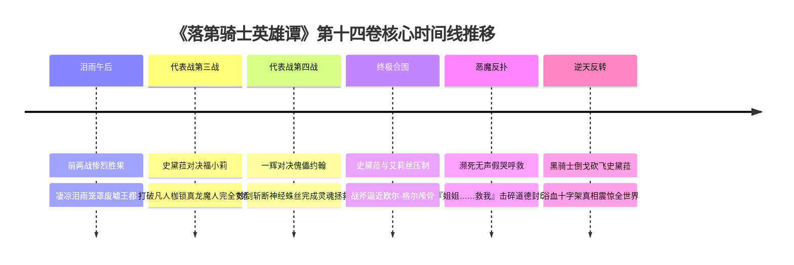

# 第十四卷卷内时间线：全量锚定与时序坐标

> **权威材料依据**：`落第骑士英雄谭 第十四卷 gbk.txt`（`MAT-014`，6,612 行全量原著正文）  
> **时间规范原则**：严格基于原著显式时间词、比赛轮次推演、天气突变与战术节奏，不捏造虚假公历年月日。  
> **事实状态标定**：`extracted`（原文显式字句确认）、`proposed`（卷内情节连续逻辑推导）。

---

## 一、宏观决战时序与对战结果

| 代表战轮次 | 对决场地 | 对战双方 | 核心战术演变 | 最终结果 |
|---|---|---|---|---|
| **第三战** | 路榭尔城西崩塌废墟 | **史黛菈·法米利昂 VS 〈饕餮〉福小莉** | 真龙内聚概念 VS 暴食概念吞噬 | **史黛菈完全觉醒《魔人》获胜**（焚灭饕餮力场） |
| **第四战** | 路榭尔主干道石板大街 | **黑铁一辉 VS 〈黄金风暴〉约翰王子** | 绝妙微观斩丝 VS 黄金战车蹄轹王道 | **黑铁一辉胜并成功解放约翰**（灵魂与肉体获救） |
| **第五战** | 奎多兰王城残破中庭 | **史黛菈 & 艾莉丝 VS 〈傀儡王〉欧尔·格尔** | 围攻绝杀 VS 亲情伪装反噬 | **艾莉丝倒戈砍飞史黛菈护弟**（全剧最大伦理反转） |

---

## 二、卷内核心时间节点全量锚定（Anchor `T01` ～ `T06`）

---

### `T01` 泪雨午后·战局过半：前两场惨烈胜利后的沉重休整
- **时间状态**：`extracted`
- **章节范围**：间章（L3–L177）
- **核心事件**：王都路榭尔天空汇聚阴云，凄凉的雨滴落在深渊巨坑与沙化战圈上。多多良幽衣断肢残废送医抢救，纳西姆窒息身死。法米利昂以 2:0 取得赛点，但全员深知真正的恶魔欧尔·格尔与福小莉尚未登场，空气凝固至极点。
- **地点**：路榭尔废墟战地指挥部。

---

### `T02` 代表战第三战·午后：史黛菈正式跨越魔人之境
- **时间状态**：`extracted`
- **章节范围**：`CH-19` 第十九章（L178–L2678）
- **核心事件**：史黛菈·法米利昂迎战神龙寺仙人〈饕餮〉福小莉。面对福小莉将一切能量化为乌有的暴食深渊，史黛菈摒弃了一切杂念，将雪山修行领悟与护国之誓融为一体——**打破凡人因果，正式觉醒为《魔人（Desperado）》**！红莲巨龙实体化降临，极温龙息以绝对因果神威将暴食吞噬力场硬生生烧穿碳化，击溃福小莉，法米利昂取得 3:0 胜局！
- **地点**：路榭尔城西崩塌废墟大剧场。

---

### `T03` 代表战第四战·傍晚：绝技斩丝拯救约翰王子
- **时间状态**：`extracted`
- **章节范围**：`CH-20` 第二十章（L2679–L5007）
- **核心事件**：欧尔·格尔将惨遭夺舍的约翰王子推上战场，逼迫泣不成声的约翰发动〈黄金战车〉与奥义〈蹄轹王道〉轰杀一辉。一辉敏锐洞察约翰心灵深处未死的尊严，在千钧一发之际迎着冲锋，以神乎其技的剑理在毫厘之间切断了深植于约翰四肢运动神经与颈椎的微观蛛丝，在未取其性命的前提下将悲剧王子彻底拯救唤醒！
- **地点**：路榭尔主干道中央大道。

---

### `T04` 终极围剿·黄昏暮色：逼入绝境的傀儡之王
- **时间状态**：`extracted`
- **章节范围**：`CH-21` 第二十一章前半（L5008–L5500）
- **核心事件**：代表战进入最终大将战。真龙觉醒的史黛菈与手持长柄重型战斧枪的〈黑骑士〉艾莉丝·格尔联手合围欧尔·格尔。在真龙烈火与不屈战斧的狂暴碾压下，欧尔·格尔的操偶暗器尽数被毁，被艾莉丝死死压制在废墟石柱前，巨型战斧距离其颅骨仅差毫厘！
- **地点**：奎多兰王城残破中央大殿废墟。

---

### `T05` 恶魔伪装·黄昏最后一秒：击碎道德封印的无声求救
- **时间状态**：`extracted`
- **章节范围**：`CH-21` 第二十一章中段（L5501–L5650）
- **核心事件**：在死亡阴影彻底笼罩的最后一刹那，欧尔·格尔收起所有嗜虐狞笑，双眸收缩成幼童般无助惊恐的泪眼，以双色异瞳死死盯着自己的亲姐姐艾莉丝，用只有艾莉丝能看懂的嘴型无声哭求：**『姐、姐……救救、我……』**！
- **地点**：石柱废墟死角。

---

### `T06` 逆天反转·暮色降临：黑骑士倒戈弑盟与原罪大白
- **时间状态**：`extracted`
- **章节范围**：`CH-21` 第二十一章后半（L5651–L6570）
- **核心事件**：雷薇部长多年来对艾莉丝施加的“亲手杀弟赎罪”道德催眠在弟弟求救的一瞬间彻底碎裂！当年濒死觉醒魔人的底层本能——【誓死保护弟弟欧尔雷斯】全面暴走反噬！艾莉丝面部扭曲发狂，**手中重达数吨的战斧枪横向变线，以排山倒海之势一斧横扫砍飞史黛菈**！史黛菈吐血倒飞砸穿三道石墙。艾莉丝挡在恶魔弟弟身前与全世界为敌，震惊全球观众；秘密大案〈浴血十字架〉的全景真相随之彻底曝光！
- **地点**：王城中央广场深坑。
